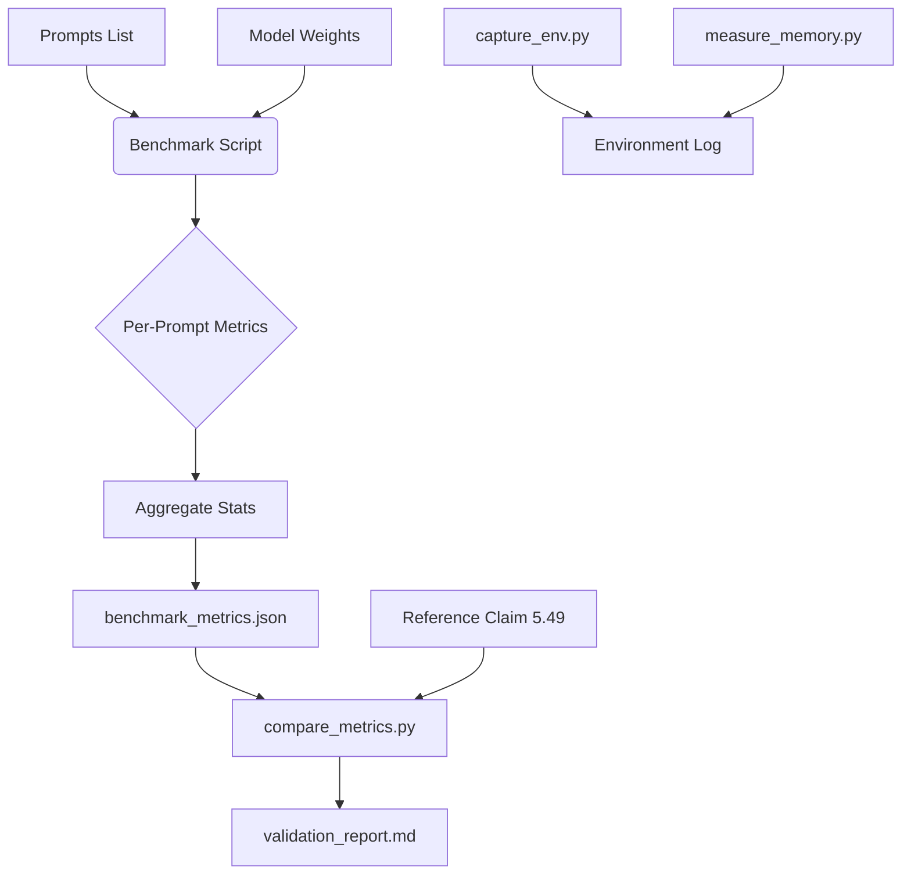

# Data Model: Reproduce & Validate Domino Speculative Decoding Framework

## 1. Overview

This document defines the data structures used for the benchmark execution, metrics collection, and validation reporting. The primary data flow is: **Prompts Input** -> **Benchmark Execution** -> **Metrics Artifact (JSON)** -> **Validation Report (Markdown/JSON)**.

## 2. Entity Definitions

### 2.1 BenchmarkConfig
Configuration parameters for the benchmark run.
- `model_name`: String (e.g., "Qwen/Qwen2-0.5B")
- `draft_model_name`: String (optional, for Domino)
- `device`: String ("cpu")
- `precision`: String ("float32", "float16")
- `num_runs`: Integer (5)
- `prompts_per_run`: Integer (10, dynamic based on Dry Run)
- `timeout_seconds`: Integer (2700 for 45 minutes)
- `paper_claim_speedup`: Float (5.49) - **Reference Only**. Source: arXiv abstract. Hardcoded in `compare_metrics.py`.

### 2.2 Environment
Captured environment details (FR-006).
- `torch_version`: String
- `transformers_version`: String
- `python_version`: String
- `hardware`: Object (CPU cores, RAM)

### 2.3 MetricsArtifact
The structured output generated by the benchmark script.
- `run_id`: String (UUID)
- `timestamp`: ISO8601 DateTime
- `environment`: Object (from 2.2)
- `peak_memory_mb`: Float (Max RSS observed during run, SC-002)
- `baseline`: Object (latency, tokens_per_second, total_tokens)
- `domino`: Object (latency, tokens_per_second, total_tokens)
- `speedup_ratio`: Float (Baseline Latency / Domino Latency) - Aggregate Mean.
- `per_prompt_speedup`: List of Float (Speedup for each individual prompt)
- `aggregated`: Object (mean, std, min, max, ci_95)
- `status`: String ("success", "timeout", "oom")

### 2.3 ValidationReport
The final report comparing results to paper claims.
- `run_id`: String
- `paper_claim_speedup`: Float (5.49) - Reference value.
- `observed_speedup`: Float (Mean of `speedup_ratio`)
- `tolerance_percent`: Float (20)
- `deviation_percent`: Float (Calculated deviation from reference)
- `valid_algorithmic_speedup`: Boolean (True if observed > 1.0)
- `notes`: String (e.g., "CPU environment, model substituted. Reference claim not reproducible.")

## 3. Data Flow Diagram

## 4. Storage Requirements

- **Prompts**: In-memory list or small JSON file (~10KB).
- **Metrics Artifact**: JSON file (~5KB) stored in `external/Domino/results/`.
- **Validation Report**: Markdown file (~2KB) stored in `external/Domino/results/`.
- **Logs**: Text file (~100KB) stored in `external/Domino/results/`.
- **Total Disk**: <1MB per run.

## 5. Output Location

All generated artifacts are written to the `external/Domino/results/` directory to ensure consistency with the execution pipeline and quickstart instructions.
-   `benchmark_metrics.json`
-   `validation_report.md`
-   `environment.log`
-   `benchmark_run.log`