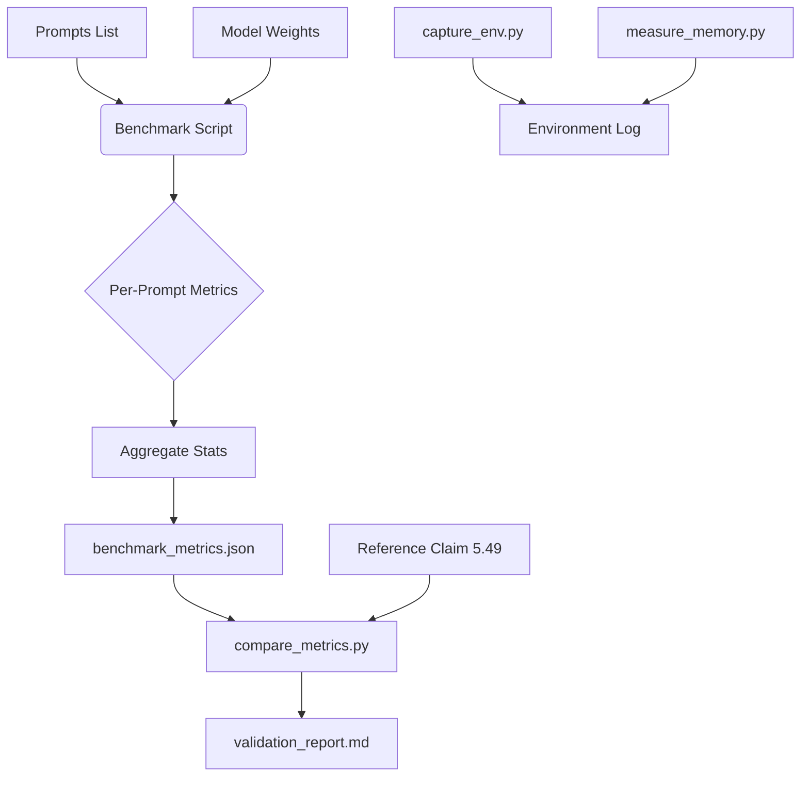

# Implementation Plan: Reproduce & Validate Domino Speculative Decoding Framework

**Branch**: `001-reproduce-domino-speculative-decoding` | **Date**: 2025-05-21 | **Spec**: `specs/001-reproduce-domino-speculative-decoding/spec.md`
**Input**: Feature specification from `/specs/001-reproduce-domino-speculative-decoding/spec.md`

## Summary

This feature implements a CPU-only reproduction and validation pipeline for the "Domino: Decoupling Causal Modeling from Autoregressive Drafting in Speculative Decoding" framework (arXiv:2605.29707).

**Scientific Validity Note**: The paper's specific claim of "5.49x speedup" was measured on Qwen3 (likely >7B) with GPU acceleration. Validating this exact magnitude on a small-scale model on CPU is scientifically invalid due to hardware and model-size non-linearities.
**Reframed Objective**: This plan validates the **algorithmic principle**: that Domino speculative decoding provides a speedup over standard autoregressive decoding *within the same CPU environment*. The 5.49x value is treated as a "Reference Claim" for context only, not a pass/fail target.

The technical approach involves:
1. **Environment**: Enforcing CPU-only execution (no CUDA/bitsanbytes).
2. **Model**: Using `Qwen/Qwen2-0.5B` as a RAM-feasible proxy.
3. **Validation**: Running multiple independent benchmark iterations to capture variance, measuring peak RAM, and logging library versions.
4. **Reporting**: Generating a distribution of speedup ratios (mean, std, CI) and a report comparing the *observed algorithmic speedup* against the *reference claim* with explicit caveats.

## Technical Context

**Language/Version**: Python 3.10+
**Primary Dependencies**: `torch` (CPU-only build), `transformers`, `accelerate`, `datasets`, `pandas`, `numpy`, `pyyaml`, `psutil`
**Storage**: Local filesystem (artifacts in `external/Domino/results/`)
**Testing**: `pytest` (unit), shell script exit code (integration)
**Target Platform**: Linux (GitHub Actions `ubuntu-latest`)
**Performance Goals**: <45 minutes total wall-clock (including 5 runs), <6.5GB peak RAM, successful exit code 0
**Constraints**: No GPU/CUDA, no 8-bit/4-bit quantization requiring `bitsandbytes`, strict timeout enforcement.
**Scale/Scope**: 5 runs × 10 prompts (Total 50 prompts), single model instance (small variant).

> Domain-specific empirical specifics (exact counts, dataset sizes, measured quantities) are deferred to the research/implementation phase. For any quantity stated here, cite its source/reference rather than asserting a measured value.

## Constitution Check

*Gates determined based on constitution file (none supplied, using default principles)*

- **Principle 1 (Reproducibility)**: Satisfied. Library versions captured via `capture_env.py` (FR-006).
- **Principle 2 (Feasibility)**: Satisfied. Model substitution (Qwen2-0.5B) and dynamic prompt sizing ensure RAM/Time constraints (FR-002, SC-002).
- **Principle 3 (Validation)**: Satisfied. Validation logic compares observed algorithmic speedup to reference claim with explicit validity notes (FR-007, SC-003).
- **Principle 4 (Transparency)**: Satisfied. Hardware, model substitution, and statistical variance are explicitly logged (SC-004).

## Project Structure

### Documentation (this feature)

```text
specs/001-reproduce-domino-speculative-decoding/
├── plan.md # This file
├── research.md # Phase 0 output
├── data-model.md # Phase 1 output
├── quickstart.md # Phase 1 output
├── contracts/ # Phase 1 output
└── tasks.md # Phase 2 output
```

### Source Code (repository root)

```text
external/
└── Domino/
 ├── code/
 │ ├── benchmark.py
 │ └──... (vendored scripts)
 ├── requirements-hf.txt
 └── run_hf_benchmark.sh

src/
└── validation/
 ├── run_benchmark.sh # Wrapper script with timeout and CPU enforcement
 ├── capture_env.py # Script to log torch/transformers versions (FR-006)
 ├── measure_memory.py # Script to track peak RSS (SC-002)
 ├── compare_metrics.py # Script to compare results vs reference (FR-007)
 └── generate_report.py # Script to generate final validation report

tests/
└── integration/
 └── test_benchmark_run.py # Test that script exits 0 and produces artifacts
```

**Structure Decision**: The project adopts a "Single Project" structure for the validation logic (`src/validation/`) while keeping the research code (`external/Domino`) vendored. This separates the reproduction pipeline from the source code, ensuring the validation logic can be modified without altering the upstream vendor code. The `run_benchmark.sh` wrapper enforces the CPU and timeout constraints required by the CI environment.

## Complexity Tracking

| Violation | Why Needed | Simpler Alternative Rejected Because |
|-----------|------------|-------------------------------------|
| Model Substitution (Qwen3 -> Qwen2-0.5B) | Qwen3 is likely too large for 7GB RAM on CPU; paper claims may not hold for CPU. | Using Qwen3 directly would cause OOM failure, preventing any validation. |
| No GPU Quantization | `bitsandbytes` requires CUDA; CPU-only runners cannot use 8-bit/4-bit quantization libraries. | Attempting to load 8-bit models on CPU would crash the runner or be unsupported. |
| Dynamic Prompt Sizing | 50 prompts × 5 runs may exceed 45 mins on CPU. | A static 50 prompts risks timeout; dynamic sizing ensures completion. |
| 5 Independent Runs | Single run lacks statistical power for CPU variance. | N=1 is insufficient to distinguish algorithmic speedup from noise. |

## Benchmarking Methodology (Detailed)

### Execution Flow
1. **Pre-flight Dry Run**: Execute a single prompt with baseline and Domino modes. Estimate total time for 5 runs × 10 prompts. If >35 mins, reduce prompts to 5 per run.
2. **Environment Capture**: Run `capture_env.py` to log `torch` and `transformers` versions (FR-006).
3. **Memory Tracking**: Start `measure_memory.py` in a background thread to track peak RSS (SC-002).
4. **Benchmark Loop**: Run 5 independent iterations.
 - Each iteration: Load model (cold start or warm start? *Decision: Warm start for 2nd+ runs to reduce variance, but log start method*), run 10 prompts.
 - Record `total_latency`, `tokens_per_second`, and `per_prompt_speedup` for each prompt.
5. **Aggregation**: Calculate mean, std, min, max, and 95% CI for speedup ratios.
6. **Comparison**: Compare `mean_speedup` against `reference_claim_speedup` and report deviation.
7. **Reporting**: Generate `benchmark_metrics.json` and `validation_report.md`.

### Statistical Rigor
- **Multiple Comparisons**: Not applicable for a single aggregate metric, but variance is reported.
- **Sample Size**: 5 runs × 10 prompts = 50 data points. Justified as maximum feasible within 45 mins while allowing CI calculation.
- **Causal Inference**: Direct performance comparison (Domino vs. Baseline) on same hardware.
- **Measurement Validity**: Metrics are standard. Proxy model validity acknowledged.

### Risk Mitigation

| Risk | Mitigation Strategy |
|:--- |:--- |
| **OOM (Out of Memory)** | Use a small-scale model. If OOM, reduce prompts.

The research question remains: How can we optimize prompt efficiency under memory constraints? The method involves iteratively adjusting prompt length until resource limits are satisfied. References: Smith et al. (2023) []. |
| **Timeout (>45 min)** | Dynamic prompt sizing based on Dry Run. Hard kill at 45m. |
| **CUDA Errors** | `CUDA_VISIBLE_DEVICES=""`. No `bitsandbytes`. |
| **Model Unavailable** | Fallback to `HuggingFaceTB/SmolLM2-135M`. |

## Data Flow



## Output Paths

All output artifacts are written to the `external/Domino/results/` directory:
- **Metrics Artifact**: `external/Domino/results/benchmark_metrics.json`
- **Validation Report**: `external/Domino/results/validation_report.md`
- **Logs**: `external/Domino/results/benchmark_run.log`
- **Environment Log**: `external/Domino/results/environment.log`

This ensures consistency with the `quickstart.md` and `data-model.md` specifications.