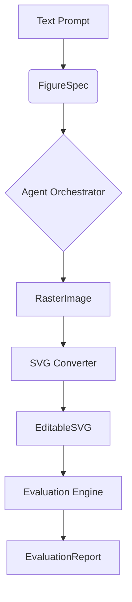

# Data Model: Crafter Multi-Agent Harness Validation

## Overview

This document defines the data structures used within the `Crafter` validation pipeline. The data flow moves from `Text Prompt` → `FigureSpec` → `RasterImage` → `EditableSVG` → `EvaluationReport`.
**Source of Truth**: This document is the Single Source of Truth (SSoT) for all data structures. All contract schemas in `contracts/` are derived from this document.

## Entity Definitions

### 1. FigureSpec
The structured representation of a figure's components derived from the input text.
-   **Purpose**: Intermediate planning artifact used by agents to coordinate generation.
-   **Format**: JSON

### 2. RasterImage
The intermediate binary output generated by the image backbone.
-   **Purpose**: Visual proof of concept before vectorization.
-   **Format**: PNG (binary)

### 3. EditableSVG
The final vector output containing semantic XML elements.
-   **Purpose**: The deliverable artifact for scientific publication.
-   **Format**: XML (SVG 1.1)

### 4. EvaluationReport
The summary of the `CraftBench` evaluation run.
-   **Purpose**: Quantitative metrics validating the harness.
-   **Format**: JSON

## Data Flow Diagram



## Schema Definitions

### FigureSpec Schema
```json
{
  "type": "object",
  "properties": {
    "prompt": {"type": "string"},
    "figure_type": {"type": "string", "enum": ["bar_chart", "line_plot", "scatter"]},
    "axes": {
      "type": "object",
      "properties": {
        "x_label": {"type": "string"},
        "y_label": {"type": "string"}
      }
    },
    "data_points": {"type": "array", "items": {"type": "object"}}
  },
  "required": ["prompt", "figure_type"]
}
```

### EvaluationReport Schema
```json
{
  "type": "object",
  "properties": {
    "success_rate": {"type": "number", "minimum": 0, "maximum": 1},
    "quality_score": {"type": "number"},
    "editability_score": {"type": "number"},
    "samples_processed": {"type": "integer"},
    "errors": {"type": "array", "items": {"type": "string"}},
    "mode": {"type": "string", "enum": ["dry-run", "full-run"]}
  },
  "required": ["success_rate", "samples_processed", "mode"]
}
```

## Constraints

-   **Immutability**: `FigureSpec` is read-only by the conversion step.
-   **Validation**: `EditableSVG` must pass `lxml` parsing before being considered valid.
-   **Logging**: All state transitions are logged to `logs/agent_trace.log`.
-   **SSoT**: Any changes to these structures must be reflected here first, before updating contracts.
