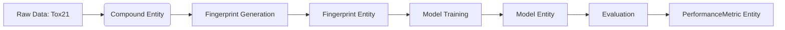

# Data Model Specification

This document defines the core entities and schemas used throughout the comparative analysis of molecular fingerprints for pesticide toxicity prediction.

## Overview

The data model consists of four primary entities:
1. **Compound**: Represents a chemical entity with its structural and toxicological data.
2. **Fingerprint**: Represents the binary vector encoding of a compound's molecular structure.
3. **Model**: Represents a trained machine learning model instance.
4. **PerformanceMetric**: Represents the evaluation metrics of a model.

---

## Entity: Compound

Represents a chemical compound derived from the Tox21 dataset.

### Schema

| Field Name | Type | Description | Constraints |
|:--- |:--- |:--- |:--- |
| `compound_id` | str | Unique identifier for the compound (e.g., DSSTox ID). | Primary Key, Not Null |
| `smiles` | str | Canonical SMILES string representing the molecular structure. | Not Null, Valid SMILES |
| `molecular_formula` | str | Molecular formula (e.g., C10H15N). | Nullable |
| `molecular_weight` | float | Molecular weight in g/mol. | Nullable, > 0 |
| `is_organophosphate` | bool | Flag indicating if the compound matches the organophosphate SMARTS pattern. | Not Null |
| `toxicity_labels` | dict | Dictionary mapping endpoint names to binary labels (0/1) or float confidence scores. | Not Null, Keys: `NR-AR`, `NR-ER`, etc. |
| `source_dataset` | str | Name of the source dataset (e.g., "tox21"). | Not Null |
| `download_timestamp` | datetime | Timestamp when the data was acquired. | Not Null |

### Relationships
- One Compound has one or more Fingerprint records (depending on the fingerprint method used).
- One Compound is associated with zero or more Model predictions.

---

## Entity: Fingerprint

Represents a binary vector encoding of a compound's molecular structure generated by a specific algorithm.

### Schema

| Field Name | Type | Description | Constraints |
|:--- |:--- |:--- |:--- |
| `fingerprint_id` | str | Unique identifier for the fingerprint instance. | Primary Key |
| `compound_id` | str | Foreign key referencing the Compound. | Not Null, FK |
| `method` | str | The algorithm used (e.g., "Morgan", "MACCS", "RDKit"). | Not Null |
| `radius` | int | Radius parameter (only applicable for Morgan fingerprints). | Nullable |
| `n_bits` | int | Number of bits in the fingerprint vector. | Not Null, > 0 |
| `bit_vector` | list[int] | The binary vector (list of 0s and 1s) or sparse representation. | Not Null |
| `creation_timestamp` | datetime | Timestamp when the fingerprint was generated. | Not Null |

### Relationships
- One Fingerprint belongs to one Compound.
- Used as input for Model training and evaluation.

---

## Entity: Model

Represents a trained Random Forest classifier used for toxicity prediction.

### Schema

| Field Name | Type | Description | Constraints |
|:--- |:--- |:--- |:--- |
| `model_id` | str | Unique identifier for the model instance. | Primary Key |
| `fingerprint_method` | str | The fingerprint method used for training (e.g., "Morgan", "MACCS"). | Not Null |
| `fold_index` | int | The cross-validation fold index (0-4). | Not Null, 0 ≤ x < 5 |
| `algorithm` | str | The ML algorithm used (e.g., "RandomForestClassifier"). | Not Null |
| `hyperparameters` | dict | Dictionary of hyperparameters used (e.g., `n_estimators`, `max_depth`). | Not Null |
| `artifact_path` | str | Relative path to the serialized model file (e.g., `data/processed/models/model_0_morgan.pkl`). | Not Null |
| `training_compounds_count` | int | Number of compounds used in the training set for this fold. | Not Null, > 0 |
| `validation_compounds_count` | int | Number of compounds used in the validation set for this fold. | Not Null, > 0 |
| `training_timestamp` | datetime | Timestamp when training was completed. | Not Null |

### Relationships
- One Model is trained on one Fingerprint method.
- One Model produces one or more PerformanceMetric records.

---

## Entity: PerformanceMetric

Represents the evaluation metrics calculated for a specific Model on a specific dataset split.

### Schema

| Field Name | Type | Description | Constraints |
|:--- |:--- |:--- |:--- |
| `metric_id` | str | Unique identifier for the metric record. | Primary Key |
| `model_id` | str | Foreign key referencing the Model. | Not Null, FK |
| `fold_index` | int | The cross-validation fold index. | Not Null |
| `metric_name` | str | Name of the metric (e.g., "ROC-AUC", "PR-AUC", "Balanced Accuracy"). | Not Null |
| `value` | float | The calculated metric value. | Not Null, 0.0 ≤ x ≤ 1.0 |
| `confidence_interval_lower` | float | Lower bound of the 95% confidence interval (if applicable). | Nullable |
| `confidence_interval_upper` | float | Upper bound of the 95% confidence interval (if applicable). | Nullable |
| `calculation_method` | str | Method used for calculation (e.g., "standard", "bootstrap"). | Not Null |
| `calculation_timestamp` | datetime | Timestamp when the metric was calculated. | Not Null |

### Relationships
- One PerformanceMetric belongs to one Model.
- Aggregated across folds for statistical testing (e.g., Paired t-test).

---

## Data Flow Diagram

## Constraints and Validation Rules

1. **Compound Validity**: All `smiles` strings must be parseable by RDKit.
2. **Fingerprint Consistency**: The `n_bits` must match the expected bit count for the chosen `method` (e.g., Morgan=2048, MACCS=166).
3. **Model Reproducibility**: All `hyperparameters` must include the random seed used.
4. **Metric Bounds**: All probability-based metrics (AUC, Accuracy) must be in the range [0.0, 1.0].
5. **Organophosphate Filter**: The `is_organophosphate` flag must be derived strictly from the SMARTS pattern `[P](=O)([O,SC])[O,SC]`.