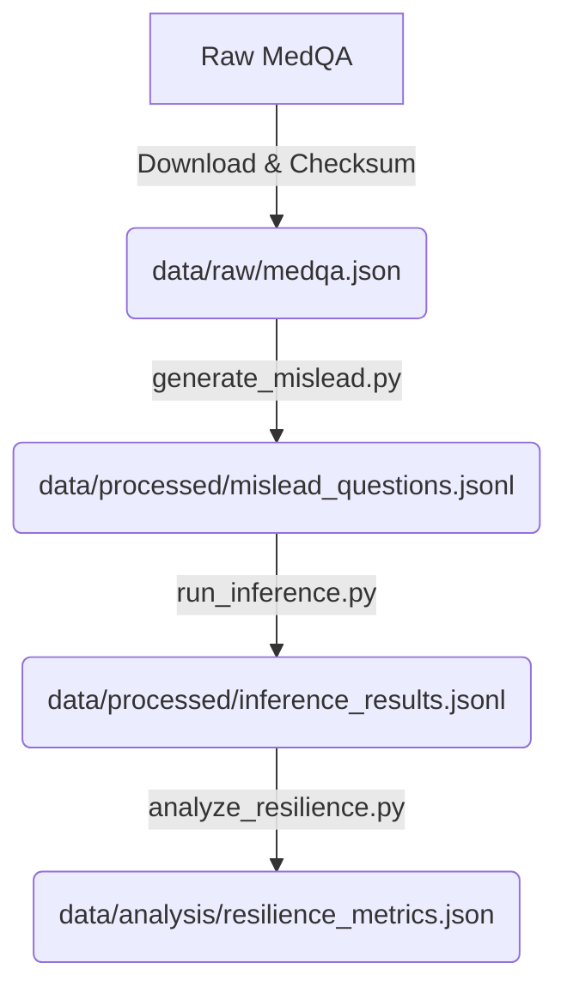

# Data Model: Measuring Epistemic Resilience of LLMs Under Misleading Medical Context

## Overview

This document defines the data structures used throughout the project. All data flows from `raw` (downloaded) to `processed` (mislead questions, inference results) to `analysis` (metrics).

## Entity Definitions

### 1. QuestionItem

Represents a single medical question instance, either in its original form or with an injected misleading claim.

**Fields**:
- `id`: Unique string identifier (e.g., `medqa_1234`).
- `original_stem`: The original text of the question.
- `options`: List of strings (A, B, C, D, E...).
- `gold_answer`: The correct option letter (e.g., "A").
- `injected_claim`: (Optional) The false medical claim string.
- `mislead_stem`: (Optional) The question stem with the injected claim.
- `is_valid`: Boolean indicating if the injection preserved the answer key (FR-006).
- `source_dataset`: Name of the source dataset (e.g., "medqa").

### 2. InferenceResult

Represents the output of a single model inference run.

**Fields**:
- `question_id`: Reference to `QuestionItem.id`.
- `model_name`: e.g., "Llama-2-7B".
- `strategy`: e.g., "Baseline", "CoT", "Self-Critique".
- `condition`: "clean" or "mislead".
- `raw_output`: The full text generated by the model.
- `extracted_answer`: The single letter extracted from `raw_output` (or `null` if invalid).
- `is_correct`: Boolean (True if `extracted_answer` == `gold_answer`).
- `generation_time_ms`: Execution time.

### 3. ResilienceMetric

Aggregated metrics for a specific model/strategy combination.

**Fields**:
- `model_name`: e.g., "Llama-2-7B".
- `strategy`: e.g., "CoT".
- `clean_accuracy`: Float (0.0 - 1.0).
- `mislead_accuracy`: Float (0.0 - 1.0).
- `resilience_score`: Float (calculated per FR-003).
- `wilcoxon_statistic`: Float (from per-item comparison).
- `wilcoxon_p_value`: Float.
- `wilcoxon_p_adjusted`: Float (Bonferroni corrected).
- `sample_size`: Integer (number of items).

## Data Flow Diagram

## Storage Strategy

- **Raw**: `data/raw/` (Read-only, checksummed).
- **Processed**: `data/processed/` (Intermediate JSONL files).
- **Analysis**: `data/analysis/` (Final metrics, reports).
- **Schemas**: `specs/001-measuring-epistemic-resilience/contracts/` (YAML definitions for validation).
