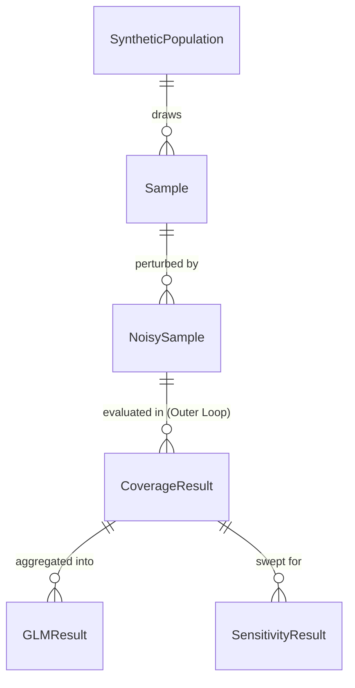

# Data Model: Robustness of Confidence Intervals to Differential Privacy Noise

## 1. Overview

This document defines the data structures used in the simulation pipeline. All data is transient (generated in memory) or persisted as CSV/Parquet in the `artifacts/` directory.

## 2. Entity Relationship Diagram (Conceptual)

## 3. Data Entities

### 3.1. SyntheticPopulation
Represents the ground truth population with known parameters.
*   **Attributes**:
    *   `population_id`: Unique identifier.
    *   `dataset_name`: e.g., "Adult_Synthetic", "Iris_Synthetic".
 * `N`: Number of records (e.g., [deferred]).
    *   `true_mean`: Dict of true means for numeric attributes.
    *   `true_coefficients`: Dict of true regression coefficients.
    *   `covariance_matrix`: Theoretical covariance matrix used for generation.
*   **Storage**: Not stored to disk (generated on-the-fly). Parameters stored in `config.py`.

### 3.2. Sample
A subset drawn from the SyntheticPopulation.
*   **Attributes**:
    *   `sample_id`: Unique ID.
    *   `population_id`: FK.
    *   `n`: Sample size.
    *   `raw_data`: Pandas DataFrame (in-memory).

### 3.3. NoisySample
The sample with DP noise added.
*   **Attributes**:
    *   `sample_id`: FK.
    *   `epsilon`: Privacy budget (float).
    *   `noise_type`: "Laplace" or "Gaussian".
    *   `noise_scale`: Calculated scale parameter.
    *   `noisy_data`: Pandas DataFrame (in-memory).

### 3.4. CoverageResult
The core output of the simulation. **Unit of Analysis: Outer Loop Replication.**
*   **Attributes**:
    *   `result_id`: Unique ID.
    *   `dataset_name`: String.
    *   `epsilon`: Float.
    *   `noise_type`: String.
    *   `statistic_type`: "Mean" or "Regression".
    *   `adjustment_method`: "None", "BiasCorrected", "VarianceInflated".
    *   `true_parameter`: The **Fixed Ground Truth** value (float).
    *   `ci_lower`: Lower bound of CI (float).
    *   `ci_upper`: Upper bound of CI (float).
    *   `covered`: Boolean (1 if `ci_lower <= true_parameter <= ci_upper`).
    *   `seed`: Random seed used for this replication.
*   **Note**: `bootstrap_replication` is **NOT** stored here. It is an internal step used to generate the CI bounds for this single result.

### 3.5. GLMResult
Aggregated statistical test results.
*   **Attributes**:
    *   `model_id`: Unique ID.
    *   `formula`: String.
    *   `p_value_epsilon`: Float.
    *   `p_value_noise_type`: Float.
    *   `p_value_interaction`: Float.
    *   `coefficient_epsilon`: Float.
    *   `deviance`: Float.

### 3.6. SensitivityResult
Results of the threshold sweep (FR-006).
*   **Attributes**:
    *   `threshold`: Float (e.g., 0.90, 0.93, 0.95).
    *   `passing_cases`: Integer (count of conditions where coverage >= threshold).
    *   `variance`: Float (variance in passing cases across thresholds).

## 4. File Formats

### 4.1. `artifacts/coverage_results.csv`
*   **Format**: CSV.
*   **Columns**: `result_id, dataset_name, epsilon, noise_type, statistic_type, adjustment_method, true_parameter, ci_lower, ci_upper, covered, seed`.
*   **Usage**: Input for GLM analysis and visualization. **Single Source of Truth**.

### 4.2. `artifacts/glm_summary.json`
*   **Format**: JSON.
*   **Content**: Aggregated GLM statistics.

### 4.3. `artifacts/sensitivity_analysis.csv`
*   **Format**: CSV.
*   **Columns**: `threshold, passing_cases, variance`.

## 5. Constraints & Validations

*   **epsilon**: Must be $> 0$.
*   **noise_type**: Must be in `["Laplace", "Gaussian"]`.
*   **covered**: Must be 0 or 1.
*   **ci_lower <= ci_upper**: Always true.
*   **No PII**: All data is synthetic.