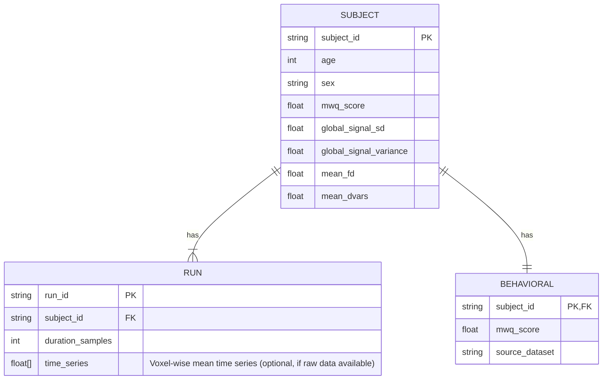

# Data Model: Resting‑State fMRI Global Signal as a Marker of Mind‑Wandering

## Overview
This document defines the data structures used for ingestion, processing, and modeling. All data is derived from the verified HCP and MWQ sources.

## Entity-Relationship Diagram (Conceptual)

## Data Schema Definitions

### 1. Raw Input Schema (HCP Parquet)
*Source: `
Expected columns (to be verified at runtime):
- `subject_id` (string/int)
- `run_id` (string)
- `global_signal` (array[float]) OR `global_signal_sd` (float)
- `fd` (float)
- `dvars` (float)
- `age` (int)
- `sex` (string/int)

### 2. Processed Dataset Schema (Cleaned CSV)
*Output of `ingestion.py` (FR-001, FR-002, FR-009)*
| Column | Type | Description | Constraints |
|:--- |:--- |:--- |:--- |
| `subject_id` | string | Unique participant ID | PK, Not Null |
| `global_signal_sd` | float | Standard deviation of global signal | Not Null, > 0 |
| `global_signal_variance` | float | Variance of global signal | Not Null, > 0 |
| `mwq_score` | float | Mind-Wandering Questionnaire total score | Not Null |
| `mean_fd` | float | Mean Framewise Displacement | Not Null |
| `mean_dvars` | float | Mean DVARS | Not Null |
| `age` | int | Participant age | Not Null |
| `sex` | string | 'Male' or 'Female' | Not Null |
| `exclusion_reason` | string | If excluded, reason (e.g., "FD > 0.5") | Nullable |

### 3. Model Result Schema (JSON)
*Output of `modeling.py` (FR-004, FR-005)*
| Field | Type | Description |
|:--- |:--- |:--- |
| `model_type` | string | "ridge", "null", or "reduced" |
| `alpha` | float | Regularization parameter used |
| `fold` | int | Fold index (if CV) |
| `mae` | float | Mean Absolute Error |
| `pearson_r` | float | Pearson correlation coefficient |
| `r_squared` | float | Coefficient of determination |
| `p_value` | float | Empirical p-value (only for final aggregate) |
| `delta_r2` | float | Difference in R² between Full and Reduced models (for isolation) |

## Data Flow
1. **Ingestion**: Raw HCP + MWQ $\to$ Clean CSV (filtered by FR-008, FR-009).
2. **Modeling**: Clean CSV $\to$ Ridge Model (CV) + Null Distribution + Reduced Model $\to$ JSON Report.
3. **Robustness**: Clean CSV $\to$ Alternative Models (Variance, Alpha Sweep) $\to$ JSON Report.