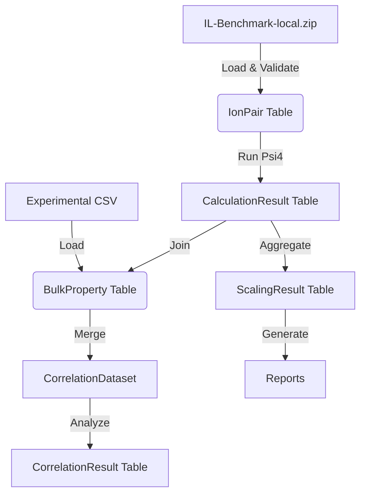

# Data Model: Transferability of DFT‑D3 Dispersion to Ionic Liquids

## Overview
This document defines the data structures, schemas, and transformation logic for the project. All data flows from `data/raw/` (local fallback files) to `data/derived/` and finally to report artifacts.

## Entities

### 1. IonPair (Raw Data)
Represents a single ion-pair complex from the local fallback dataset.
- `pair_id`: string (Unique identifier, e.g., "EMIM_BF4_01")
- `xyz_path`: string (Path to the XYZ coordinate file)
- `reference_energy`: float (CCSD(T)/CBS interaction energy in kcal/mol)
- `cations`: string (List of cation formulas)
- `anions`: string (List of anions formulas)

### 2. CalculationResult (Derived)
Output of the Psi4 single-point calculation.
- `pair_id`: string
- `dft_total_energy`: float (Total DFT-D3 energy in kcal/mol)
- `d3_dispersion_energy`: float (Isolated D3 contribution in kcal/mol)
- `bsse_correction`: float (Counterpoise correction in kcal/mol)
- `calculation_status`: string ("success", "failed", "skipped")
- `error_signed`: float (`dft_total_energy` - `reference_energy`)
- `dispersion_only_error`: float (`d3_dispersion_energy` - `scaled_d3_energy`)

### 3. BulkProperty (External)
Experimental bulk properties from local fallback.
- `pair_id`: string
- `density`: float (g/cm³)
- `viscosity`: float (cP)
- `source`: string ("Local_Fallback")

### 4. CorrelationResult (Derived)
Statistical results for bulk property analysis.
- `metric`: string (e.g., "Pearson_DispersionError_vs_Viscosity")
- `coefficient`: float
- `r_squared`: float
- `p_value`: float
- `p_value_bonferroni`: float
- `ci_lower`: float
- `ci_upper`: float
- `n_samples`: int

## Data Flow Diagram

## File Specifications

### Input: `IL-Benchmark-local.zip`
- **Format**: ZIP archive containing `metadata.csv` and `xyz/` directory.
- **Schema**:
  - `metadata.csv`: `pair_id`, `xyz_file`, `reference_energy`, `cations`, `anions`
  - `xyz/`: `*.xyz` files with standard XYZ format (N atoms, comment line, coordinates).
- **Origin**: Curated synthetic test set generated for this project.

### Input: `experimental_bulk_properties.csv`
- **Format**: CSV
- **Schema**: `pair_id`, `density`, `viscosity`
- **Origin**: Curated synthetic test set generated for this project.

### Output: `raw_energies.csv`
- **Format**: CSV
- **Columns**: `pair_id`, `reference_energy`, `dft_total_energy`, `d3_dispersion_energy`, `error_signed`, `calculation_status`, `dispersion_only_error`

### Output: `scaling_factor.txt`
- **Format**: Text
- **Content**: Single float `s` and a JSON block with CI and p-value.

### Output: `correlation_report.md`
- **Format**: Markdown
- **Content**: Tables of correlation coefficients, p-values, CIs, and Bonferroni-adjusted significance.

## Constraints
- **Data Immutability**: Raw data files in `data/raw/` are never modified.
- **Missing Data**: If `reference_energy` is missing, the record is skipped (logged).
- **Unit Consistency**: All energies in **kcal/mol**. Densities in **g/cm³**. Viscosities in **cP**.