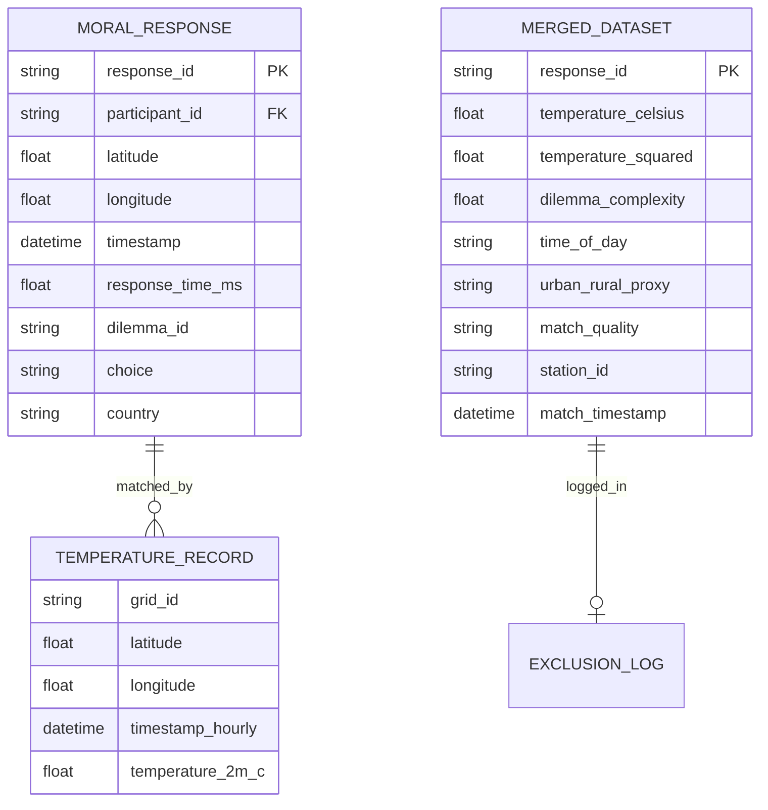

# Data Model: Ambient Temperature Influence on Moral Decision Speed

## Entity Relationship Diagram (Conceptual)

## Data Schemas

### 1. Raw Input: Moral Machine Response
* **Source**: `data/raw/moral_machine.csv`
* **Format**: CSV
* **Fields**:
 * `response_id` (string): Unique identifier.
 * `participant_id` (string): Unique user ID.
 * `country` (string): ISO country code.
 * `latitude` (float): Decimal degrees.
 * `longitude` (float): Decimal degrees.
 * `timestamp` (datetime): ISO 8601.
 * `response_time_ms` (int): Milliseconds.
 * `dilemma_id` (string): Dilemma scenario ID.
 * `choice` (string): "save_many", "save_few", etc.

### 2. Raw Input: ERA5 Temperature
* **Source**: ` (accessed via `cdsapi` for a multi-year period)
* **Format**: NetCDF/HDF5 (converted to `xarray` dataset)
* **Fields**:
 * `time` (datetime): Hourly timestamps.
 * `latitude` (float): Grid latitude.
 * `longitude` (float): Grid longitude.
 * `temperature_2m` (float): Temperature in Kelvin (converted to Celsius).

### 3. Processed: Merged Dataset
* **Target**: `data/processed/merged_dataset.parquet`
* **Format**: Parquet (for efficiency)
* **Fields**:
 * `response_id` (string): PK.
 * `participant_id` (string).
 * `country` (string).
 * `response_time_ms` (int): Filtered (<100 ms or >10 000 ms removed).
 * `log_response_time` (float): Natural log of response time.
 * `temperature_celsius` (float): Mapped from ERA5.
 * `temperature_squared` (float): `temperature_celsius ** 2`.
 * `dilemma_complexity` (float): Derived static metric.
 * `time_of_day` (float): Hour of the day (0‑23) or sin/cos encoded.
 * `choice_type` (string): Type of moral choice made (e.g., 'save_many').
 * `distance_km` (float): Distance to the nearest ERA5 grid point.
 * `station_id` (string): Identifier of the matched ERA5 grid cell.
 * `match_timestamp` (datetime): Timestamp of the matched ERA5 observation.
 * `match_quality` (string): "high" if distance ≤ 25 km, "low" otherwise.
 * `exclusion_flag` (bool): True if the record was excluded due to distance, time gap, or temperature extreme.

### 4. Log: Exclusion Log
* **Target**: `results/logs/exclusion_log.csv`
* **Format**: CSV
* **Fields**:
 * `response_id` (string).
 * `reason` (string): "distance > 100km", "ERA5 coverage gap", "invalid response time", "missing location", etc.
 * `original_lat` (float), `original_lon` (float).
 * `timestamp` (datetime).

### 5. Log: Match Log
* **Target**: `results/logs/match_log.csv`
* **Format**: CSV
* **Fields**:
 * `response_id` (string).
 * `station_id` (string).
 * `match_timestamp` (datetime).
 * `distance_km` (float).
 * `match_quality` (string).

## Data Flow

1. **Ingestion**: Download ERA5 via CDS API and Moral Machine CSV.
2. **Validation**: Verify checksums and resolution (31 km, hourly). Abort if checks fail (FR‑014).
3. **Matching**: Chunked nearest‑neighbor join using KD‑Tree; enforce distance ≤ 100 km and temporal gap ≤ 2 h. Log successes to `match_log.csv` and failures to `exclusion_log.csv`.
4. **Filtering**: Remove `response_time_ms` < 100 ms or > 10 000 ms (FR‑010). Exclude temperature extremes outside ‑30 °C – 50 °C (FR‑002).
5. **Transformation**: Log‑transform response time; compute quadratic term; derive `dilemma_complexity` from static scenario attributes.
6. **Output**: Save `merged_dataset.parquet`, `exclusion_log.csv`, and `match_log.csv`.
