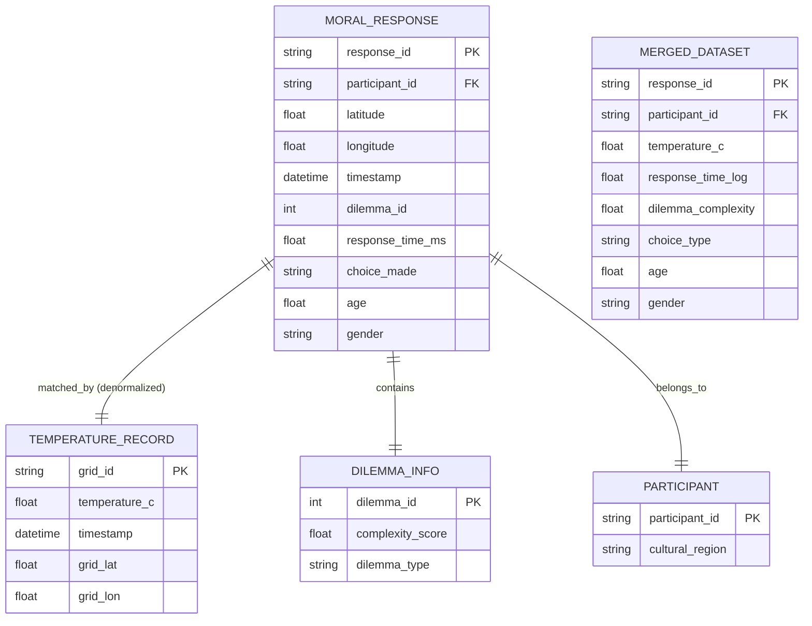

# Data Model: Ambient Temperature Influence on Moral Decision Speed

## Entity Relationship Diagram (Conceptual)

## Data Schema Definitions

### 1. Raw Moral Machine Response (Ingested)
- **Source**: `moral_machine.csv`
- **Fields**:
  - `response_id`: Unique identifier (generated).
  - `participant_id`: Anonymous ID.
  - `latitude`, `longitude`: Decimal degrees.
  - `timestamp`: ISO 8601 datetime (UTC).
  - `dilemma_id`: Integer.
  - `response_time`: Milliseconds (raw).
  - `choice`: String (e.g., "save_many", "save_few").
  - `country`: String (for cultural region mapping).
  - `age`: Participant age (if available).
  - `gender`: Participant gender (if available).

### 2. ERA5 Temperature Record (Ingested)
- **Source**: `era5_2016_2019.h5` (Required: verified source for 2016-2019).
- **Fields**:
  - `grid_id`: Unique grid identifier.
  - `latitude`, `longitude`: Grid center coordinates.
  - `timestamp`: Hourly datetime (UTC).
  - `temperature_2m`: Temperature at 2m height (°C).

### 3. Merged Analysis Dataset (Derived)
- **Source**: `merged_analysis.parquet`
- **Fields**:
  - `response_id`: PK.
  - `participant_id`: FK.
  - `cultural_region`: String (derived from country).
  - `latitude`, `longitude`: Decimal degrees.
  - `timestamp`: Datetime.
  - `response_time_log`: Float (log-transformed response time).
  - `temperature_c`: Float (matched ERA5 temperature).
  - `temperature_3hr_avg`: Float (rolling average).
  - `dilemma_complexity`: Float (static score derived from lives/species only).
  - `time_of_day`: Float (0-24).
  - `choice_type`: String.
  - `dilemma_id`: Integer.
  - `age`: Float (if available).
  - `gender`: String (if available).
  - `match_quality`: String ("high", "low", "excluded").
  - `exclusion_reason`: String (if excluded).

### 4. Model Output Schema
- **Source**: `results/stats/model_summary.json`
- **Fields**:
  - `model_type`: String ("LMM", "GLMM").
  - `fixed_effects`: Object (key: term, value: coefficient, se, p_value).
  - `random_effects`: Object (key: grouping, value: variance).
  - `convergence_status`: Boolean.
  - `likelihood_ratio_test`: Object (statistic, p_value).
  - `diagnostics`: Object (shapiro_wilk_p, anderson_darling_p).

## Data Processing Logic

1. **Ingestion**:
   - Load `moral_machine.csv`.
   - Load ERA5 data (handle HDF5 structure).
   - **Filter**: Remove responses with `response_time < 100` or `> 10000`.
   - **Filter**: Remove responses with missing lat/long.
   - **Validation**: Check ERA5 source timestamp range (must be 2016-2019). Halt if mismatch.

2. **Matching**:
   - For each response, find the nearest ERA5 grid cell.
   - Calculate distance. If > 100km, flag as "low confidence" and exclude.
   - Find the nearest hourly timestamp. If gap > 2 hours, exclude.
   - Interpolate linearly if gap <= 2 hours.

3. **Feature Engineering**:
   - Compute `log(response_time)`.
   - Compute `temperature_3hr_avg` (rolling mean).
   - Derive `dilemma_complexity` from dilemma attributes (lives, species) **excluding response time**.
   - Extract `time_of_day` from timestamp.
   - Map `country` to `cultural_region`.
   - Preserve `age` and `gender` if available.

4. **Export**:
   - Save cleaned dataset to `data/processed/merged_analysis.parquet`.
   - Save exclusion log to `results/logs/exclusion_log.csv`.

## Constraints & Validation
- **Temperature Range**: Must be between -50°C and +60°C.
- **Response Time**: Must be > 0 and < 10,000ms.
- **Geospatial**: Must be within valid lat/long ranges (-90 to 90, -180 to 180).
- **Temporal**: Must be within the coverage of the ERA5 source (2016-2019).
- **Complexity**: Must be derived solely from static attributes to avoid circularity.