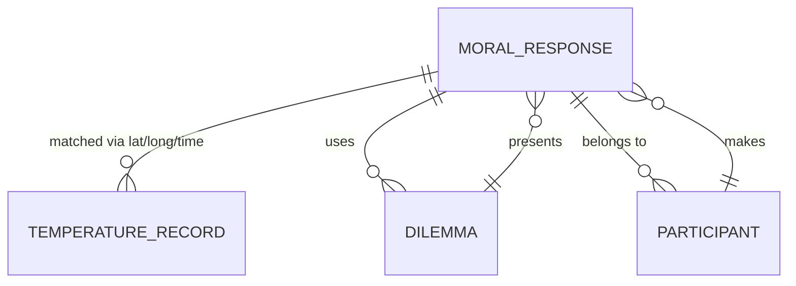

# Data Model: Ambient Temperature Influence on Moral Decision Speed

## 1. Entity Relationship Diagram (Textual)

```mermaid
erDiagram
    MORAL_RESPONSE ||--o{ TEMPERATURE_RECORD : "matched via lat/long/time"
    MORAL_RESPONSE ||--o{ DILEMMA : "uses"
    MORAL_RESPONSE ||--o{ PARTICIPANT : "belongs to"
    PARTICIPANT ||--o{ MORAL_RESPONSE : "makes"
    DILEMMA ||--o{ MORAL_RESPONSE : "presents"
```

## 2. Schema Definitions

### 2.1. Raw Moral Machine Data (`data/raw/moral_machine.csv`)

| Column | Type | Description | Constraints |
| :--- | :--- | :--- | :--- |
| `id` | INT | Unique record ID | PK |
| `participant_id` | STRING | Anonymous participant ID | |
| `country` | STRING | Country of participant | |
| `latitude` | FLOAT | Latitude (decimal) | Not Null |
| `longitude` | FLOAT | Longitude (decimal) | Not Null |
| `timestamp` | TIMESTAMP | UTC timestamp of decision | Not Null |
| `response_time_ms` | INT | Response time in milliseconds | > 0 |
| `dilemma_id` | INT | Dilemma scenario ID | |
| `choice` | STRING | "save_many" or "save_few" | |
| `age_group` | STRING | Age bracket (if available) | |
| `gender` | STRING | Gender (if available) | |

### 2.2. Temperature Record (`data/raw/era5/` or `data/raw/worldclim/`)

| Column | Type | Description | Constraints |
| :--- | :--- | :--- | :--- |
| `grid_id` | STRING | Grid cell identifier | |
| `latitude` | FLOAT | Grid center latitude | |
| `longitude` | FLOAT | Grid center longitude | |
| `temperature_c` | FLOAT | Ambient temperature (C) | |
| `time_period` | STRING | "2014-2018" (ERA5 subset) | |

### 2.3. Merged Dataset (`data/processed/merged_dataset.parquet`)

| Column | Type | Description | Source |
| :--- | :--- | :--- | :--- |
| `record_id` | STRING | Composite ID (MM_ID + GRID_ID) | Derived |
| `participant_id` | STRING | Participant ID | MM |
| `country` | STRING | Country | MM |
| `latitude` | FLOAT | Lat | MM |
| `longitude` | FLOAT | Long | MM |
| `response_time_log` | FLOAT | Log-transformed response time | Derived |
| `temperature_c` | FLOAT | Ambient temperature | ERA5 |
| `distance_km` | FLOAT | Distance to grid point | Derived |
| `dilemma_complexity` | FLOAT | Static complexity score | Derived |
| `time_of_day` | FLOAT | Hour of day (0-23) | Derived |
| `quality_flag` | STRING | "OK", "LOW_CONF", "EXCLUDED" | Derived |

## 3. Data Flow

1.  **Ingest**: Load `moral_machine.csv` and `era5` grid data (2014-2018).
2.  **Match**: Join on `latitude`/`longitude` (nearest neighbor < 100km).
3.  **Filter**: Remove records with `response_time_ms` < 100 or > 10000.
4.  **Derive**: Calculate `response_time_log`, `dilemma_complexity`, `time_of_day`.
5.  **Export**: Save to `merged_dataset.parquet`.

## 4. Constraints & Rules

-   **Temperature Range**: Must be within -40°C to +50°C.
-   **Response Time**: Must be > 0.
-   **Distance**: Must be <= 100km.
-   **PII**: No names or exact addresses stored.
