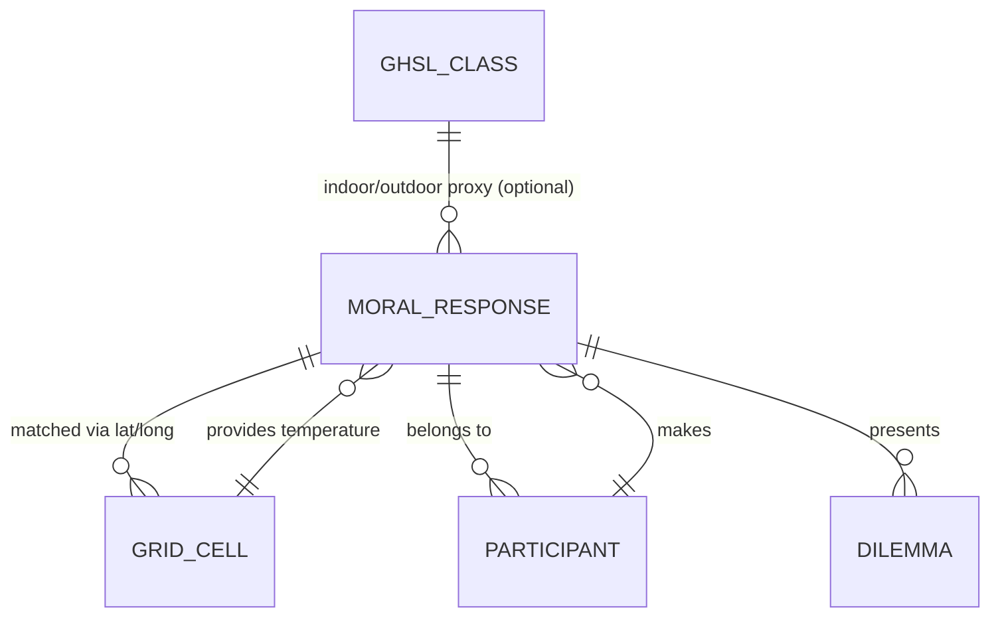

# Data Model: Ambient Temperature Influence on Moral Decision Speed (Re‑scoped)

## 1. Entity Relationship (Textual)

```mermaid
erDiagram
    MORAL_RESPONSE ||--o{ GRID_CELL : "matched via lat/long"
    MORAL_RESPONSE ||--o{ PARTICIPANT : "belongs to"
    MORAL_RESPONSE ||--o{ DILEMMA : "presents"
    PARTICIPANT ||--o{ MORAL_RESPONSE : "makes"
    GRID_CELL ||--o{ MORAL_RESPONSE : "provides temperature"
    GHSL_CLASS ||--o{ MORAL_RESPONSE : "indoor/outdoor proxy (optional)"
```

## 2. Schema Definitions

### 2.1. Raw Moral Machine Data (`data/raw/moral_machine.csv`)

| Column | Type | Description | Constraints |
|--------|------|-------------|-------------|
| `response_id` | STRING | Unique row identifier | PK |
| `participant_id` | STRING | Anonymous participant ID | |
| `country` | STRING | ISO‑country code | |
| `latitude` | FLOAT | Decimal latitude | NOT NULL |
| `longitude` | FLOAT | Decimal longitude | NOT NULL |
| `timestamp` | TIMESTAMP | UTC timestamp of decision | NOT NULL |
| `dilemma_id` | INTEGER | Scenario identifier | |
| `age_group` | STRING | Age bracket (optional) | |
| `gender` | STRING | Gender (optional) | |
| `choice` | STRING | `"utilitarian"` / `"non_utilitarian"` | NOT NULL |

> **Note**: The public Moral Machine CSV does **not** contain a response‑time field; the required latency comes from the auxiliary experiment (FR‑016).

### 2.2. Auxiliary Response‑Time Data (`data/raw/latency_study.csv`)

| Column | Type | Description |
|--------|------|-------------|
| `scenario_id` | STRING | Matches `dilemma_id` in Moral Machine data |
| `mean_response_time_ms` | INTEGER | Average latency (ms) for that scenario |

### 2.3. ERA5 Climate Grid (`data/raw/era5_subset.h5`)

| Column | Type | Description | Constraints |
|--------|------|-------------|-------------|
| `grid_id` | STRING | Unique grid cell identifier | |
| `latitude` | FLOAT | Center latitude of cell | |
| `longitude` | FLOAT | Center longitude of cell | |
| `temperature_c` | FLOAT | Hourly 2 m air temperature (°C) | -50 ≤ temp ≤ 50 |
| `timestamp` | TIMESTAMP | Hour of observation | |

*Only grid cells intersecting the convex hull of all Moral Machine locations are stored (≈ few hundred MB), respecting compute limits.*

### 2.4. GHSL Urban/Rural Classification (`data/raw/ghsl_urban_rural.parquet`)

| Column | Type | Description |
|--------|------|-------------|
| `grid_id` | STRING | Matches ERA5 grid cells |
| `urban_rural` | STRING | `"urban"` or `"rural"` |

### 2.5. Processed Merged Dataset (`data/processed/merged_dataset.parquet`)

| Column | Type | Description | Source |
|--------|------|-------------|--------|
| `record_id` | STRING | `{response_id}_{grid_id}` composite | Derived |
| `response_id` | STRING | From Moral Machine | MM |
| `participant_id` | STRING | From Moral Machine | MM |
| `country` | STRING | From Moral Machine (used as random effect) | MM |
| `latitude` | FLOAT | From Moral Machine (kept) | MM |
| `longitude` | FLOAT | From Moral Machine | MM |
| `response_time_ms` | INTEGER | **Scenario‑level average latency** from auxiliary experiment (FR‑016) | AUX |
| `log_rt` | FLOAT | `log(response_time_ms)` | Derived |
| `temperature_c` | FLOAT | Hourly temperature (ERA5) | ERA5 |
| `temperature_c_squared` | FLOAT | Square of temperature (non‑linearity test) | Derived |
| `distance_km` | FLOAT | Haversine distance to nearest ERA5 grid cell | Derived |
| `dilemma_complexity` | FLOAT | Static score (lives + difficulty mapping) | Derived |
| `difficulty_score` | INTEGER | Categorical difficulty (Low = 0, Medium = 1, High = 2) derived **independently** of latency | Derived |
| `time_of_day` | INTEGER | Hour of day (0‑23) | Derived |
| `age_group` | STRING | Optional | MM |
| `gender` | STRING | Optional | MM |
| `urban_rural_proxy` | STRING | `"urban"` or `"rural"` (optional) | GHSL |
| `quality_flag` | STRING | Data quality status. | Derived |
| `scenario_id` | STRING | Links to auxiliary latency (`dilemma_id`) | MM |
| `exclusion_flag` | BOOLEAN | True if record excluded (distance >100 km, temp out of range, etc.) | Derived |

**Key**: `response_time_ms` is a **scenario‑level** average, not an individual measurement. This limitation is documented in the research plan and the analysis is interpreted as an association.

### 2.6. Data Quality Log (`data/processed/data_quality_log.json`)

Conforms to `contracts/exclusion_log.schema.yaml`. Each entry records `response_id`, reason for exclusion (e.g., “distance > 100km”, “invalid response time”), original coordinates, and timestamp.

## 3. Data Flow

1. **Download Moral Machine CSV** (`download_moral_machine.py`).  
2. **Download ERA5 hourly subset** (`download_era5.py`).  
3. **Validate Sources** (`validate_sources.py`) – abort if ERA5 not hourly (FR‑014).  
4. **Download GHSL raster** (`download_ghsl.py`) – optional (FR‑012).  
5. **Ingest & Match** (`ingestion.py`): nearest‑grid join, compute haversine distance, flag > 100 km (FR‑009), linearly interpolate temperature gaps ≤ 2 h (FR‑019), write `merged_dataset.parquet`.  
6. **Merge Auxiliary RTs** (`preprocessing.py`): left‑join `latency_study.csv` on `scenario_id`; abort if any scenario missing latency (FR‑016).  
7. **Preprocess** (`preprocessing.py`): filter implausible RTs (<100 ms, >10 000 ms) (FR‑010), apply temperature range filter (FR‑002), compute covariates (`log_rt`, `dilemma_complexity`, **`difficulty_score`**, `time_of_day`), write final `merged_dataset.parquet`. Validate against **both** `contracts/moral_temperature.schema.yaml` **and** `contracts/merged_dataset.schema.yaml` (new validation step) (FR‑018).  
8. **Fit Primary Mixed‑Effects Model** (`modeling.py`): MixedLM on `log_rt`; output `model_results.json` (`contracts/model_output.schema.yaml`).  
9. **Robustness Analyses** (`robustness.py`): alternative temperature metric, outlier‑threshold sweeps, indoor/outdoor stratified models (or bootstrap if GHSL missing), spatial clustering of SEs, multiple‑comparison correction; produce `sensitivity_analysis.csv`.  
10. **Power Analysis** (`power_analysis.py`): simulation‑based a‑priori power analysis (α = 0.05, target = 0.8, effect size ≈ 0.2 SD); write `results/logs/power_analysis.txt`.  

All artifacts are validated against the schemas in `contracts/`.

---

