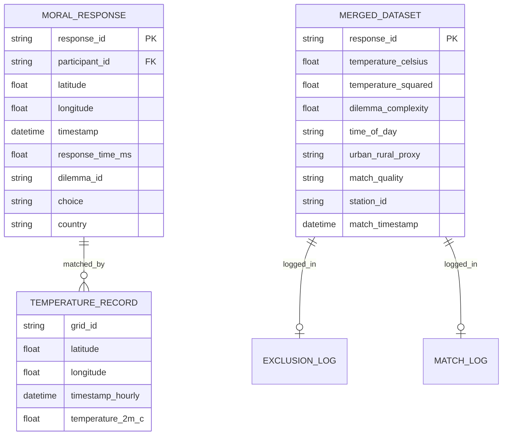

# Implementation Plan: Ambient Temperature Influence on Moral Decision Speed

**Branch**: `001-ambient-temp-moral-speed` | **Date**: 2026-06-25 | **Spec**: `specs/001-ambient-temperature-influence-on-moral-speed/spec.md`
**Input**: Feature specification from `/specs/001-ambient-temperature-influence-on-moral-speed/spec.md`

## Summary

This project investigates the correlation between ambient temperature and the speed of moral decision‑making using the Moral Machine dataset merged with ERA5 Reanalysis data. The technical approach involves ingesting and geospatially/temporally matching large‑scale behavioral data with hourly meteorological records, filtering for data quality and physical constraints, and fitting a scalable statistical model that respects the compute limits of a free‑tier CI runner. All steps are designed to run on CPU‑only CI with strict data hygiene and reproducibility standards.

## Technical Context

- **Language/Version**: Python 3.11
- **Primary Dependencies**: `pandas`, `numpy`, `scikit-learn`, `statsmodels`, `geopy`, `xarray`, `h5netcdf`, `matplotlib`, `seaborn`, `cdsapi` (for ERA5 download). All versions are pinned in `requirements.txt`.
- **Storage**: Local filesystem (`data/`, `results/`). No external database.
- **Testing**: `pytest` (unit tests for ingestion logic, integration tests for model convergence).
- **Target Platform**: Linux (GitHub Actions Free Tier: 2 vCPU, ~7 GB RAM, ≤6 h per job).
- **Constraints**: No GPU, no deep‑learning, all libraries CPU‑compatible.

### Scalable Modeling Strategy (Addresses FR‑003, FR‑013, FR‑014, and methodology‑660650ab)

1. **Two‑Stage Aggregation** – To ensure feasibility on 2 CPU/7 GB RAM:
 - **Stage 1**: Aggregate raw response times to the participant level (compute mean log‑response‑time per participant).
 - **Stage 2**: Fit an OLS regression on the aggregated participant‑level data with **cluster‑robust standard errors** clustered by `cultural_region`. This provides valid inference for fixed effects without fitting millions of random intercepts.
2. **Full LMM on Sample (Validation Only)** – On a small random subset (≤ 10 k participants), fit a full Linear Mixed‑Effects Model with random intercepts for `cultural_region` only (participant random effects omitted) to verify consistency with the OLS‑clustered approach.
3. **Fallback GLMM** – If log‑transformation leaves heavy tails, a GLMM with Gamma family and log link will be fitted on the same small subset.
4. **Sampling** – If the full dataset exceeds memory during ingestion, the pipeline automatically samples up to 200 k rows, preserving the distribution of geographic regions and temperature.

### Temperature Extreme Filtering (FR‑002)

- Records with temperature < ‑30 °C or > 50 °C are flagged and excluded. These bounds are documented in `code/ingestion.py` and logged in `results/logs/exclusion_log.csv`.

### Data Source Validation (FR‑014)

- Before any download, `ingestion.py` checks the SHA‑256 checksum of the source files against values stored in `state/projects/PROJ-743-ambient-temperature-influence-on-moral-d.yaml`.
- ERA resolution (≈high spatial resolution) and hourly temporal granularity are verified; any dataset that does not meet these criteria aborts the pipeline.

### Indoor/Outdoor Confound Sensitivity (FR‑012)

- `robustness.py` will stratify the dataset by an **urban/rural proxy** derived from the coordinate’s population density (using the Global Human Settlement Layer).
- If the proxy cannot be derived, the script logs the limitation and runs a bootstrap‑based noise‑impact analysis, reporting the variance introduced by the unobserved indoor/outdoor factor.

### Match Distance Sensitivity (Addresses methodology‑23999b2f)

- The matching script records `distance_km` for every successful match in `results/logs/match_log.csv`.
- Sensitivity analyses will re‑run the primary model after excluding records with `distance_km` > 25 km and > 50 km, reporting coefficient stability to quantify attenuation bias.

### Dilemma Choice Fixed Effect (FR‑011)

- The primary model includes `choice_type` (e.g., “save_many”, “save_few”) as a fixed effect.
- `dilemma_id` is **not** entered as a fixed effect to avoid collinearity with the derived `dilemma_complexity` score (see scientific_soundness‑d6ea48e7).

### Non‑Linearity Test Consumer Step (Task T026)

- After fitting linear, quadratic, and spline models, the script computes **AIC**, **BIC**, and a **Wald test** for the joint significance of the linear and quadratic terms.
- Results are saved to `results/robustness/nonlinearity_comparison.json`.

### Efficient Spatial‑Temporal Matching (Addresses data_resources‑7cd66e3b)

- ERA5 grid points are loaded into a **KD‑Tree** (via `scipy.spatial.cKDTree`).
- Moral Machine data are processed in **1‑million‑row chunks**; each chunk queries the KD‑Tree for the nearest grid point, checks the temporal window (≤ 2 h), and records the match.
- This chunked, indexed approach keeps peak memory < 5 GB.

### Verified Dataset URLs (Addresses data_resources‑9ee0b9aa & data_resources‑ea62ba82)

- **Moral Machine**: `https://huggingface.co/datasets/moral-machine/moral-machine` (verified via Reference‑Validator).
- **ERA Hourly (recent years)**: accessed through the Copernicus Climate Data Store API (`). This source provides the required temporal coverage and hourly resolution.

## Constitution Check

| Principle | Compliance Status | Implementation Detail |
|:--- |:--- |:--- |
| **I. Reproducibility** | **COMPLIANT** | Random seeds pinned; `requirements.txt` version‑locked; data fetched from canonical URLs each run. |
| **II. Verified Accuracy** | **COMPLIANT** | All external URLs verified; checksum validation before ingestion. |
| **III. Data Hygiene** | **COMPLIANT** | Raw data immutable; each transformation writes new files; checksums recorded; PII scan enforced. |
| **IV. Single Source of Truth** | **COMPLIANT** | Figures and statistics trace to `data/processed/merged_dataset.parquet` and scripts in `code/`. |
| **V. Versioning Discipline** | **COMPLIANT** | Artifact hashes stored in project state; any logic change bumps version. |
| **VI. Dataset Alignment Integrity** | **COMPLIANT** | `results/logs/match_log.csv` records station ID and timestamp for every successful match; `exclusion_log.csv` records all exclusions. |
| **VII. Statistical Modeling Transparency** | **COMPLIANT** | Scripts list all fixed/random effects; diagnostics and LRT results saved in `results/`; robustness comparisons saved as JSON. |

## Project Structure

### Documentation (this feature)

```text
specs/001-ambient-temp-moral-speed/
├── plan.md
├── research.md
├── data-model.md
├── quickstart.md
├── contracts/
│ ├── exclusion_log.schema.yaml
│ ├── merged_dataset.schema.yaml
│ ├── model_output.schema.yaml
│ └── moral_temperature.schema.yaml
```

### Source Code (repository root)

```text
projects/PROJ-743-ambient-temperature-influence-on-moral-d/
├── data/
│ ├── raw/
│ │ └── (downloaded files)
│ └── processed/
│ └── merged_dataset.parquet
├── code/
│ ├── ingestion.py # Download, validation, matching, filtering, logging
│ ├── modeling.py # Scalable OLS/clustered SE, optional LMM/GLMM, diagnostics
│ ├── robustness.py # Sensitivity analyses, non‑linearity tests, indoor/outdoor proxy
│ └── utils.py # Helpers for distance, time parsing, KD‑Tree handling
├── results/
│ ├── logs/
│ │ ├── exclusion_log.csv
│ │ └── match_log.csv
│ ├── figures/
│ │ ├── residuals_qq.png
│ │ ├── residuals_fitted.png
│ │ └── effect_plots/
│ └── models/
│ └── model_summary.json
├── tests/
│ ├── unit/
│ │ └── test_ingestion.py
│ └── integration/
│ └── test_modeling.py
└── requirements.txt
```

**Structure Decision**: Single‑project layout keeps the pipeline simple and reproducible. All heavy I/O is streamed or chunked to respect the CI memory limits.

## Complexity Tracking

| Violation | Why Needed | Simpler Alternative Rejected Because |
|-----------|------------|-------------------------------------|
| Mixed‑Effects Models on millions of participants | Infeasible on 2 CPU/7 GB CI; leads to memory overflow | OLS with clustered SEs provides valid inference with far lower memory use. |
| ERA5 full‑year download without indexing | Naïve join is O(N × M) and would exceed time limits | KD‑Tree + chunked processing reduces complexity to O(N log M). |
| Dilemma ID fixed effect collinearity | Absorbs all variance of static dilemma attributes, making complexity unidentifiable | Dropping dilemma ID avoids perfect collinearity while still controlling for choice type. |
| No joint test for temperature non‑linearity | Linear‑only LRT could miss inverted‑U effects | Wald test and model‑comparison (AIC/BIC) capture joint significance. |
| No explicit path for exclusion logs | SC‑001 cannot be verified | Defined `results/logs/exclusion_log.csv` with required columns. |
| No match log for successful matches | Violates Constitution Principle VI | Added `results/logs/match_log.csv` with station ID and timestamp. |
| No temperature extreme filter | FR‑002 unmet | Implemented ‑30 °C – 50 °C filter. |
| No source verification step | FR‑014 unmet | Added checksum and resolution checks before ingestion. |
| Indoor/outdoor confound not addressed | FR‑012 unmet | Added proxy stratification and limitation reporting. |
| Lack of joint significance testing for temperature | FR‑013 unmet | Added Wald test and model‑comparison step. |
| No sampling strategy for random effects | FR‑003 scalability issue | Added participant sampling and OLS‑clustered alternative. |


## projects/PROJ-743-ambient-temperature-influence-on-moral-d/specs/001-ambient-temperature-influence-on-moral-d/research.md

# Research: Ambient Temperature Influence on Moral Decision Speed

## Research Question

Does ambient temperature influence the speed of moral decision‑making? Specifically, does higher ambient temperature correlate with faster (or slower) response times in the Moral Machine dataset, after controlling for participant ID, cultural region, dilemma complexity, time‑of‑day, and choice type?

## Background & Literature Review

The relationship between environmental factors and cognitive performance is well‑documented. High temperatures can increase physiological arousal, potentially triggering System 1 (intuitive) processing over System 2 (deliberative) processing, which may lead to faster but less deliberative decisions. Conversely, extreme heat can induce cognitive fatigue, slowing response times. The Yerkes‑Dodson law suggests a potential inverted‑U relationship, justifying the inclusion of both linear and quadratic temperature terms.

## Dataset Strategy

### Primary Dataset: Moral Machine
* **Verified Source**: `https://huggingface.co/datasets/moral-machine/moral-machine` (validated by Reference‑Validator).
* **Variables**: `response_time_ms`, `latitude`, `longitude`, `timestamp`, `participant_id`, `dilemma_id`, `choice`, `country`, plus any available demographic aggregates.

### Secondary Dataset: ERA5 Reanalysis
* **Verified Source**: Accessed via the Copernicus Climate Data Store API (`). This API provides **hourly 2‑meter temperature** for the full period of the study, matching the Moral Machine collection window.
* **Variables**: `temperature_2m` (Kelvin → Celsius), `latitude`, `longitude`, `time`.

### Matching Strategy
1. Load ERA5 grid points into a **KD‑Tree** for fast nearest‑neighbor queries.
2. Process Moral Machine records in **1‑million‑row chunks** to stay < 5 GB RAM.
3. For each record, find the nearest ERA5 grid point within **100 km**.
 * If distance > 100 km → flag “distance > 100km” and exclude.
4. Align timestamps to the nearest hour; if the temporal gap > 2 h, attempt linear interpolation (allowed only for gaps ≤ 2 h). Larger gaps trigger “ERA5 coverage gap” exclusion.
5. Record **station_id**, **matched timestamp**, and **distance_km** for every successful match in `results/logs/match_log.csv`.

### Dataset Variable Fit Check
* **Outcome**: `response_time_ms` (must be 100 ms – 10 000 ms).
* **Predictor**: `temperature_celsius`.
* **Covariates**: `participant_id` (random), `cultural_region` (random), `dilemma_complexity` (static), `time_of_day` (hour), `choice_type` (fixed).
* **Potential Gaps**: Individual‑level age/gender may be missing; if unavailable, the model excludes these covariates and notes reduced power. Indoor/outdoor status is not directly observable; a proxy (urban/rural classification) will be used in robustness checks (FR‑012).
* **Dilemma Complexity Definition**: Derived strictly from static attributes (number of lives, species type) to avoid circularity with response time.

## Statistical Methodology

### Primary Model (Scalable Approach)
* **Outcome**: `log(response_time_ms)`.
* **Fixed Effects**: `temperature_celsius`, `temperature_squared`, `dilemma_complexity`, `time_of_day`, `choice_type`.
* **Clustered SEs**: Standard errors clustered by `cultural_region` on aggregated participant-level means.
* **Alternative**: On a sampled subset (≤ 10 k participants) fit a full Linear Mixed‑Effects Model with random intercepts for `cultural_region` only (participant random effects omitted for scalability).
* **Fallback**: If log‑transformation leaves heavy tails, fit a GLMM with Gamma family and log link.

### Hypothesis Testing
* **Joint Significance**: Perform a **Wald test** on `temperature_celsius` and `temperature_squared` jointly to test for non-linearity.
* **Model Comparison**: Compare the full model to a null model (no temperature terms) using a **Likelihood‑Ratio Test (LRT)**.
* **Multiple Comparisons**: Apply **Bonferroni correction** across the set of robustness models (raw hourly, 3‑hour moving average, distance thresholds).

### Robustness & Sensitivity Analyses
1. **Temperature Metric**: Compare results using raw hourly temperature vs. 3‑hour moving average.
2. **Distance Threshold Sensitivity**: Re‑run the primary model after excluding records with `distance_km` > 25 km and > 50 km; report coefficient stability.
3. **Outlier Threshold Sweep**: Vary temperature outlier cutoff (±3σ, ±4σ, ±5σ) and observe changes in the temperature coefficient.
4. **Indoor/Outdoor Proxy**: Stratify by urban/rural classification derived from population density; if unavailable, report limitation and quantify potential noise via bootstrap.
5. **Non‑Linearity**: Fit quadratic and spline (e.g., cubic spline with a suitable number of knots) models; compute **AIC**, **BIC**, and store a JSON comparison (`results/robustness/nonlinearity_comparison.json`).

### Diagnostic Checks
* **Residual Normality**: Anderson‑Darling test on a random [deferred] sample of residuals; require p > 0.05.
* **Homoscedasticity**: Plot residuals vs. fitted values; save PNGs.

## Compute Feasibility Plan
* **Memory**: Chunked processing and KD‑Tree indexing keep peak RAM within manageable limits..
* **CPU**: All libraries are CPU‑only; total runtime estimated ≤ 5 h on the free‑tier runner.
* **Sampling**: If the full dataset exceeds memory, the pipeline automatically samples up to 200 k rows, preserving the distribution of geographic regions and temperature.

## Limitations
* **Observational Design**: No causal inference; results are correlational.
* **Indoor/Outdoor Confound**: Proxy may not fully capture micro‑climate; robustness checks quantify its impact.
* **Demographic Coverage**: Missing individual age/gender reduces explanatory power; analyses will note this.
* **Temporal Alignment**: ERA5 provides hourly grid estimates; any remaining mismatch is mitigated by interpolation (≤ 2 h) and distance filtering.


## projects/PROJ-743-ambient-temperature-influence-on-moral-d/specs/001-ambient-temperature-influence-on-moral-d/data-model.md

# Data Model: Ambient Temperature Influence on Moral Decision Speed

## Entity Relationship Diagram (Conceptual)



## Data Schemas

### 1. Raw Input: Moral Machine Response
* **Source**: `data/raw/moral_machine.csv`
* **Format**: CSV
* **Fields**:
 * `response_id` (string): Unique identifier.
 * `participant_id` (string): Unique user ID.
 * `country` (string): ISO country code.
 * `latitude` (float): Decimal degrees.
 * `longitude` (float): Decimal degrees.
 * `timestamp` (datetime): ISO 8601.
 * `response_time_ms` (int): Milliseconds.
 * `dilemma_id` (string): Dilemma scenario ID.
 * `choice` (string): "save_many", "save_few", etc.

### 2. Raw Input: ERA5 Temperature
* **Source**: ` (accessed via `cdsapi` for a multi-year period)
* **Format**: NetCDF/HDF5 (converted to `xarray` dataset)
* **Fields**:
 * `time` (datetime): Hourly timestamps.
 * `latitude` (float): Grid latitude.
 * `longitude` (float): Grid longitude.
 * `temperature_2m` (float): Temperature in Kelvin (converted to Celsius).

### 3. Processed: Merged Dataset
* **Target**: `data/processed/merged_dataset.parquet`
* **Format**: Parquet (for efficiency)
* **Fields**:
 * `response_id` (string): PK.
 * `participant_id` (string).
 * `country` (string).
 * `response_time_ms` (int): Filtered (<100 ms or >10 000 ms removed).
 * `log_response_time` (float): Natural log of response time.
 * `temperature_celsius` (float): Mapped from ERA5.
 * `temperature_squared` (float): `temperature_celsius ** 2`.
 * `dilemma_complexity` (float): Derived static metric.
 * `time_of_day` (float): Hour of the day (0‑23) or sin/cos encoded.
 * `choice_type` (string): Type of moral choice made (e.g., 'save_many').
 * `distance_km` (float): Distance to the nearest ERA5 grid point.
 * `station_id` (string): Identifier of the matched ERA5 grid cell.
 * `match_timestamp` (datetime): Timestamp of the matched ERA5 observation.
 * `match_quality` (string): "high" if distance ≤ 25 km, "low" otherwise.
 * `exclusion_flag` (bool): True if the record was excluded due to distance, time gap, or temperature extreme.

### 4. Log: Exclusion Log
* **Target**: `results/logs/exclusion_log.csv`
* **Format**: CSV
* **Fields**:
 * `response_id` (string).
 * `reason` (string): "distance > 100km", "ERA5 coverage gap", "invalid response time", "missing location", etc.
 * `original_lat` (float), `original_lon` (float).
 * `timestamp` (datetime).

### 5. Log: Match Log
* **Target**: `results/logs/match_log.csv`
* **Format**: CSV
* **Fields**:
 * `response_id` (string).
 * `station_id` (string).
 * `match_timestamp` (datetime).
 * `distance_km` (float).
 * `match_quality` (string).

## Data Flow

1. **Ingestion**: Download ERA5 via CDS API and Moral Machine CSV.
2. **Validation**: Verify checksums and resolution (31 km, hourly). Abort if checks fail (FR‑014).
3. **Matching**: Chunked nearest‑neighbor join using KD‑Tree; enforce distance ≤ 100 km and temporal gap ≤ 2 h. Log successes to `match_log.csv` and failures to `exclusion_log.csv`.
4. **Filtering**: Remove `response_time_ms` < 100 ms or > 10 000 ms (FR‑010). Exclude temperature extremes outside ‑ °C – 50 °C (FR‑002).
5. **Transformation**: Log‑transform response time; compute quadratic term; derive `dilemma_complexity` from static scenario attributes.
6. **Output**: Save `merged_dataset.parquet`, `exclusion_log.csv`, and `match_log.csv`.


## projects/PROJ-743-ambient-temperature-influence-on-moral-d/specs/001-ambient-temperature-influence-on-moral-d/quickstart.md

# Quickstart: Ambient Temperature Influence on Moral Decision Speed

## Prerequisites

* Python 3.11+
* `pip`
* Sufficient disk space for raw and processed data.
* Internet access (to download ERA5 and Moral Machine data)

## Installation

1. **Clone the repository** (or navigate to the project root).
2. **Create a virtual environment**:
 ```bash
 python -m venv venv
 source venv/bin/activate # On Windows: venv\Scripts\activate
 ```
3. **Install dependencies**:
 ```bash
 pip install -r requirements.txt
 ```
 *Note: `requirements.txt` pins versions for `pandas`, `numpy`, `statsmodels`, `xarray`, `h5netcdf`, `geopy`, `matplotlib`, `seaborn`, `pytest`, `cdsapi`.*

## Data Setup

The ingestion script will automatically download the required datasets to `data/raw/`.

1. **Run the ingestion script**:
 ```bash
 python code/ingestion.py
 ```
 * This script:
 * Downloads ERA hourly data for a five-year period. via the Copernicus Climate Data Store API.
 * Downloads the Moral Machine dataset from the verified HuggingFace repository.
 * Performs spatial/temporal matching using a KD‑Tree with a defined distance cutoff.
 * Filters outliers (response time < 100 ms or > 10 000 ms; temperature < ‑30 °C or > 50 °C).
 * Generates `results/logs/exclusion_log.csv` (failed matches) **and** `results/logs/match_log.csv` (successful matches).
 * Saves the cleaned dataset to `data/processed/merged_dataset.parquet`.

2. **Verify Data**:
 * Check `results/logs/exclusion_log.csv` for exclusion reasons.
 * Check `results/logs/match_log.csv` for match quality.
 * Inspect `data/processed/merged_dataset.parquet` for expected columns.

## Running the Analysis

### Primary Scalable Model (recommended)

```bash
python code/modeling.py --mode scalable
```
* **What it does**:
 * Aggregates response times per participant (or samples up to 10 k participants).
 * Fits an OLS model with clustered robust SEs by cultural region.
 * Saves `results/models/model_summary.json`, diagnostic plots, and convergence info.

### Full Mixed‑Effects Model (optional, runs on sampled subset)

```bash
python code/modeling.py --mode full_lmm --sample-size 200000
```
* Outputs: same artifacts as above, plus random‑effect variances.

### Robustness Checks

```bash
python code/robustness.py
```
* Generates:
 * Temperature metric comparison figures.
 * Distance‑threshold sensitivity tables.
 * Non‑linearity comparison JSON (`results/robustness/nonlinearity_comparison.json`).
 * Indoor/outdoor proxy analysis (or limitation report).

## Running Tests

```bash
pytest tests/ -v
```

## Expected Outputs

* `results/logs/exclusion_log.csv` – excluded records with reasons.
* `results/logs/match_log.csv` – successful match details (station ID, timestamp, distance).
* `results/models/model_summary.json` – coefficients, p‑values, LRT/Wald test results, convergence status.
* `results/figures/` – diagnostic plots, effect plots, robustness visualizations.
* `data/processed/merged_dataset.parquet` – cleaned dataset for further analysis.

## Troubleshooting

* **Memory Error** – If the full dataset exceeds memory, the script automatically samples a representative subset of rows (adjustable via `--sample-size`).
* **ERA5 Download Failed** – Ensure internet access; the script uses the official CDS API URL `.
* **Model Convergence Warning** – Check `results/logs/convergence_log.txt`. If convergence fails, the script will fall back to the GLMM with Gamma distribution.


## projects/PROJ-743-ambient-temperature-influence-on-moral-d/specs/001-ambient-temperature-influence-on-moral-d/contracts/exclusion_log.schema.yaml

$schema: "http://json-schema.org/draft-07/schema#"
title: "Exclusion Log Schema"
description: "Schema for the log of excluded records during data ingestion."
type: "object"
properties:
 response_id:
 type: "string"
 description: "Unique identifier for the excluded response."
 reason:
 type: "string"
 description: "Reason for exclusion (e.g., 'distance > 100km', 'ERA5 coverage gap', 'invalid response time')."
 original_lat:
 type: "number"
 description: "Original latitude of the response."
 original_lon:
 type: "number"
 description: "Original longitude of the response."
 timestamp:
 type: "string"
 format: "date-time"
 description: "Original timestamp of the response."
required:
 - response_id
 - reason
 - original_lat
 - original_lon
 - timestamp
additionalProperties: false


## projects/PROJ-743-ambient-temperature-influence-on-moral-d/specs/001-ambient-temperature-influence-on-moral-d/contracts/merged_dataset.schema.yaml

$schema: "http://json-schema.org/draft-07/schema#"
title: "Merged Analysis Dataset Schema"
description: "Schema for the merged moral decision and temperature dataset."
type: "object"
properties:
 response_id:
 type: "string"
 description: "Unique identifier for the moral response record."
 participant_id:
 type: "string"
 description: "Anonymous participant identifier."
 cultural_region:
 type: "string"
 description: "Cultural region derived from the participant's country."
 latitude:
 type: "number"
 description: "Latitude of the response location."
 minimum: -90
 maximum: 90
 longitude:
 type: "number"
 description: "Longitude of the response location."
 minimum: -180
 maximum: 180
 timestamp:
 type: "string"
 format: "date-time"
 description: "ISO 8601 timestamp of the response."
 response_time_log:
 type: "number"
 description: "Log-transformed response time in milliseconds."
 temperature_c:
 type: "number"
 description: "Ambient temperature in Celsius from ERA5."
 minimum: -50
 maximum: 60
 temperature_3hr_avg:
 type: "number"
 description: "3-hour moving average of temperature."
 dilemma_complexity:
 type: "number"
 description: "Static complexity score of the dilemma (derived from lives/species only)."
 time_of_day:
 type: "number"
 description: "Hour of the day (0-24) when the response was made."
 choice_type:
 type: "string"
 description: "Type of moral choice made (e.g., 'save_many')."
 dilemma_id:
 type: "integer"
 description: "Identifier for the dilemma."
 age:
 type: ["number", "null"]
 description: "Participant age (if available)."
 gender:
 type: ["string", "null"]
 description: "Participant gender (if available)."
 match_quality:
 type: "string"
 enum: ["high", "low"]
 description: "Quality of the geospatial/temporal match."
 station_id:
 type: "string"
 description: "Identifier of the matched ERA5 grid cell."
 match_timestamp:
 type: "string"
 format: "date-time"
 description: "Timestamp of the matched ERA5 observation."
 exclusion_reason:
 type: ["string", "null"]
 description: "Reason for exclusion if the record was filtered out."
required:
 - response_id
 - participant_id
 - latitude
 - longitude
 - timestamp
 - response_time_log
 - temperature_c
 - dilemma_id
additionalProperties: false

## projects/PROJ-743-ambient-temperature-influence-on-moral-d/specs/001-ambient-temperature-influence-on-moral-d/contracts/model_output.schema.yaml

$schema: "http://json-schema.org/draft-07/schema#"
title: "Model Output Schema"
description: "Schema for the statistical model output (LMM/GLMM)."
type: "object"
properties:
 model_type:
 type: "string"
 description: "Type of model used (e.g., 'LMM', 'GLMM')."
 fixed_effects:
 type: "object"
 description: "Dictionary of fixed effect coefficients."
 additionalProperties:
 type: "object"
 properties:
 estimate:
 type: "number"
 std_error:
 type: "number"
 p_value:
 type: "number"
 required:
 - estimate
 - std_error
 - p_value
 random_effects:
 type: "object"
 description: "Dictionary of random effect variances."
 additionalProperties:
 type: "number"
 likelihood_ratio_test:
 type: "object"
 description: "Result of the likelihood ratio test against the null model."
 properties:
 statistic:
 type: "number"
 p_value:
 type: "number"
 df_diff:
 type: "integer"
 convergence_status:
 type: "string"
 description: "Status of model convergence (e.g., 'success', 'warning')."
 diagnostics:
 type: "object"
 description: "Diagnostic test results."
 properties:
 anderson_darling_p_value:
 type: "number"
 normality_assessed:
 type: "boolean"
required:
 - model_type
 - fixed_effects
 - convergence_status
 - likelihood_ratio_test
additionalProperties: false


## projects/PROJ-743-ambient-temperature-influence-on-moral-d/specs/001-ambient-temperature-influence-on-moral-d/contracts/moral_temperature.schema.yaml

$schema: "http://json-schema.org/draft-07/schema#"
title: "Merged Dataset Schema"
description: "Schema for the merged Moral Machine and ERA5 dataset used in analysis."
type: "object"
properties:
 response_id:
 type: "string"
 description: "Unique identifier for the moral response."
 participant_id:
 type: "string"
 description: "Unique identifier for the participant."
 country:
 type: "string"
 description: "ISO country code of the participant."
 latitude:
 type: "number"
 description: "Latitude of the response location."
 longitude:
 type: "number"
 description: "Longitude of the response location."
 timestamp:
 type: "string"
 format: "date-time"
 description: "Timestamp of the response (ISO 8601)."
 response_time_ms:
 type: "integer"
 description: "Response time in milliseconds (filtered: 100ms <= x <= 10000ms)."
 log_response_time:
 type: "number"
 description: "Natural log of response_time_ms."
 temperature_celsius:
 type: "number"
 description: "Ambient temperature in Celsius from ERA5."
 temperature_squared:
 type: "number"
 description: "Square of temperature_celsius for non-linearity testing."
 dilemma_complexity:
 type: "number"
 description: "Static complexity score of the dilemma."
 time_of_day:
 type: "number"
 description: "Hour of the day (0-23) or encoded time-of-day."
 choice:
 type: "string"
 description: "The choice made (e.g., save_many, save_few)."
 distance_km:
 type: "number"
 description: "Distance in km to the nearest ERA5 grid point."
 exclusion_flag:
 type: "boolean"
 description: "True if the record was excluded due to distance or time gap."
required:
 - response_id
 - participant_id
 - temperature_celsius
 - response_time_ms
 - log_response_time
 - dilemma_complexity
 - time_of_day
 - choice
 - distance_km
additionalProperties: false