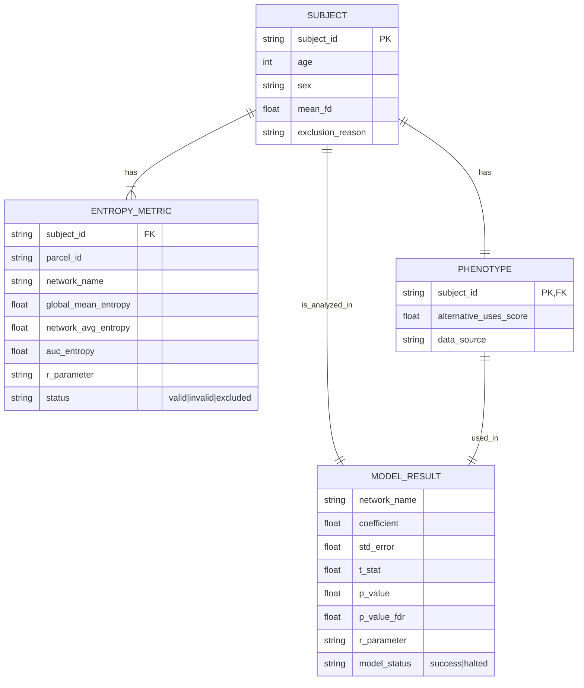

# Data Model: Linking Resting‑State fMRI Entropy to Creative Problem Solving

## 1. Entity Relationship Diagram (Conceptual)

## 2. Data Schemas

### 2.1 Input: Phenotype File (`Creative_Problem_Solving.csv`)
*Format: CSV*
*Required Columns:* `subject_id`, `alternative_uses_score`, `age`, `sex`.

### 2.2 Input: fMRI Volumes
*Format: NIfTI (.nii.gz)*
*Structure:* 4-D volumes (x, y, z, time) pre-processed by HCP pipeline.

### 2.3 Intermediate: Entropy Metrics (`entropy_metrics.csv`)
*Format: CSV*
*Columns:*
- `subject_id`: String (Subject identifier)
- `parcel_id`: String (e.g., "1001", "1002")
- `network_name`: String (e.g., "DMN", "FPN", "CON", "Global")
- `global_mean_entropy`: Float (Mean entropy across all parcels)
- `network_avg_entropy`: Float (Average entropy for the specific network)
- `auc_entropy`: Float (Area Under the Curve of entropy vs. scale)
- `r_parameter`: Float (Tolerance parameter used, e.g., 0.2)
- `scale_range`: String (e.g., "1-20")
- `status`: String ("valid", "invalid", "excluded")
- `invalid_parcels_pct`: Float (Percentage of parcels with NaN)

### 2.4 Intermediate: Model Results (`model_results.csv`)
*Format: CSV*
*Columns:*
- `network_name`: String
- `predictor`: String ("entropy")
- `coefficient`: Float
- `std_error`: Float
- `t_stat`: Float
- `p_value`: Float
- `p_value_fdr`: Float
- `r_parameter`: Float
- `covariates`: String (JSON string of covariate coefficients)
- `n_subjects`: Integer
- `runtime_seconds`: Float
- `peak_ram_mb`: Float

### 2.5 Logs
*   `motion_exclusions.log`: Subject ID, Reason (FD > 0.2mm), FD Value.
*   `missing_data.log`: Subject ID, Reason (< 100 frames or missing phenotype).
*   `sensitivity_log.json`: Detailed stats for each `r` sweep iteration.

## 3. Data Flow

1.  **Ingestion**: Load raw NIfTI and Phenotype CSV.
2.  **Scrubbing**: Compute Mean FD. Exclude subjects with FD > 0.2mm or < 100 frames. Log to `missing_data.log`.
3.  **Entropy Calculation**:
    *   Loop over valid subjects.
    *   Loop over parcels (360).
    *   Compute MSE for scales 1-20.
    *   Aggregate AUC.
    *   Check >10% invalid parcels -> Flag for manual review.
    *   Output `entropy_metrics.csv`.
4.  **Merging**: Join `entropy_metrics.csv` with Phenotype data.
5.  **Modeling**:
    *   Fit OLS for Global and each Network.
    *   Compute Robust SEs.
    *   Apply BH FDR.
    *   Output `model_results.csv`.
6.  **Sensitivity**: Repeat steps 3-5 for `r` ∈ {0.15, 0.20, 0.25}.
7.  **Validation**: Check N < 30. Halt if true.
