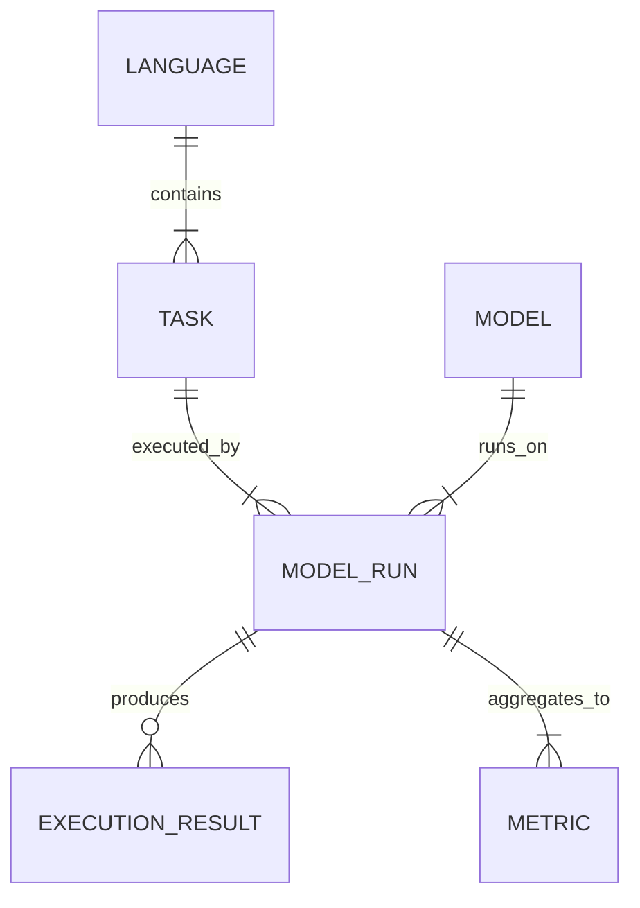

# Data Model: Multi-LCB

## Overview
This document defines the data schemas for the Multi-LCB benchmarking pipeline. All data flows from `raw` (downloaded) to `processed` (cleaned/filtered) to `results` (aggregated metrics).

## Entity Relationship Diagram (Conceptual)

## Core Entities

### 1. Task
A single code generation problem.
- **ID**: `task_id` (string, unique)
- **Language**: `language` (string, e.g., "python", "cpp")
- **Problem**: `problem_statement` (text)
- **Test Cases**: `test_cases` (list of {input, output})
- **Reference**: `reference_solution` (text)
- **Metadata**: `release_date` (ISO 8601, nullable)

### 2. ModelRun
A specific execution attempt by a model.
- **ID**: `run_id` (string, UUID)
- **Task ID**: `task_id` (FK)
- **Model**: `model_name` (string)
- **Temperature**: `temperature` (float)
- **Seed**: `seed` (int)
- **Generated Code**: `generated_code` (text, optional in results)
- **Status**: `status` (enum: "pass", "fail", "timeout", "runtime_error")
- **Duration**: `duration_ms` (int)
- **Pass**: `pass` (boolean, derived from status)

### 3. PerformanceMetric
Aggregated statistics.
- **Model**: `model_name`
- **Language**: `language`
- **Temperature**: `temperature`
- **Pass@1**: `pass_1` (float)
- **Pass@5**: `pass_5` (float)
- **Pass@10**: `pass_10` (float)
- **Mean**: `mean_pass` (float)
- **Std**: `std_pass` (float)
- **N_Trials**: `n_trials` (int)

### 4. StatisticalResult
Output of the analysis pipeline.
- **Metric**: `metric_name` (e.g., "pearson_corr", "glmm_interaction", "loo_pca")
- **Value**: `value` (float)
- **P_Value**: `p_value` (float)
- **Bonferroni_Corrected**: `p_value_bonf` (float)
- **Significant**: `is_significant` (bool)
- **Context**: `context` (string, e.g., "Python vs LOO_PC1")
- **LOO_PC1_Score**: `loo_pca_score` (float, optional)
- **Residual**: `residual` (float, optional)
- **Threshold_Multiplier**: `threshold_multiplier` (float, optional)
- **Pca_Valid**: `pca_valid` (bool, optional)
- **Language_Count**: `language_count` (int, optional)
- **Intra_Model_Correlation**: `intra_model_corr` (float, optional)

## File Formats

### Input: Raw Dataset (Parquet)
- Source: HuggingFace.
- Columns: `task_id`, `language`, `problem`, `test_cases`, `solution`, `date`.

### Output: Execution Log (JSON)
- Structure: List of `ModelRun` objects.
- Location: `data/artifacts/execution_log.json`

### Output: Statistical Results (JSON)
- Structure: List of `StatisticalResult` objects.
- Location: `data/artifacts/statistical_results.json`

## Data Hygiene Rules
1. **Immutability**: Raw data in `data/raw/` is never modified.
2. **Checksums**: SHA-256 hash recorded for every file in `data/raw/`.
3. **Derived Data**: All processed files in `data/processed/` must include a `source_hash` field referencing the raw file.
4. **PII**: No Personally Identifiable Information allowed in code or metadata.