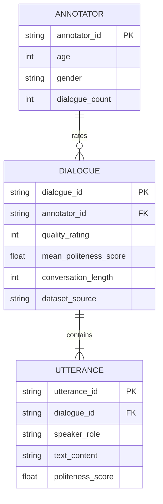

# Data Model: The Influence of Chatbot Politeness on User-Perceived Quality

## Entity Relationship Diagram

## Schema Definitions

### 1. Raw Dialogue (Source)
*Derived from EmpatheticDialogues / HCI_P2*

| Field | Type | Description | Constraints |
|-------|------|-------------|-------------|
| `dialogue_id` | String | Unique identifier | PK |
| `annotator_id` | String | Anonymized annotator ID | FK to Annotator |
| `utterances` | List[Object] | Sequence of messages | Non-empty |
| `quality_rating` | Integer | User rating (1-5) | 1 ≤ x ≤ 5 |
| `metadata` | Object | Demographics, context | Optional (age, gender) |

### 2. Processed Dialogue (Analysis Unit)
*Output of `download_and_score.py`*

| Field | Type | Description | Constraints |
|-------|------|-------------|-------------|
| `dialogue_id` | String | Unique identifier | PK |
| `annotator_id` | String | Anonymized annotator ID | FK |
| `quality_rating` | Integer | Outcome variable | 1 ≤ x ≤ 5 |
| `mean_politeness_score` | Float | Z-scored mean politeness (within-dataset) | Normalized |
| `conversation_length` | Integer | Word count of bot utterances | ≥ 0 |
| `dataset_source` | String | Source dataset name | Enum: "EmpatheticDialogues", "HCI_P2" |
| `utterance_count` | Integer | Number of bot utterances | ≥ 1 |

### 3. Model Output (Results)
*Output of `analysis_clmm.py`*

| Field | Type | Description |
|-------|------|-------------|
| `term` | String | Predictor name |
| `estimate` | Float | Coefficient estimate |
| `std_error` | Float | Standard error |
| `p_value` | Float | Raw p-value |
| `p_value_adj` | Float | BH-corrected p-value |
| `confidence_interval_low` | Float | 95% CI Lower |
| `confidence_interval_high` | Float | 95% CI Upper |

## Data Processing Pipeline

1. **Ingestion**: Stream raw Parquet/CSV from verified URLs.
2. **Filtering**:
   - Exclude dialogues with missing `quality_rating`.
   - Exclude dialogues with no chatbot utterances.
   - Log excluded counts.
3. **Feature Engineering**:
   - **Politeness**: Run `jfiedler/politeness-bert` on each bot utterance.
   - **Aggregation**: Compute mean per dialogue.
   - **Standardization**: Z-score `mean_politeness_score` **within each dataset** (EmpatheticDialogues, HCI_P2) separately to avoid distribution artifacts.
   - **Length**: Count words in bot utterances.
4. **Merging**: Join with user demographics (if available) for subgroup analysis.
5. **Validation**: Run schema validator against `contracts/dataset.schema.yaml`.

## Constraints & Assumptions

- **Missing Data**: Dialogues with missing demographics are retained for main analysis but excluded from subgroup analysis.
- **Collinearity**: If `politeness_score` and `conversation_length` are highly correlated (VIF > 5), the model will report the joint effect and note the hypothesis is untestable.
- **Outliers**: No automatic outlier removal; robustness checks will assess sensitivity.
