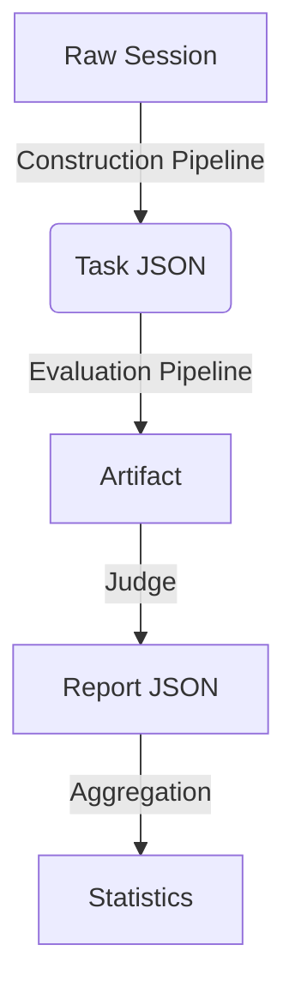

# Data Model: EnterpriseClawBench Reproduction & Validation

## 1. Overview

This document defines the data structures used by the reproduction pipeline. It covers the **Task Pack** (output of construction) and the **Evaluation Report** (output of evaluation). The models are derived from the `spec.md` acceptance criteria and the `EnterpriseClawBench` paper protocol.

## 2. Core Entities

### 2.1 Task
A single reproducible task derived from a raw session.
- **Source**: `construction` pipeline output.
- **Purpose**: Input for the evaluation agent and the judge.
- **Required Fields (SC-002)**:
  - `prompt`: The instruction given to the agent.
  - `role_class`: The high-level role (e.g., "Analyst").
  - `skill_subclass`: The specific skill (e.g., "Data Cleaning").
  - `hard_rules`: List of constraints the agent must follow.
  - `semantic_rubric`: The evaluation criteria for the agent's output.

### 2.2 Artifact
The output generated by an agent in response to a Task.
- **Source**: External Agent (simulated in `example_runs`).
- **Purpose**: Input for the Judge.
- **Fields**:
  - `file_path`: Path to the generated file.
  - `content_type`: MIME type (e.g., `text/html`).
  - `size_bytes`: File size (validated against 500MB limit).

### 2.3 Evaluation Report
The aggregated result of the Judge scoring an Artifact.
- **Source**: `evaluation` pipeline output.
- **Purpose**: Validation of the benchmark protocol.
- **Fields**:
  - `artifact_delivery`: Score (0-1 or 0/1).
  - `visual_quality`: Score.
  - `cost`: Estimated cost.
  - `runtime`: Estimated time.
  - `skill_transfer`: Score.
  - `total_score`: Weighted aggregate.

## 3. Data Flow

## 4. Schema Definitions

The schemas below define the strict validation rules for the implementation.
