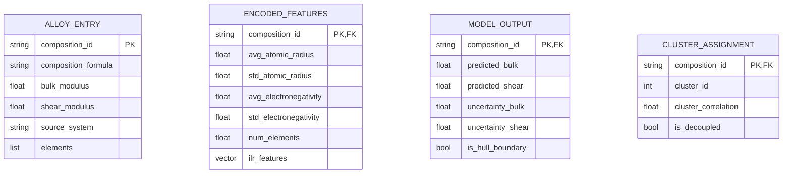

# Data Model: Multi-Property Trade-Offs in Alloy Design

## 1. Entity Relationship Diagram (Conceptual)

## 2. Data Dictionary

### 2.1 Raw Input: `data/raw/oqmd_targets.csv`
| Column | Type | Description |
|--------|------|-------------|
| `composition` | string | Chemical formula (e.g., "Fe0.5Ni0.5") |
| `bulk_modulus` | float | Bulk modulus in GPa |
| `shear_modulus` | float | Shear modulus in GPa |
| `elements` | string | Comma-separated list of elements |

### 2.2 Processed: `data/processed/encoded_alloys.csv`
| Column | Type | Description |
|--------|------|-------------|
| `composition_id` | string | Unique hash of composition |
| `composition` | string | Original formula |
| `bulk_modulus` | float | Target 1 |
| `shear_modulus` | float | Target 2 |
| `avg_atomic_radius` | float | Weighted mean of atomic radii |
| `std_atomic_radius` | float | Weighted std of atomic radii |
| `avg_electronegativity` | float | Weighted mean of electronegativities |
| `std_electronegativity` | float | Weighted std of electronegativities |
| `num_elements` | int | Count of unique elements |
| `ilr_1` ... `ilr_N` | float | Isometric log-ratio transformed features |

### 2.3 Model Output: `data/processed/model_validation_report.json`
| Key | Type | Description |
|-----|------|-------------|
| `composition_id` | string | ID of the point |
| `predicted_bulk` | float | Model prediction |
| `predicted_shear` | float | Model prediction |
| `uncertainty_variance` | float | Variance from LOSO-CV predictions |
| `hull_distance` | float | Distance to convex hull boundary |
| `is_boundary` | boolean | True if distance < 5% of hull radius |

### 2.4 LOSO Test Points: `data/processed/loso_test_points.csv`
| Column | Type | Description |
|--------|------|-------------|
| `composition_id` | string | ID of the point |
| `system` | string | Chemical system name |
| `actual_bulk` | float | True value |
| `predicted_bulk` | float | Model prediction |
| `residual` | float | Difference |

### 2.5 Sensitivity Output: `data/processed/sensitivity_analysis.csv`
| Column | Type | Description |
|--------|------|-------------|
| `threshold` | float | Correlation threshold (0.1 to 0.9) |
| `robustness_score` | float | Stability metric (0.0 to 1.0) |

## 3. Data Flow

1. **Ingestion**: `oqmd_targets.csv` -> Filtered -> `encoded_alloys.csv`
2. **Training**: `encoded_alloys.csv` -> Split (LOSO) -> Model Weights + `loso_test_points.csv`
3. **Optimization**: Model Weights + `encoded_alloys.csv` (Hull) -> `pareto_frontier.csv`
4. **Analysis**: `encoded_alloys.csv` (ilr) -> LCE -> `sensitivity_analysis.csv`
5. **Versioning**: All `data/processed` files -> Hash -> `state/` YAML