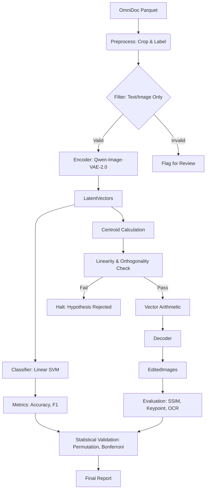

# Data Model: llmXive follow-up: extending "Qwen-Image-VAE-2.0 Technical Report"

## 1. Overview

This document defines the data structures used in the analysis pipeline. All data flows from the raw OmniDoc dataset through preprocessing to latent representations and final metrics.

## 2. Entity Definitions

### 2.1. RegionAnnotation
Metadata defining a specific region of a document image.
- **Fields**:
    - `image_id`: Unique identifier for the source image.
    - `bbox`: List of 4 integers `[x_min, y_min, x_max, y_max]`.
    - `modality`: String, one of `["text", "image", "mixed"]`.
    - `crop_path`: Relative path to the cropped image file (if pre-cropped).

### 2.2. LatentVector
The high-dimensional representation of an image region.
- **Fields**:
    - `vector_id`: Unique identifier.
    - `source_region`: Reference to `RegionAnnotation`.
    - `modality_label`: Ground truth label (`text` or `image`) used for evaluation only.
    - `latent_data`: Array of floats (dimension depends on VAE configuration).
    - `encoding_time_ms`: Time taken to encode.

### 2.3. Centroid
The mean vector of a cluster of latent vectors.
- **Fields**:
    - `modality`: `text` or `image`.
    - `mean_vector`: Array of floats.
    - `sample_count`: Number of vectors averaged.
    - `contamination_ratio`: Float (0.0-1.0) measuring layout variance in the centroid.
    - `orthogonality_angle`: Float (degrees) between centroid and layout subspace.

### 2.4. EditedImage
An image generated by decoding a modified latent vector.
- **Fields**:
    - `image_id`: Source image ID.
    - `operation`: Description of the arithmetic performed.
    - `image_path`: Path to the generated image.
    - `baseline_path`: Path to the baseline reconstruction.

### 2.5. AnalysisMetrics
Aggregated results of the analysis.
- **Fields**:
    - `metric_name`: e.g., "accuracy", "ssim", "keypoint_score".
    - `value`: Float.
    - `p_value`: Float (unadjusted).
    - `p_value_adjusted`: Float (Bonferroni corrected).
    - `threshold`: Decision threshold used.
    - `is_significant`: Boolean.
    - `family`: String (e.g., "separability", "fidelity") indicating the correction family.

## 3. Data Flow Diagram

## 4. Constraints & Invariants

- **LatentVector**: `latent_data` dimension must match the VAE output dimension.
- **RegionAnnotation**: `bbox` coordinates must be within the bounds of the source image.
- **AnalysisMetrics**: `p_value_adjusted` must be $\le 1.0$ and $\ge 0.0$.
- **Data Hygiene**: No file in `data/processed` or `data/interim` may be modified in place. All transformations produce new files.
- **LinearityMetrics**: If `LinearityMetrics.passed` is false, the editing pipeline must **HALT**.
- **CentroidContamination**: If `contamination_ratio` > 0.15 or `orthogonality_angle` < 85, the editing pipeline must **HALT**.