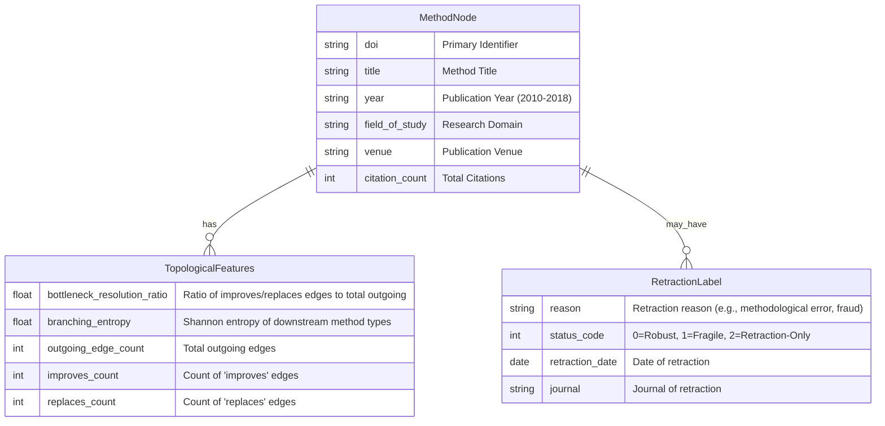

# Data Model: Extending Intern-Atlas

This document defines the schema for the core entities used in the llmXive follow-up study: `MethodNode`, `RetractionLabel`, and `TopologicalFeatures`.

## Entity Relationship Diagram

## Entity Definitions

### MethodNode
Represents a scientific method or paper within the Intern-Atlas graph.

| Field | Type | Description | Constraints |
|:--- |:--- |:--- |:--- |
| `doi` | string | Digital Object Identifier | Unique, non-null |
| `title` | string | Title of the method/paper | Non-null |
| `year` | int | Publication year | Range: 2010-2018 |
| `field_of_study` | string | Research domain | Non-null |
| `venue` | string | Publication venue (journal/conference) | Non-null |
| `citation_count` | int | Total number of citations | >= 0 |

### TopologicalFeatures
Derived metrics calculated from the graph structure surrounding a `MethodNode`.

| Field | Type | Description | Constraints |
|:--- |:--- |:--- |:--- |
| `doi` | string | Foreign Key to MethodNode | Unique per node |
| `bottleneck_resolution_ratio` | float | (improves + replaces edges) / total outgoing edges | Range: [0.0, 1.0] |
| `branching_entropy` | float | Shannon entropy of downstream method types | >= 0.0 |
| `outgoing_edge_count` | int | Total outgoing edges in the graph | >= 0 |
| `improves_count` | int | Count of outgoing 'improves' edges | >= 0 |
| `replaces_count` | int | Count of outgoing 'replaces' edges | >= 0 |

### RetractionLabel
Ground truth label indicating the robustness status of a method, mapped from retraction databases.

| Field | Type | Description | Constraints |
|:--- |:--- |:--- |:--- |
| `doi` | string | Foreign Key to MethodNode | Unique per node (if exists) |
| `reason` | string | Specific reason for retraction | Matches constants (e.g., "methodological error") |
| `status_code` | int | Categorical label | 0=Robust, 1=Fragile, 2=Retraction-Only |
| `retraction_date` | date | Date the retraction was issued | Optional |
| `journal` | string | Journal where retraction appeared | Optional |

## JSON Schema Reference

The formal JSON Schema for these entities is defined in `data-model.schema.json`.
