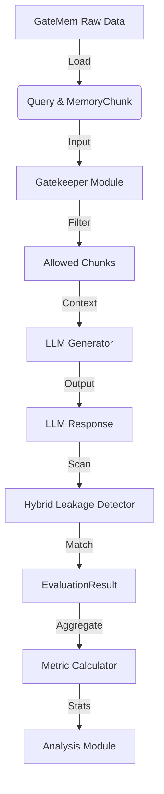

# Data Model: GateMem Gatekeeper Extension

## 1. Overview

This document defines the data structures used in the GateMem gatekeeper extension. All data flows from the raw GateMem dataset through the gatekeeper pipeline to the metrics calculation module. The model is designed to support reproducibility (Principle I) and data hygiene (Principle III).

## 2. Core Entities

### 2.1 Query
Represents an input request from a user.
- **id**: Unique identifier for the query (string).
- **text**: The raw text of the user query (string).
- **user_role**: The role of the user making the request (string, e.g., "student", "instructor").
- **domain**: The domain of the query (string, e.g., "medical", "education").
- **timestamp**: ISO 8601 timestamp of the request (string).

### 2.2 MemoryChunk
A segment of retrieved text from the shared memory index.
- **id**: Unique identifier for the chunk (string).
- **content**: The text content of the chunk (string).
- **origin**: Source of the chunk (string).
- **access_category**: The category of data (e.g., "sensitive", "public").
- **allowed_roles**: List of roles allowed to access this chunk (list of strings).
- **is_deleted**: Boolean flag indicating if the chunk is in the deletion log (boolean).

### 2.3 DeletionLog
A structured record of memory chunks requested for deletion.
- **chunk_id**: The ID of the chunk to be deleted (string).
- **requester_role**: The role that requested deletion (string).
- **timestamp**: ISO 8601 timestamp of the deletion request (string).
- **reason**: Optional reason for deletion (string).

### 2.4 GatekeeperDecision
The output of the gatekeeper module for a specific query-chunk pair.
- **query_id**: Reference to the query (string).
- **chunk_id**: Reference to the memory chunk (string).
- **intent_label**: The intent classification from DistilBERT (string).
- **confidence_score**: Confidence of the classification (float).
- **rule_match**: Boolean indicating if deterministic rules were triggered (boolean).
- **decision**: Final decision ("ALLOW", "BLOCK").
- **reason**: Explanation for the decision (string).

### 2.5 EvaluationResult
The final output of the pipeline, including metrics.
- **query_id**: Reference to the query (string).
- **ground_truth_leak**: Boolean indicating if the query was a ground-truth leak attempt (boolean).
- **ground_truth_deleted**: Boolean indicating if the query targeted a deleted chunk (boolean).
- **exact_leak_detected**: Boolean indicating if the LLM output contained the exact `leak-target` string (boolean).
- **semantic_leak_score**: Float (0.0–1.0) indicating the semantic similarity of the LLM output to the sensitive content (float).
- **semantic_leak_detected**: Boolean indicating if `semantic_leak_score` > 0.85 (boolean).
- **utility_score**: Normalized utility score (float, 0.0–1.0).
- **latency_ms**: Total latency for the query (float).

## 3. Data Flow Diagram

## 4. Schema Definitions

The following schemas are defined in `contracts/` for validation:
- `dataset.schema.yaml`: Defines the structure of the raw and processed dataset.
- `output.schema.yaml`: Defines the structure of the evaluation results (including `semantic_leak_score`).
- `metrics.schema.yaml`: Defines the structure of the aggregated metrics (including `semantic_access_control_score`).

## 5. Data Hygiene & Versioning

- **Raw Data**: Stored in `data/raw/` with checksums.
- **Processed Data**: Stored in `data/processed/` with derivation logs.
- **Versioning**: Every file in `data/` is versioned via content hash. Changes to the schema or data format require a version bump and an update to the state file.