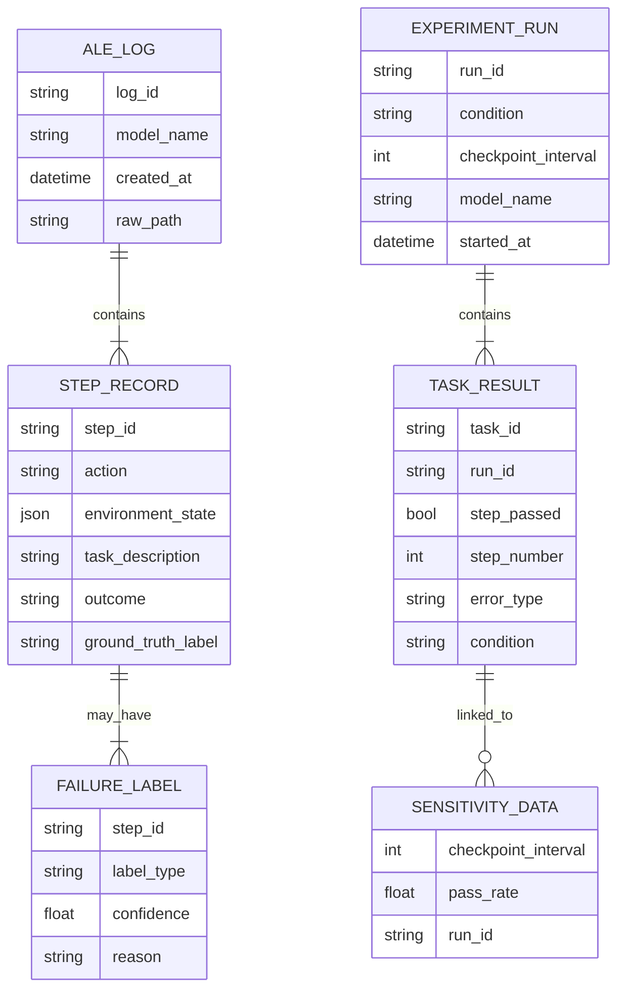

# Data Model: llmXive follow-up: extending "Agents' Last Exam"

## Overview

This document defines the data structures used for:
1.  **Raw Input**: Synthetic ALE execution traces (JSONL).
2.  **Classified Output**: Failure labels and reconstruction accuracy.
3.  **Experiment Results**: Step-level success, p-values, sensitivity analysis.

All data is stored in `data/` with checksums. Raw data is immutable; processed data is derived.

## Entity-Relationship Diagram

## Data Schemas

### 1. ALE Log (Raw - Synthetic)

Source: `code/data/generator.py` (Local).  
Format: JSONL (one record per step).  
Fields:
- `step_id`: Unique identifier for the step.
- `action`: The agent's action string.
- `environment_state`: JSON object representing the file system/variables at that step.
- `task_description`: Static task goal.
- `outcome`: "success", "failure", or "timeout".
- `ground_truth_label`: "State Persistence Error", "Reasoning Deficit", or "None".

### 2. Classified Trace (Processed)

Derived from ALE logs via `code/classification/heuristics.py` and `semantic_classifier.py`.  
Format: JSON (one record per trace).  
Fields:
- `trace_id`: Unique identifier for the trace.
- `total_steps`: Number of steps in the trace.
- `failures`: List of `FAILURE_LABEL` objects.
- `reconstruction_accuracy`: Float (0-1) for the trace (if validated against human annotation).

### 3. Experiment Result (Processed)

Derived from `code/intervention/runner.py`.  
Format: JSON (one record per **step**).  
Fields:
- `task_id`: Unique identifier for the task.
- `run_id`: Unique identifier for the experiment run.
- `step_number`: Integer (step index).
- `step_passed`: Boolean.
- `checkpoint_interval`: Integer (N).
- `memory_usage_mb`: Float.
- `condition`: "baseline" or "intervention".

### 4. Sensitivity Analysis (Aggregated)

Derived from `code/analysis/sensitivity.py`.  
Format: JSON (one record per checkpoint interval).  
Fields:
- `checkpoint_interval`: Integer (1, 3, or 5).
- `pass_rate`: Float.
- `total_steps`: Integer.
- `p_value`: Float (vs. baseline).

## Data Flow

1.  **Ingestion**: Run `code/data/generator.py` → `data/raw/synthetic_ale.jsonl`.
2.  **Parsing**: `code/classification/parser.py` reads raw logs → `data/processed/classified_traces.json`.
3.  **Validation**: `code/classification/validator.py` checks reconstruction accuracy on golden set.
4.  **Experiment**: `code/intervention/runner.py` runs baseline/intervention → `data/processed/step_results.json`.
5.  **Analysis**: `code/analysis/stats.py` and `sensitivity.py` generate aggregated metrics → `data/processed/sensitivity_analysis.json`.
6.  **Reporting**: `docs/report.md` consumes aggregated metrics.