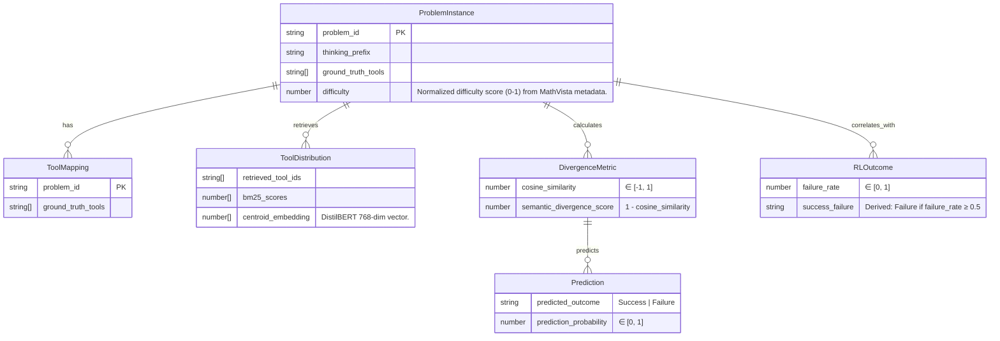

# Data Model: llmXive Follow-up: Semantic Divergence Diagnostic for Agentic Reasoning

## 1. Entity Relationship Diagram (Conceptual)

## 2. Data Flow

1. **Ingestion**: `ProblemInstance` loaded from MathVista (Parquet).  
2. **Tool Mapping**: `ToolMapping` CSV (checksum‑verified) supplies `ground_truth_tools`. **If missing**, a deterministic synthetic mapping based on `difficulty` is generated (see Research.md).  
3. **Retrieval**: `ToolDistribution` generated via BM25 over `tool_descriptions.csv`. **If missing**, a synthetic tool corpus is generated (see Research.md).  
4. **Embedding**: `thinking_prefix` and each retrieved tool description → DistilBERT vectors.  
5. **Metric Calculation**: `DivergenceMetric` derived from vectors.  
6. **Enrichment**: `RLOutcome` joined from external `rl_failure_rates.csv`. **If missing**, synthetic failure rates are generated independently from the tool mapping (see Research.md).  
7. **Analysis**: Logistic regression → `Prediction`. (K‑Means clustering is used only for risk‑group labeling, not as a predictor.)

All transformations produce new files; original raw files remain unchanged, satisfying Constitution Principle III.

## 3. Schema Definitions (refer to contracts)

- `ProblemInstance` → `contracts/dataset.schema.yaml` (includes optional `difficulty`).  
- `ToolDistribution`, `DivergenceMetric`, `RLOutcome`, `Prediction` → `contracts/output.schema.yaml`.
