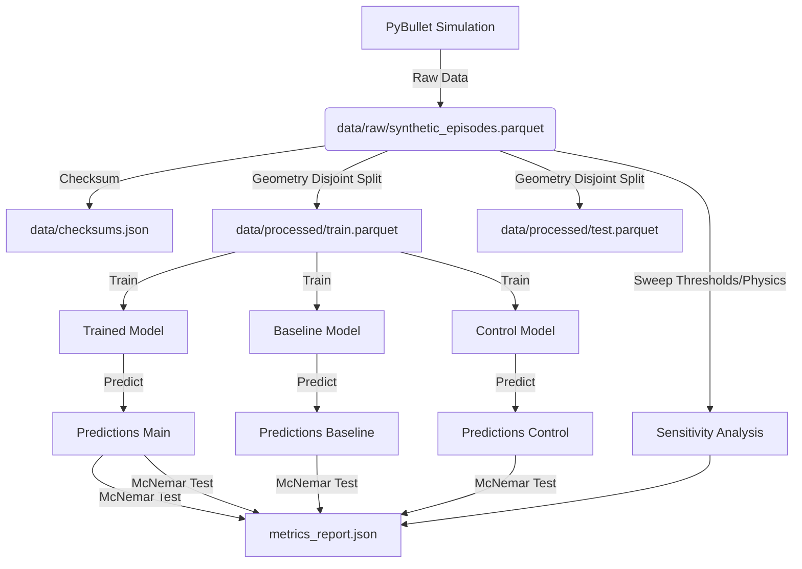

# Data Model: llmXive follow-up: extending "Translation as a Bridging Action"

## 1. Entity-Relationship Overview

The data model consists of three primary entities: `ManipulationEpisode`, `StabilityMetric`, and `PredictionResult`.

1.  **ManipulationEpisode**: The core unit of data. Contains the raw input (translation sequence, object bounds) and the derived ground truth (stability label).
2.  **StabilityMetric**: Derived values (tipping angle, slippage) used to compute the label. These are intermediate calculations, not stored in the final model-ready dataset, but used during generation.
3.  **PredictionResult**: The output of the evaluation phase, containing model predictions and comparison metrics.

## 2. Dataset Schema

### Raw Dataset: `synthetic_episodes.parquet`

This file contains the raw output of the PyBullet simulation. It is **immutable** once generated.

| Column Name | Type | Description | Constraints |
|-------------|------|-------------|-------------|
| `episode_id` | int64 | Unique identifier for the episode. | Primary Key |
| `geometry_id` | string | Unique identifier for the object geometry. | Required for disjoint split |
| `translation_sequence` | list[float] | Flattened sequence of relative wrist translation vectors (x, y, z). | Length = `seq_len * 3` |
| `initial_bounds` | list[float] | Initial object bounding box coordinates [min_x, min_y, min_z, max_x, max_y, max_z]. | Length = 6 |
| `tipping_angle` | float32 | Max tipping angle observed during the episode. | Used for labeling |
| `slippage_distance` | float32 | Max slippage distance observed. | Used for labeling |
| `stability_label` | int8 | Binary label: 1 (Success), 0 (Failure). | Derived from thresholds |
| `timestamp` | string | ISO8601 timestamp of generation. | For reproducibility |
| `mass_distribution` | float32 | Mass distribution factor (for sensitivity analysis). | Used for sensitivity |
| `friction_coeff` | float32 | Friction coefficient (for sensitivity analysis). | Used for sensitivity |

**Forbidden Columns**: `rotation_quaternion`, `joint_torque`, `force_sensor`, `angular_velocity`.

### Processed Dataset: `train.parquet`, `test.parquet`

These files are derived from the raw dataset via a **geometry-disjoint split**.

| Column Name | Type | Description |
|-------------|------|-------------|
| `episode_id` | int64 | Unique identifier (from raw). |
| `geometry_id` | string | Unique identifier (from raw). |
| `translation_sequence` | list[float] | Input feature. |
| `initial_bounds` | list[float] | Input feature (for baseline). |
| `stability_label` | int8 | Ground truth label. |

*Note: `tipping_angle`, `slippage_distance`, `mass_distribution`, and `friction_coeff` are removed from processed files as they are not inputs to the model.*

## 3. Model Artifacts

### Trained Model: `trained_model.pt`

A PyTorch state dictionary containing the weights of the lightweight Transformer.

*   **Architecture**: 4-layer Transformer Encoder.
*   **Input Dim**: 3 (translation vector).
*   **Output Dim**: 1 (binary probability).
*   **Parameter Count**: < 10,000,000.

### Baseline/Control Models

*   `baseline_model.pt`: Weights for the geometry-only model (MLP with comparable capacity).
*   `control_model.pt`: Weights for the shuffled-translation control model.

## 4. Metrics Report: `data/processed/metrics_report.json`

The single source of truth for all results.

```json
{
  "model_accuracy": 0.85,
  "baseline_accuracy": 0.78,
  "control_accuracy": 0.52,
  "accuracy_improvement": 0.07,
  "mcnemar_p_value": 0.03,
  "parameter_count": 4500000,
  "sensitivity_variance": 0.02,
  "confusion_matrix": { ... },
  "runtime_seconds": 14000,
  "peak_ram_gb": 6.2
}
```

## 5. Data Flow Diagram


