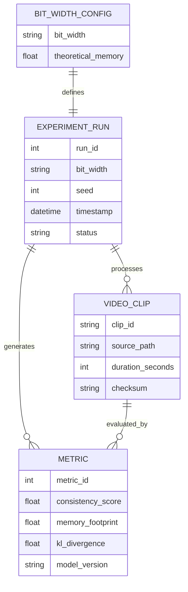

# Data Model: llmXive follow-up: extending "LongLive-2.0: An NVFP4 Parallel Infrastructure for Long Video Generation"

## Entity Relationship Diagram (Conceptual)

## Data Schemas

### 1. Experiment Run Metadata
Captures the configuration and status of each experimental run.

| Field | Type | Description | Source |
| :--- | :--- | :--- | :--- |
| `run_id` | String | Unique identifier (e.g., `run_2bit_seed1`) | Generated |
| `bit_width` | Integer | Simulated bit-width (2, 4, 8) | Config |
| `seed` | Integer | Random seed for reproducibility | Config |
| `timestamp` | ISO8601 | Start time of the run | System |
| `status` | String | "completed", "collapsed", "timeout" | Code |
| `theoretical_memory_gb` | Float | Calculated memory `(Params × Bits / 8) + 1.2` | Formula |

### 2. Video Clip
Represents the input/output unit of the simulation.

| Field | Type | Description | Source |
| :--- | :--- | :--- | :--- |
| `clip_id` | String | Unique ID (e.g., `kinetics_001`) | Dataset |
| `source_path` | String | Path to the video file | Dataset |
| `duration_seconds` | Integer | Duration (target 4s) | Dataset |
| `checksum` | String | SHA256 of the file | Code |
| `label` | String | Action label (optional) | Dataset |

### 3. Consistency Metric
The primary outcome variable.

| Field | Type | Description | Source |
| :--- | :--- | :--- | :--- |
| `metric_id` | String | Foreign key to run/clip | Generated |
| `consistency_score` | Float | CLIP-ViT temporal coherence score | Evaluator |
| `frame_count` | Integer | Number of frames processed | Evaluator |
| `inference_time_s` | Float | Time taken for evaluation | System |
| `is_nan` | Boolean | Flag if score is undefined (collapse) | Code |

### 4. Aggregated Results
The final CSV output for analysis.

| Field | Type | Description | Source |
| :--- | :--- | :--- | :--- |
| `bit_width` | Integer | Grouping variable | Aggregation |
| `seed` | Integer | Grouping variable | Aggregation |
| `mean_consistency` | Float | Average score for this run | Aggregation |
| `std_consistency` | Float | Standard deviation | Aggregation |
| `convergence_epoch` | Integer | Epoch where loss plateaued | Training Log |
| `memory_gb` | Float | Theoretical memory | Formula |

## Data Flow

1.  **Ingestion**: `data/loader.py` streams Kinetics-400.
2.  **Transformation**: `data/downsampler.py` extracts 4s clips, computes checksums, writes to `data/derived/`.
3.  **Simulation**: `simulation/train_loop.py` processes clips, applies stochastic rounding, logs metrics.
4.  **Evaluation**: `evaluation/clip_evaluator.py` scores generated clips.
5.  **Aggregation**: `analysis/threshold_finder.py` merges results into `data/results/aggregated.csv`.

## Data Hygiene Rules

- **Immutable Raw**: Raw dataset files are never modified.
- **Derived Files**: All derived files (parquet, json) are stored in `data/derived/` with versioned names.
- **Checksums**: Every file in `data/` must have a corresponding `.sha256` file.
- **No PII**: Kinetics-400 is public; no PII expected. If detected, files are redacted.
