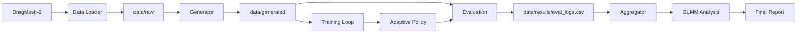

# Project Documentation: Virtual Tactile Zero-Shot Adaptation

## Table of Contents
1. [Architecture Overview](#architecture-overview)
2. [Module Descriptions](#module-descriptions)
3. [Data Flow](#data-flow)
4. [Configuration & Constants](#configuration--constants)
5. [Troubleshooting](#troubleshooting)

## Architecture Overview

The system implements a closed-loop adaptive control policy for robotic manipulation. [UNRESOLVED-CLAIM: c_039ead9e — status=not_enough_info]
It consists of three main phases:
1. **Perception**: Estimating object stiffness ($k_{est}$) from contact dynamics.
2. **Adaptation**: Adjusting reward weights dynamically based on $k_{est}$.
3. **Evaluation**: Validating zero-shot performance on unseen high-friction objects.

## Module Descriptions

### Core Logic
- `code/estimator.py`: Implements `VirtualTactileEstimator`.
 - **Input**: Torque ($\tau$) and Velocity ($v$) time series.
 - **Processing**:
 - Applies a moving average filter (window size = 5) to torque.
 - Computes derivatives $\Delta \tau$ and $\Delta v$.
 - Applies epsilon clamping ($\epsilon = 10^{-4}$) to prevent division by zero.
 - Calculates $k_{est} = |\Delta \tau| / |\Delta v|$.
- `code/scheduler.py`: Implements `AdaptiveRewardScheduler`.
 - Maps $k_{est}$ to reward multipliers.
 - **Rule**: If $k_{est} > 1.0$, increase detach reward by $\ge 20\%$.
 - **Rule**: If $k_{est} < 0.2$, decrease contact reward by $\le 15\%$.

### Simulation & Data
- `code/environment.py`: CPU-only PyBullet wrapper. Enforces no CUDA usage.
- `code/generator.py`: Generates articulated geometries with randomized friction.
- `code/data_loader.py`: Fetches DragMesh-2 from HuggingFace.

### Analysis
- `code/glmm_analysis.py`: Fits Generalized Linear Mixed Models (GLMM) to handle zero-success baselines.
- `code/aggregate.py`: Aggregates trial logs into per-object statistics.

## Data Flow

## Configuration & Constants

Key constants used in the implementation (logged for reproducibility):

| Parameter | Value | Description |
|:--- |:--- |:--- |
| `epsilon` | `1e-4` | Minimum denominator for stiffness calculation (FR-007) |
| `filter_window` | `5` | Moving average window for torque smoothing (FR-006) |
| `high_friction_min` | `0.8` | Lower bound for high-friction evaluation set |
| `high_friction_max` | `1.2` | Upper bound for high-friction evaluation set |
| `seed` | `42` | Random seed for generation and training |

## Troubleshooting

- **CUDA Detected**: The `environment.py` module will raise an error if GPU usage is detected. Ensure `CUDA_VISIBLE_DEVICES=""` or run on a CPU-only machine.
- **Data Fetch Failure**: The `data_loader.py` will raise `ConnectionError` if the HuggingFace dataset is unreachable. No synthetic fallbacks are permitted.
- **Statistical Failure**: If `p_value >= 0.05` in `glmm_analysis.py`, the pipeline logs a failure for SC-005.
