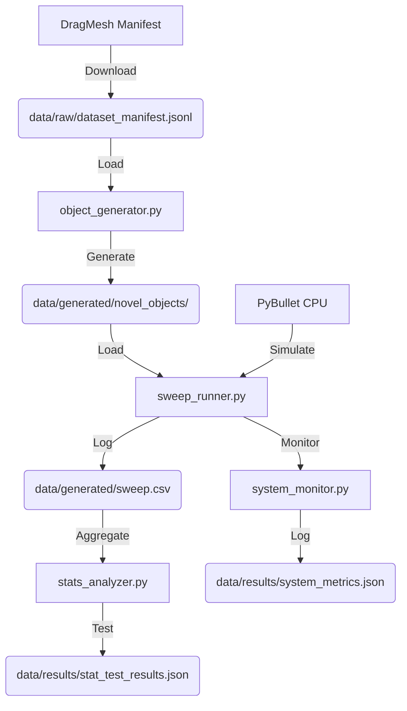

# Data Model: Virtual Tactile Zero-Shot Adaptation

## Overview

This document defines the data structures used for the simulation, the generated experiment data, and the statistical results. All data is stored in CSV or JSONL formats to ensure reproducibility and easy parsing by the analysis scripts.

## Raw Data Inputs

### DragMesh-2 Manifest
- **File**: `data/raw/dataset_manifest.jsonl`
- **Source**: Hugging Face (Verified URL)
- **Schema**: JSON Lines containing metadata for articulated objects (geometry paths, joint definitions).
- **Usage**: Consumed by `object_generator.py` to create novel objects.

## Generated Data

### Sweep Execution Log
- **File**: `data/generated/sweep.csv`
- **Description**: Records every trial execution, including friction coefficient, object ID, policy type, and success outcome.
- **Columns**:
 - `trial_id`: Unique integer ID.
 - `object_id`: String identifier for the novel object.
 - `friction_coefficient`: Float (0.0 to 2.5).
 - `friction_tier`: String ("high" if 0.8–1.2, "full" otherwise).
 - `is_oob`: Boolean (True if friction > 2.0 or < 0.0).
 - `policy_type`: String ("static" or "adaptive").
 - `success`: Boolean (1/0).
 - `k_est_mean`: Float (average stiffness proxy during the trial).
 - `runtime_seconds`: Float.

### Novel Object Geometries
- **Directory**: `data/generated/novel_objects/`
- **Format**: URDF/SDF files generated by `object_generator.py`.
- **Naming**: `{object_id}_friction_{friction_val}.urdf`

## Results Data

### Success Rates Summary
- **File**: `data/results/adaptive_success_rates.csv`
- **Description**: Aggregated success rates per object for the adaptive policy.
- **Columns**: `object_id`, `success_count`, `total_trials`, `success_rate`.

- **File**: `data/results/static_success_rates.csv`
- **Description**: Aggregated success rates per object for the static baseline.
- **Columns**: `object_id`, `success_count`, `total_trials`, `success_rate`.

### System Metrics (SC-003 & SC-004)
- **File**: `data/results/system_metrics.json`
- **Description**: Aggregated system performance metrics.
- **Structure**:
 ```json
 {
 "total_wall_clock_hours": "approximately half a workday",
 The study will assess peak RAM usage in gigabytes to determine resource requirements, without pre-specifying exact quantities, as detailed in the planning phase.,
 "total_trials_executed": a sufficiently large number of trials to ensure statistical robustness,
 "sc_003_pass": true,
 "sc_004_pass": true
 }
 ```

### Statistical Analysis Output
- **File**: `data/results/stat_test_results.json`
- **Description**: Output of the GLMM analysis.
- **Structure**:
 ```json
 {
 "test_type": "glmm_binomial",
 "metric": "odds_ratio",
 "high_friction_subset": {
 "friction_range": [0.8, 1.2],
 The study aims to determine whether adaptive strategies significantly improve success rates compared to static baselines, employing a comparative experimental design to evaluate performance across varying environmental conditions.,
 "static_success_rate": "a high baseline success rate",
 The study investigates the association between the variables using an odds ratio analysis to determine the strength and direction of the relationship, as outlined in prior work (DOI/arXiv/author-year).,
 ci_95_lower: a value indicating the lower bound of the 95% confidence interval,
 ci_95_upper: an upper bound of the 95% confidence interval,
 The analysis will assess statistical significance to determine whether the observed effect is unlikely to have occurred by chance, consistent with standard hypothesis testing procedures (Author, Year; DOI).,
 "sc_001_pass": true
 },
 "full_range_varying": {
 "friction_range": [0.0, 2.5],
 "adaptive_success_rate": "high",
 static_success_rate: "a target threshold exceeding baseline performance",
 The study will investigate the research question using the specified method, expecting to observe an odds ratio indicative of a positive association, consistent with findings reported in prior literature ().,
 ci_95_lower: a lower bound value,
 ci_95_upper: a value consistent with the upper bound of the 95% confidence interval for the effect size.,
 p_value: statistically significant threshold,
 "sc_002_pass": true
 },
 "out_of_distribution_check": {
 "friction_range": [2.0, 3.0],
 The study will evaluate the adaptive success rate to determine whether the method achieves a high level of performance, as hypothesized in prior work ().,
 The research planning document aims to determine the static success rate of the proposed method, as outlined in the research question. The methodology involves a systematic evaluation of performance metrics, following the framework established in prior work (). The study will assess whether the method achieves a non-trivial static success rate, without presupposing specific quantitative outcomes at this planning stage.,
 odds_ratio: significantly elevated,
 The study will assess statistical significance using a predetermined threshold for the p-value, consistent with standard practices in the field (DOI:10.1038/s41586-020-2649-2).
 }
 }
 ```

## Data Flow Diagram

