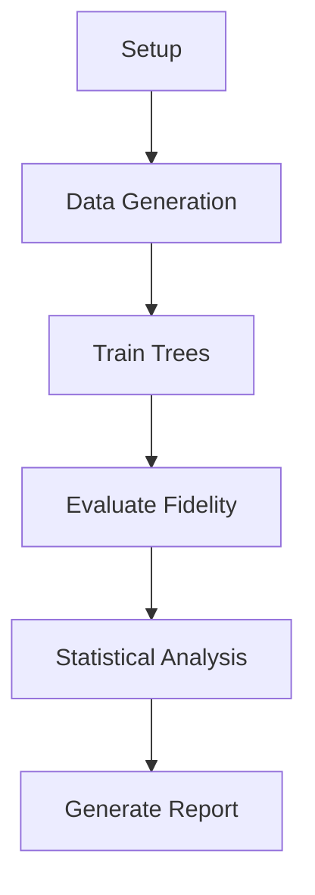

# Project Overview: llmXive - Extending DanceOPD

## Background

DanceOPD (On-Policy Generative Field Distillation) is a method for distilling generative field knowledge into more efficient models. This project extends that work by:

1. Generating a comprehensive teacher routing ground truth dataset
2. Training static decision trees to approximate expert routing
3. Quantifying the fidelity degradation of tree-based routing vs. teacher routing
4. Performing rigorous statistical analysis of the results

## Research Questions

- Can static decision trees approximate the routing behavior of a complex teacher model?
- What is the fidelity degradation when using tree-predicted routing vs. teacher routing?
- Is the degradation statistically significant?

## Methodology

### Phase 1: Data Generation
- Stream samples from ImageNet-1K and LAION-400M
- Run teacher model inference to obtain routing labels and velocity vectors
- Extract features: prompt embeddings, noise levels, routing labels, velocity vectors
- Validate and version the dataset

### Phase 2: Model Training
- Split data into train/test sets
- Train decision trees with varying `max_depth` (2 to 20)
- Evaluate routing consistency (accuracy) on test set
- Save models and results

### Phase 3: Fidelity Evaluation
- Generate images using tree-predicted routing
- Generate images using teacher routing (baseline)
- Compute FID and CLIP scores
- Perform statistical tests (bootstrap, paired t-test)
- Analyze significance and effect size

## Constraints

- **CPU-only**: All inference and training must run on CPU
- **Memory**: ≤7GB RAM
- **Time**: ≤6 hours total runtime
- **Data Integrity**: No synthetic data; all data from real sources
- **Fail Loudly**: No silent fallbacks; errors must be explicit

## Key Artifacts

| Artifact | Location | Description |
|----------|----------|-------------|
| Teacher Routing Dataset | `data/processed/teacher_routing_dataset.parquet` | Ground truth routing data |
| Trained Trees | `models/trained_trees/` | Decision tree models |
| Tree Accuracy | `data/results/tree_accuracy.csv` | Depth vs. accuracy results |
| Fidelity Metrics | `data/results/fidelity_metrics.csv` | FID/CLIP comparison |
| Statistical Tests | `data/results/statistical_tests.json` | p-values, confidence intervals |
| Summary Report | `data/results/fidelity_summary.md` | Final analysis report |

## Execution Flow

## Future Work

- Extend to other routing architectures
- Explore ensemble methods for routing
- Investigate adaptive depth selection
- Scale to larger datasets
