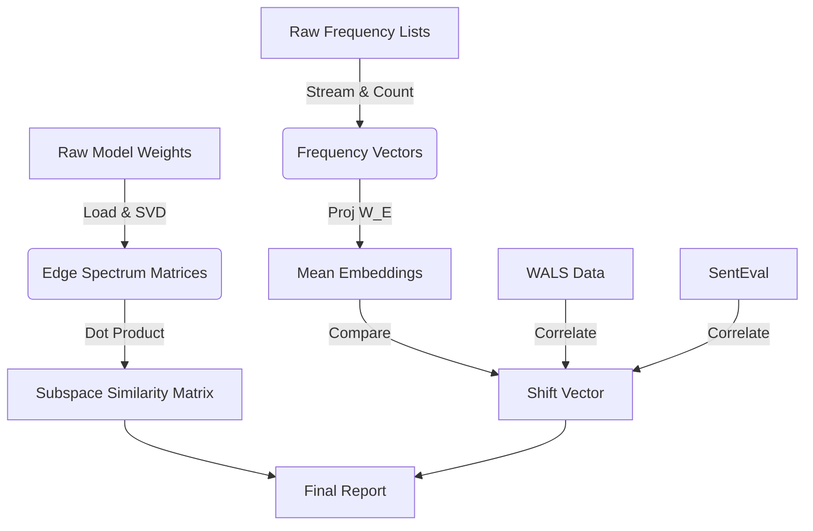

# Data Model: llmXive follow-up: extending "Your UnEmbedding Matrix is Secretly a Feature Lens for Text Embeddings"

## 1. Overview

This document defines the data structures, storage formats, and relationships for the `llmXive` follow-up project. It ensures reproducibility and strict adherence to the "Single Source of Truth" principle.

## 2. Data Flow



## 3. File Specifications

### 3.1. Raw Data (`data/raw/`)

| File Pattern | Description | Format | Checksum Source |
| :--- | :--- | :--- | :--- |
| `models/{model_name}/` | Model weights (symlink to HF cache) | Binary (PyTorch) | HF SHA256 |
| `freq/` | Raw frequency counts (streamed) | JSONL (partial) | `sha256sum` |
| `external/wals.csv` | Typological features | CSV | Git SHA |
| `external/senteval_sts.json` | Performance benchmarks | JSON | Git SHA |

### 3.2. Processed Data (`data/processed/`)

| File Pattern | Description | Format | Derivation |
| :--- | :--- | :--- | :--- |
| `svd/{model}_e_spectrum.npy` | Top-$k$ singular vectors | NumPy `.npy` | SVD on $W_U$ |
| `similarity/cosine_matrix.json` | Pairwise cosine similarities | JSON | Dot product of `.npy` |
| `freq/{lang}_vector.npy` | Normalized frequency distribution | NumPy `.npy` | Stream & Normalize |
| `mean_embedding/{model}_{lang}.npy` | $\hat{h} = W_E \times f$ | NumPy `.npy` | Matrix Multiplication |
| `stats/permutation_results.json` | P-value, null distribution | JSON | Permutation Test |
| `validation/correlation_report.json` | WALS/SentEval correlations | JSON | Pearson Correlation |
| `feasibility_report.json` | Memory/CPU feasibility check | JSON | Runtime logs |
| `vocab_alignment_warning.json` | Vocabulary overlap warnings | JSON | Vocab intersection check |

## 4. Schema Definitions

### 4.1. Subspace Similarity Report

```yaml
$schema: "http://json-schema.org/draft-07/schema#"
type: object
properties:
  models:
    type: array
    items:
      type: string
      description: "List of model names (e.g., 'llama-3', 'bloom')"
  similarities:
    type: array
    items:
      type: object
      properties:
        model_a:
          type: string
        model_b:
          type: string
        cosine_similarity:
          type: number
          description: "Cosine similarity between top-k subspaces"
        language_pair:
          type: string
          description: "e.g., 'EN-FR', 'EN-EN'"
      required:
        - model_a
        - model_b
        - cosine_similarity
        - language_pair
  timestamp:
    type: string
    format: date-time
  k_value:
    type: integer
    description: "Number of singular vectors used"
required:
  - models
  - similarities
  - k_value
```

### 4.2. Permutation Test Results

```yaml
$schema: "http://json-schema.org/draft-07/schema#"
type: object
properties:
  observed_similarity:
    type: number
    description: "Cosine similarity between observed cross-lingual subspaces"
  null_distribution:
    type: array
    items:
      type: number
    description: "Similarities from permutation test (N=1000)"
  p_value:
    type: number
    minimum: 0
    maximum: 1
    description: "Probability of observing <= observed similarity under H0"
  iterations:
    type: integer
    description: "Number of permutations performed"
  significance_flag:
    type: boolean
    description: "True if p_value < 0.05"
required:
  - observed_similarity
  - null_distribution
  - p_value
  - iterations
  - significance_flag
```
