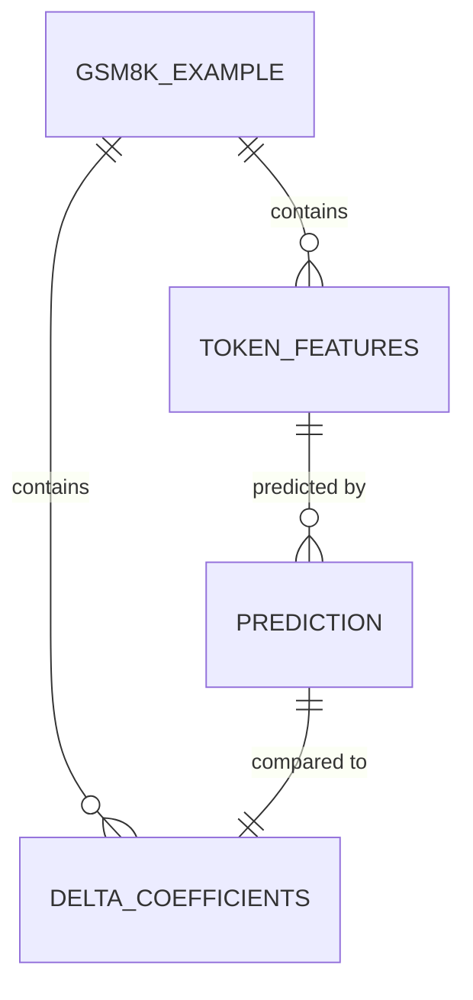

# Data Model: llmXive follow-up: extending "DelTA: Discriminative Token Credit Assignment for Reinforcement Learning"

## 1. Overview

This document defines the data structures used throughout the pipeline. All data is stored in `data/` with checksums. The flow is: `Raw GSM8K` -> `Filtered GSM8K` -> `Oracle Coefficients` -> `Feature Vectors` -> `Model Predictions`.

## 2. Entity Relationship Diagram (Conceptual)

## 3. Data Schemas

### 3.1. Raw GSM8K (Input)
Source: HuggingFace Parquet.
- `question`: string (The math problem)
- `answer`: string (The final answer)
- `solution`: string (Step-by-step solution)

### 3.2. Filtered Dataset (Intermediate)
Derived from Raw GSM8K.
- `example_id`: string (Unique ID, e.g., "gsm8k_001")
- `question`: string
- `solution`: string
- `solution_length`: int (Number of tokens in solution)
- `valid`: boolean (True if solution verified)

### 3.3. DelTA Coefficients (Oracle Output)
Generated by `generate_oracle.py` (Phi-3-mini Oracle).
- `example_id`: string
- `token_index`: int (Position in the tokenized solution)
- `token_text`: string
- `delta_coefficient`: float (The ground-truth discriminative score)
- `computation_status`: string ("success", "failed", "nan")

### 3.4. Static Feature Vector (Input to Model)
Generated by `extract_features.py` (using sentence-transformers/all-MiniLM-L6-v2).
- `example_id`: string
- `token_index`: int
- `ngram_features`: list[float] (Flattened counts of n-grams)
- `pos_tags`: list[int] (One-hot encoded POS tags)
- `semantic_similarity`: float (Cosine similarity to seed patterns, computed via sentence-transformers)
- `feature_vector`: list[float] (Concatenation of all features)

### 3.5. Model Predictions (Output)
Generated by `train.py` and `eval/`.
- `example_id`: string
- `token_index`: int
- `true_delta`: float
- `predicted_delta`: float
- `residual`: float
- `feature_importance`: object (SHAP or permutation importance scores)
  - `ngram`: float
  - `pos`: float
  - `semantic`: float

### 3.6. Example-Level Aggregation (for Evaluation)
Derived from token-level predictions and targets.
- `example_id`: string
- `true_delta_mean`: float (Average true DelTA across tokens in the example)
- `predicted_delta_mean`: float (Average predicted DelTA across tokens in the example)
- `true_delta_std`: float (Standard deviation of true DelTA)
- `predicted_delta_std`: float (Standard deviation of predicted DelTA)

## 4. Data Storage Format

- **Raw Data**: `data/raw/gsm8k.parquet` (Read-only)
- **Processed Data**: `data/processed/`
  - `filtered_examples.jsonl`
  - `delta_oracle.parquet` (conforms to `contracts/delta_oracle.schema.yaml`)
  - `features.parquet` (conforms to `contracts/static_features.schema.yaml`)
  - `predictions.parquet` (conforms to `contracts/predictions.schema.yaml`)
  - `example_level_aggregation.parquet`
  - `feature_correlation_matrix.csv` (for collinearity analysis)
- **Checksums**: `data/checksums.json` (MD5/SHA256 of each file)

## 5. Data Hygiene Rules

1. **Immutability**: Raw files are never modified. Derivations create new files.
2. **PII**: No PII is expected in GSM8K, but a scan is run before commit.
3. **Seeds**: All data sampling (stratification, train/test split) uses `seed=42`.
4. **Contract Conformance**: All outputs conform to their designated schemas (delta_oracle.schema.yaml, static_features.schema.yaml, predictions.schema.yaml).
5. **Model Independence**: Feature extraction uses sentence-transformers/all-MiniLM-L-v2, not the Oracle model (Phi-3-mini), ensuring independence.
