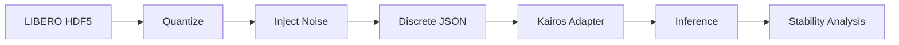

# llmXive: Extending "Kairos: A Native World Model Stack for Physical AI"

**Project ID**: PROJ-888-llmxive-follow-up-extending-kairos-a-nat

## Overview

This project implements a follow-up study to "Kairos: A Native World Model Stack for Physical AI," focusing on discrete state scaling, quantization sensitivity, and stability analysis in a CPU-only environment. The goal is to convert continuous physical AI datasets into discrete, JSON-serialized state vectors, train a modified Kairos model on this discrete data, and statistically validate the degradation in performance relative to a continuous baseline.

The pipeline adheres to strict resource constraints (CPU-only, <7GB RAM peak) and constitutional principles regarding error metrics and statistical validation (paired t-test/Wilcoxon, no Bayesian Hierarchical Modeling).

## Quickstart

### 1. Prerequisites

- Python 3.9+
- pip
- Access to HuggingFace Hub (for dataset and model weights)

### 2. Installation

```bash
# Create virtual environment (optional but recommended)
python -m venv venv
source venv/bin/activate # On Windows: venv\Scripts\activate

# Install dependencies
pip install -r requirements.txt
```

### 3. Directory Structure Initialization

Ensure the project directories exist:

```bash
python code/setup_directories.py
```

This creates `code/`, `tests/`, `data/`, `state/`, and `docs/`.

### 4. Configuration

Edit `code/config.py` to set:
- `QUANTIZATION_LEVELS`: [4, 8, 16] bits
- `NOISE_STD_DEVS`: Gaussian noise standard deviations
- `SEED`: Random seed for reproducibility
- `DATA_PATH`: Path to input HDF5 datasets (downloaded automatically if missing)

### 5. Running the Pipeline

The main orchestration script handles the full workflow:
1. Download LIBERO dataset subset (N=50 episodes)
2. Validate dataset size (header-only check)
3. Quantize continuous states to discrete integers
4. Inject Gaussian noise and clamp to valid bins
5. Train the Kairos adapter on CPU
6. Perform inference and stability analysis

```bash
# Run the full pipeline (MVP: User Story 1)
python code/main.py --stage data_pipeline --quantization low --noise_seed 42

# Run training (User Story 2) - requires data pipeline completion
python code/main.py --stage training --epochs 50 --horizon 100

# Run stability analysis (User Story 3)
python code/main.py --stage analysis --horizons 100 250 500
```

### 6. Output Artifacts

- **Data**: `data/processed/quantized_<level>.json`
- **Models**: `data/models/kairos_adapter.pt`
- **Results**: `data/results/metrics.json`, `data/results/stats.json`
- **Figures**: `figures/error_vs_bandwidth.png`, `figures/threshold_map.png`

## Architecture

### Core Components

- **Data Pipeline** (`code/data/`): Handles HDF5 download, quantization, and noise injection.
- **Models** (`code/models/`): Kairos adapter with fixed discrete projection, CPU-only training loop.
- **Analysis** (`code/analysis/`): MSE calculation, statistical validation (t-test/Wilcoxon), sensitivity sweeps.
- **Utilities** (`code/utils/`): Resource monitoring, logging, error handling, checkpointing.

### Data Flow



## Constraints & Principles

- **CPU-Only**: No CUDA or bitsandbytes dependencies.
- **Resource Limits**: Hard fail if RAM > 7GB or runtime > 6h.
- **Real Data Only**: No synthetic fallbacks. Data fetch failures must raise errors.
- **Statistical Rigor**: Paired t-test or Wilcoxon signed-rank test only. BHM is forbidden.
- **Error Metrics**: Normalized by state space dimensionality; horizons [100, 250, 500].

## Contributing

1. Create a feature branch.
2. Implement tasks from `tasks.md`.
3. Write tests first (if applicable) and ensure they fail.
4. Run `pytest` to verify.
5. Submit a pull request.

## License

MIT License. See `LICENSE` for details.