# Data Model Specification

This document describes the data entities, schemas, and relationships used in the llmXive Follow-up pipeline.

## Overview

The pipeline processes software repository issues through three main stages:

1. **Data Curation**: Download, filter, and augment issues
2. **Agent Execution**: Run baseline and iterative agents
3. **Analysis**: Compute metrics and statistical tests

Each stage produces artifacts validated against JSON schemas in `contracts/`.

## Entities

### 1. Issue

Represents a software repository issue (bug fix, feature request).

**Source**: SWE-Explore benchmark (`bench.final.public.jsonl`)

**Schema**: `contracts/dataset_schema.yaml`

**Fields**:
- `issue_id` (string): Unique identifier (e.g., "swe-bench/issue-123")
- `repo` (string): Repository name (e.g., "django/django")
- `base_commit` (string): Git commit hash
- `problem_statement` (string): Natural language description
- `code_context` (string): Relevant code snippet
- `ground_truth_lines` (list[int]): Line numbers of the solution patch
- `initial_coverage` (float): Initial retrieval coverage score (0.0–1.0)
- `is_hard` (boolean): Whether issue is in the "hard" subset
- `synthetic_metadata` (object, optional): Mutation details for synthetic issues

**Example**:
```json
{
 "issue_id": "swe-bench/issue-456",
 "repo": "pallets/flask",
 "base_commit": "a1b2c3d",
 "problem_statement": "Fix memory leak in request handler",
 "code_context": "def handle_request():...",
 "ground_truth_lines": [42, 43, 44],
 "initial_coverage": 0.15,
 "is_hard": true,
 "synthetic_metadata": null
}
```

### 2. Agent Log

Records of agent execution (queries, context, errors).

**Source**: `code/agent/base.py` (baseline), `code/agent/iterative.py` (iterative)

**Schema**: `contracts/agent_log_schema.yaml`

**Fields**:
- `issue_id` (string): Reference to the issue
- `agent_type` (string): "baseline" or "iterative"
- `turn_count` (int): Number of turns executed
- `query_history` (list[object]): List of query objects
 - `turn` (int): Turn number
 - `query` (string): Reformulated query
 - `retrieved_context_ids` (list[int]): IDs of retrieved code snippets
- `static_analysis_signals` (list[object]): Static analysis results per turn
 - `signal_type` (string): "missing_import", "undefined_variable", "syntax_error"
 - `message` (string): Error message
 - `line_number` (int): Line number
- `error_signals` (list[string]): Final error messages (if any)
- `termination_reason` (string): "max_turns", "loop_detected", "success"
- `coverage_score` (float): Final coverage score

**Example**:
```json
{
 "issue_id": "swe-bench/issue-456",
 "agent_type": "iterative",
 "turn_count": 3,
 "query_history": [
 {"turn": 1, "query": "Fix memory leak", "retrieved_context_ids": [1, 2, 3]},
 {"turn": 2, "query": "Fix memory leak in request handler", "retrieved_context_ids": [1, 2, 3, 4]}
 ],
 "static_analysis_signals": [
 {"signal_type": "undefined_variable", "message": "x is not defined", "line_number": 42}
 ],
 "error_signals": [],
 "termination_reason": "max_turns",
 "coverage_score": 0.67
}
```

### 3. Result Metrics

Aggregated metrics for statistical analysis.

**Source**: `code/analysis/stats.py`

**Schema**: `contracts/result_schema.yaml`

**Fields**:
- `issue_id` (string): Reference to the issue
- `baseline_coverage` (float): Coverage score from baseline agent
- `iterative_coverage` (float): Coverage score from iterative agent
- `baseline_ranking` (float): First relevant line position (N+1 if not found)
- `iterative_ranking` (float): First relevant line position (N+1 if not found)
- `paired_coverage_diff` (float): iterative - baseline
- `paired_ranking_diff` (float): iterative - baseline

**Example**:
```json
{
 "issue_id": "swe-bench/issue-456",
 "baseline_coverage": 0.45,
 "iterative_coverage": 0.67,
 "baseline_ranking": 15,
 "iterative_ranking": 8,
 "paired_coverage_diff": 0.22,
 "paired_ranking_diff": -7
}
```

## Data Flow

```mermaid
graph LR
 A[SWE-Explore Raw] --> B[Download]
 B --> C[Derive Ground Truth]
 C --> D[Filter Hard Instances]
 D --> E[Generate Synthetic Issues]
 E --> F[Curated Dataset]
 F --> G[Agent Execution]
 G --> H[Agent Logs]
 H --> I[Compute Metrics]
 I --> J[Statistical Tests]
 J --> K[Final Metrics]
 K --> L[Paper Draft]
```



## Validation

All artifacts are validated against schemas using `code/utils/validation.py`:

```python
from utils.validation import validate_dataset_artifact

validate_dataset_artifact("data/curated/hard_subset.jsonl", "dataset_schema.yaml")
```

## Hashing

All data artifacts are hashed using SHA256 via `code/utils/hash_artifacts.py`:

```python
from utils.hash_artifacts import hash_directory

hash_directory("data/curated", "data/curated/manifest.json")
```

## Reproducibility

- Random seeds are set in `code/config.py`
- All transformations are logged with metadata
- Final metrics include p-values and effect sizes
- Paper draft enforces associational language (no causal claims)
