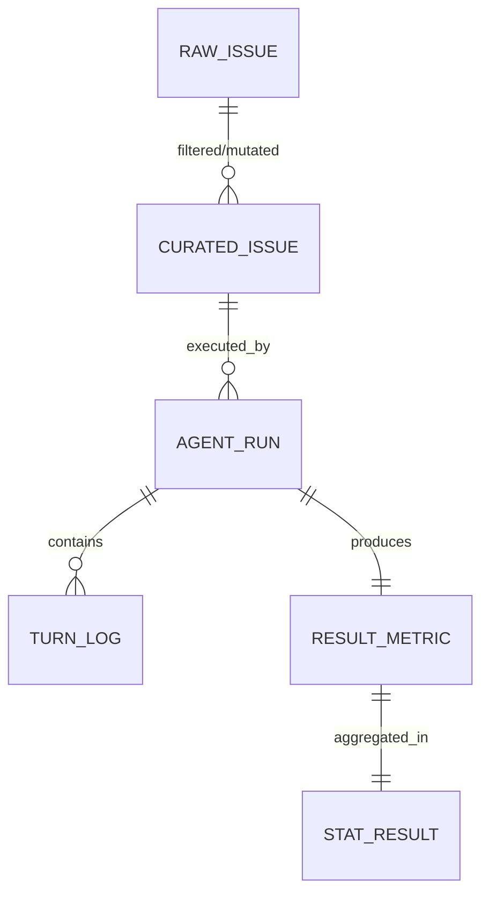

# Data Model: llmXive follow-up: extending "SWE-Explore: Benchmarking How Coding Agents Explore Repositories"

## Overview

This document defines the data structures used for the SWE-Explore benchmark extension. It covers the raw dataset schema, the curated "hard" and synthetic subset schema, the agent execution logs, and the final results schema.

## Entity Relationship Diagram

## Data Definitions

### 1. Raw Issue (SWE-Explore)
Source: `bench.final.public.jsonl`
- `issue_id`: string (unique identifier)
- `repo`: string (repository path)
- `problem_statement`: string (text description of the issue)
- `solution`: string (patch or full file)
- `code_context`: string (full code or relevant snippet)

### 2. Curated Issue
Derived: `data/curated/hard_subset.jsonl` and `data/curated/synthetic_subset.jsonl`
- `issue_id`: string
- `type`: enum ["hard", "synthetic", "easy"]
- `original_issue_id`: string (for synthetic, reference to original)
- `problem_statement`: string (mutated if synthetic)
- `code_context`: string (full code or relevant snippet)
- `ground_truth_lines`: list of integers (from original, before mutation for synthetic)
- `mutation_applied`: list of strings (e.g., ["var_rename", "comment_removal"])
- `complexity_score`: float (Cyclomatic complexity or lines of code)

### 3. Agent Run
Recorded: `data/results/runs/{issue_id}_{strategy}.json`
- `run_id`: string (UUID)
- `issue_id`: string
- `strategy`: enum ["static_multi", "iterative"]
- `start_time`: ISO8601 timestamp
- `end_time`: ISO8601 timestamp
- `total_turns`: integer
- `success`: boolean (did it find the solution? - optional, derived from coverage)
- `turn_logs`: list of `TurnLog` objects

### 4. Turn Log
Nested within `Agent Run`
- `turn_number`: integer
- `query`: string
- `retrieved_context`: string
- `static_analysis_output`: string (pylint/ast output or "none")
- `reformulation_reason`: string (e.g., "undefined variable", "timeout", "max_turns_reached")

### 5. Result Metric
Recorded: `data/results/metrics.csv`
- `run_id`: string
- `issue_id`: string
- `strategy`: enum ["static_multi", "iterative"]
- `coverage_score`: float (0.0 to 1.0)
- `ranking_efficiency`: float (position of first relevant line, or `N+1` if none found)
- `turns_used`: integer
- `censored`: boolean (true if no relevant lines found)

### 6. Statistical Result
Recorded: `data/results/stats_summary.json`
- `metric_name`: string (e.g., "coverage_score")
- `test_type`: string (e.g., "wilcoxon", "cox_regression")
- `statistic`: float
- `p_value`: float
- `adjusted_p_value`: float (Bonferroni corrected)
- `significant`: boolean
- `effect_size`: float (e.g., r or hazard ratio)

## Data Flow

1.  **Ingestion**: Raw JSONL -> Derive GT -> Filter (Hard/Easy) + Mutated (Synthetic) -> `curated/`.
2.  **Execution**: `curated/` -> Agent Loop -> `runs/` (JSON).
3.  **Aggregation**: `runs/` -> Metrics Extraction -> `metrics.csv`.
4.  **Analysis**: `metrics.csv` -> Statistical Tests -> `stats_summary.json`.
5.  **Reporting**: `stats_summary.json` -> Paper/Report generation.

## Constraints & Validation

- **Immutability**: Raw data in `data/raw/` is never modified.
- **Checksums**: All files in `data/` must have corresponding SHA256 hashes in `state/`.
- **Schema Compliance**: All JSON/CSV outputs must match the schemas defined in `contracts/`.
- **No PII**: No user-specific data is included; only repository code and issue metadata.