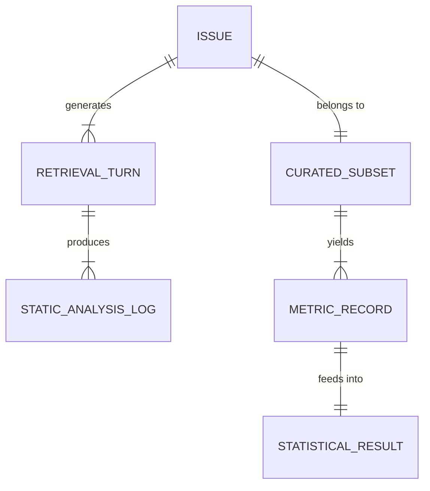

# Data Model: llmXive follow-up: extending "SWE-Explore"

## Overview

This document defines the data structures for the SWE-Explore extension study. All data is stored in JSONL (logs) and CSV (metrics) formats for portability and easy inspection. **The structure of `data/results/` is derived from this File Manifest.**

## Entity Relationships

```mermaid
erDiagram
    ISSUE ||--|{ RETRIEVAL_TURN : "generates"
    ISSUE ||--|| CURATED_SUBSET : "belongs to"
    RETRIEVAL_TURN ||--|{ STATIC_ANALYSIS_LOG : "produces"
    CURATED_SUBSET ||--|{ METRIC_RECORD : "yields"
    METRIC_RECORD ||--|| STATISTICAL_RESULT : "feeds into"
```

## Data Definitions

### 1. Issue (Input)
Represents a single task from the SWE-Explore dataset or a synthetic variant.
- `issue_id`: Unique identifier (string).
- `type`: "real_hard" or "synthetic_ambiguous".
- `original_repo`: Repository path.
- `original_issue_desc`: Text description of the issue.
- `ground_truth_lines`: List of line numbers (integers) representing the relevant code. **For synthetic issues, these are re-mapped to the mutated file via token matching.**
- `is_mutated`: Boolean (true for synthetic).
- `mutation_log`: String describing mutations applied (for synthetic).

### 2. Retrieval Turn (Agent Output)
Represents a single step in the iterative agent loop.
- `issue_id`: Reference to Issue.
- `turn_number`: Integer (1, 2, or 3).
- `query`: The prompt sent to the LLM.
- `retrieved_snippets`: List of code snippets (strings).
- `static_analysis_output`: JSON object containing `pylint`, `ast`, or sandbox execution errors.
- `error_detected`: Boolean.
- `reformulation_reason`: String (e.g., "undefined variable 'x'").
- `is_loop_detected`: Boolean (true if the query repeats a previous turn).

### 3. Metric Record (Aggregated)
One row per issue, comparing Static vs. Iterative performance.
- `issue_id`: Reference to Issue.
- `type`: "real_hard" or "synthetic_ambiguous".
- `static_coverage`: Float (0.0-1.0).
- `static_ranking`: Integer (position).
- `static_precision`: Float (0.0-1.0).
- `iterative_coverage`: Float (0.0-1.0).
- `iterative_ranking`: Integer (position).
- `iterative_precision`: Float (0.0-1.0).
- `effective_coverage_static`: Float (Coverage * Precision).
- `effective_coverage_iterative`: Float (Coverage * Precision).
- `improvement_coverage`: Float (Iterative - Static).
- `improvement_ranking`: Float (Iterative - Static).
- `total_runtime_seconds`: Float (Total pipeline runtime for this issue).
- `feasibility_pass`: Boolean (True if runtime < 6h).

### 4. Statistical Result
Final output of the hypothesis test.
- `metric_type`: "coverage" or "ranking" or "effective_coverage".
- `test_method`: "wilcoxon" or "permutation".
- `p_value`: Float.
- `corrected_p_value`: Float (Bonferroni).
- `significant`: Boolean.
- `n_samples`: Integer.
- `n_ties`: Integer (Number of zero-differences).

## File Manifest

| File Path | Format | Description |
| :--- | :--- | :--- |
| `data/curated/hard_subset.jsonl` | JSONL | Filtered "hard" issues. |
| `data/curated/synthetic_ambiguous.jsonl` | JSONL | Generated synthetic issues. |
| `data/results/baseline_logs.jsonl` | JSONL | Static agent execution logs. |
| `data/results/iterative_logs.jsonl` | JSONL | Iterative agent execution logs (per turn). |
| `data/results/metrics.csv` | CSV | Aggregated metrics per issue. |
| `data/results/statistics.json` | JSON | Final statistical test results. |
| `data/results/validation_report.md` | Markdown | Manual inspection report for "hard" instances. |
