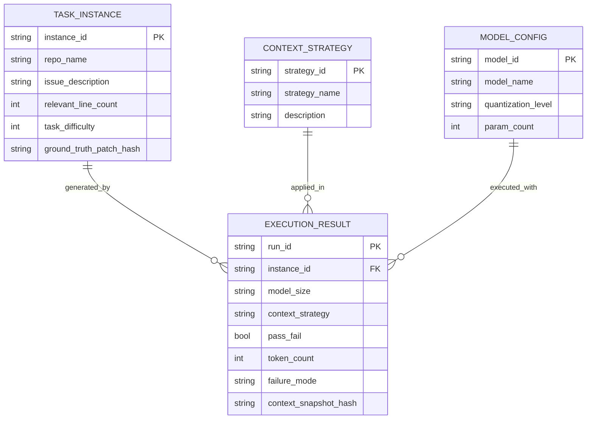

# Data Model: Context Fidelity vs. Model Scaling Trade-offs

## 1. Entity Relationship Diagram (Conceptual)

## 2. Data Schema Definitions

### 2.1 Raw/Filtered Dataset (Parquet)
- **Source**: `data/raw/swe_bench_verified.parquet` → `data/filtered/swe_bench_v1.parquet`
- **Key Fields**:
  - `instance_id`: Unique identifier.
  - `repo_name`: Repository name.
  - `problem_statement`: Issue description.
  - `relevant_line_count`: **Pre-computed** via Hybrid IR-Seeding (FR-001) using a generic CodeBERT model. This metric is **immutable** for each instance and is not a function of the experimental strategies.
  - `task_difficulty`: Number of unique files in the ground-truth patch (used as covariate).
  - `files`: List of file paths and contents (truncated for storage if needed, full content in memory during execution).

### 2.2 Execution Results (JSONL)
- **Location**: `data/intermediate/baseline_run.jsonl`, `data/intermediate/hf_run_1b.jsonl`, etc.
- **Fields**:
  - `run_id`: UUID.
  - `instance_id`: FK to Task Instance.
  - `model_size`: "1B" or "7B".
  - `context_strategy`: "baseline", "tfidf", "diff_aware", "summarization".
  - `pass_fail`: Boolean (True if all unit tests pass).
  - `token_count`: Total tokens consumed.
  - `failure_mode`: "missing_context", "reasoning_error", "timeout", "none".
  - `context_snapshot_hash`: SHA256 of the context passed to the model.
  - `quantization_level`: "Q4_K_M" or "FP16".

### 2.3 Aggregated Results (CSV)
- **Location**: `data/results.csv`
- **Fields**:
  - `model_size`: "1B", "7B".
  - `context_strategy`: Strategy name.
  - `n_instances`: Count of instances.
  - `pass_rate`: Pass@1 rate (float).
  - `avg_tokens`: Average token consumption.
  - `failure_dist`: JSON string of failure mode distribution.
  - `interaction_or`: Odds Ratio for the interaction term (from GLM).
  - `interaction_ci_lower`: Lower bound of 95% CI for interaction OR.
  - `interaction_ci_upper`: Upper bound of 95% CI for interaction OR.

## 3. Data Flow & Transformation

1. **Fetch**: `loader.py` downloads raw Parquet from verified URL.
2. **Filter**: `loader.py` applies Hybrid IR-Seeding (>500 lines), writes filtered Parquet. **`relevant_line_count` is pre-computed and immutable.**
3. **Execute**: `experiments/` scripts generate JSONL logs per configuration.
4. **Classify**: `analysis/failure_classifier.py` annotates failure modes in JSONL.
5. **Aggregate**: `analysis/metrics.py` merges JSONL into `results.csv`.
6. **Analyze**: `analysis/glm_analyzer.py` consumes `results.csv` for statistical inference (GLM with Firth).
7. **Checksum**: `utils/checksum.py` records SHA256 hashes for all Parquet, JSONL, and CSV files in `state/...yaml`.

## 4. Integrity Constraints

- **Checksums**: All Parquet and JSONL files must have corresponding SHA256 entries in `state/...yaml`.
- **Uniqueness**: `run_id` must be unique across all executions.
- **Referential Integrity**: `instance_id` in results must exist in filtered dataset.
- **Immutability**: Once written, `results.csv` is read-only; re-runs produce new files with version suffixes.
- **Independence**: `relevant_line_count` is derived from a generic retriever and is not a function of the experimental strategies.
