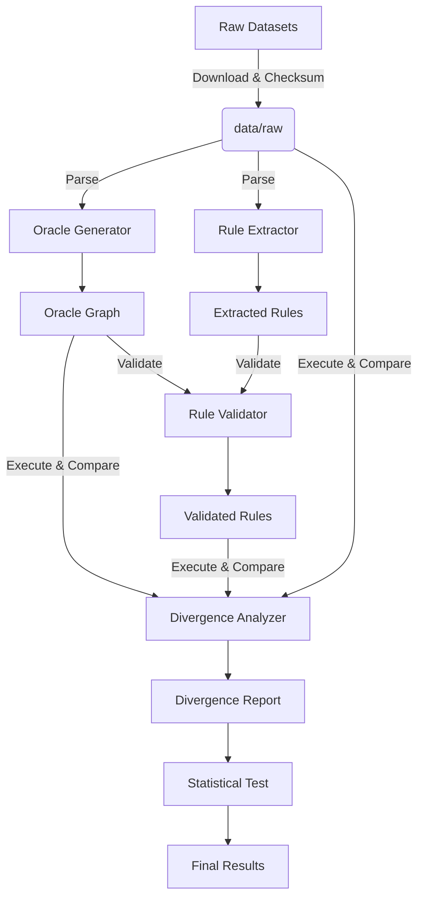

# Data Model: llmXive follow-up: extending "Qwen-AgentWorld: Language World Models for General Agents"

## 1. Overview

This document defines the data structures used to represent the State Transition Oracle, Hypothesized Rules, and Divergence Reports. All data is stored in JSON/Parquet formats for interoperability and reproducibility.

## 2. Core Entities

### 2.1 State (State Object)
Represents a snapshot of the environment at a specific time step.

- `state_id`: `string` (UUID)
- `timestamp`: `integer` (step index)
- `variables`: `object` (Key-value pairs of environment state variables)
- `interaction_type`: `string` (e.g., "spatial", "temporal", "causal")

### 2.2 Action (Action Object)
Represents an action taken by the agent.

- `action_id`: `string`
- `action_type`: `string` (e.g., "move", "interact")
- `parameters`: `object` (Action-specific arguments)

### 2.3 Transition (Transition Object)
A single step in a trajectory.

- `transition_id`: `string`
- `initial_state`: `State`
- `action`: `Action`
- `expected_state`: `State` (Ground Truth)
- `observed_state`: `State` (LLM or Oracle)
- `oracle_prediction`: `State` (Output of the Oracle)

### 2.4 Logical Rule (Rule Object)
An explicit rule extracted from traces using FOL/ILP.

- `rule_id`: `string`
- `condition`: `string` (Logical expression, e.g., "holds(A, B) AND holds(B, C)")
- `consequence`: `string` (e.g., "holds(A, C)")
- `confidence`: `float` (0.0 to 1.0)
- `source_trace_id`: `string` (Reference to the trace that generated this rule)
- `oracle_validated`: `boolean` (True if rule matches Oracle logic)

### 2.5 Divergence Record (Error Classification)
The result of comparing LLM vs Oracle vs Rules.

- `record_id`: `string`
- `task_id`: `string`
- `step_index`: `integer`
- `classification`: `enum` ("Match", "Hallucination", "Rule Gap", "Extraction Uncertainty", "Coverage Gap")
- `details`: `object` (Specifics of the deviation)

## 3. File Formats

### 3.1 Raw Data
- **Format**: Parquet / JSONL
- **Location**: `data/raw/`
- **Content**: Downloaded datasets from verified sources.

### 3.2 Processed Data
- **Format**: JSON / Parquet
- **Location**: `data/processed/`
- **Content**:
  - `oracle_graph.json`: The deterministic state transition graph.
  - `extracted_rules.json`: The Hypothesized Rule Set (with validation flags).
  - `divergence_report.json`: The final analysis results.

### 3.3 Checksums
- **Format**: JSON
- **Location**: `data/external/checksums.json`
- **Content**: SHA-256 hashes of all raw data files.

## 4. Data Flow Diagram

