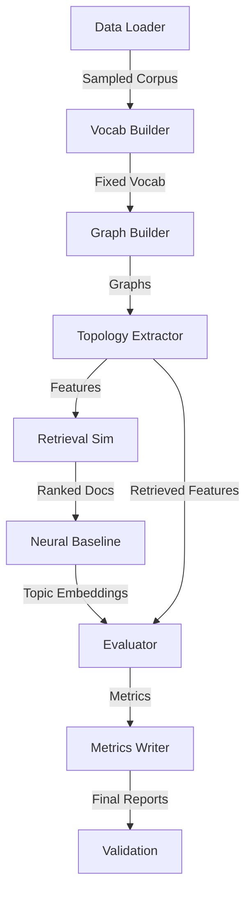

# Architecture: GraphCompass Topological RAG Pipeline

## Overview

GraphCompass is a research pipeline designed to investigate the correlation between **lexical co-occurrence graph topology** and **retrieval performance** in CPU-constrained RAG environments. The system processes academic abstracts and QA pairs to extract deterministic topological features (modularity, centrality) and compares them against neural baselines (BERTopic).

## System Components

The architecture follows a modular, stage-based pipeline design:



### 1. Data Ingestion Layer (`code/data_loader.py`)
- **Responsibility**: Fetches real datasets (HotpotQA, Wikipedia) and enforces strict sampling limits (N ≤ 360).
- **Key Constraint**: No synthetic data; fails loudly if real sources are unreachable.
- **Output**: `data/raw/sampled_corpus.parquet`

### 2. Preprocessing Layer
- **Vocabulary Builder** (`code/vocabulary_builder.py`): Constructs a fixed TF-IDF vocabulary to ensure deterministic tokenization across runs.
- **Graph Builder** (`code/graph_builder.py`): Constructs sliding-window lexical co-occurrence graphs for each document.
- **Output**: `data/processed/fixed_vocab.json`, `data/processed/graphs.json`

### 3. Topological Analysis Layer (`code/topology_extractor.py`)
- **Responsibility**: Calculates graph metrics (modularity, avg path length, degree/betweenness centrality).
- **Special Logic**: Handles low-diversity documents by assigning default zeros.
- **Output**: `data/processed/features.csv`, `data/results/retrieved_features.csv`

### 4. Retrieval & Baseline Layer
- **Neural Baseline** (`code/neural_baseline.py`): Runs BERTopic in CPU-only mode to generate topic embeddings for comparison.
- **Retrieval Simulation** (`code/retrieval_sim.py`): Uses TF-IDF cosine similarity to rank documents against queries.
- **Output**: `data/processed/bertopic_topics.json`, `data/results/retrieval_scores.csv`

### 5. Evaluation Layer (`code/evaluator.py`, `code/t_test_metrics.py`)
- **Responsibility**: Computes Recall@K, Spearman correlations, and paired t-tests.
- **Key Metrics**: Correlation coefficient (r), p-value, latency reduction percentage.
- **Output**: `data/results/correlation.csv`, `data/results/ttest_results.json`

### 6. Metrics & Validation Layer
- **Metrics Writer** (`code/final_metrics_writer.py`): Aggregates all results into `metrics.json`.
- **Validation** (`code/validate_success_criteria.py`): Checks against success criteria (SC-001 to SC-005).
- **Output**: `data/results/metrics.json`, `data/results/validation_status.json`

## Data Flow

1. **Raw Data**: HotpotQA + Wikipedia 20231001.en
2. **Processed**: Sampled corpus, fixed vocabulary, graph objects
3. **Results**: Features, retrieval scores, correlation data, final metrics

## Constraints & Design Decisions

- **CPU-Only**: All components are optimized for CPU execution (no CUDA).
- **Time Budget**: Strict 60s/doc limit enforced via `code/timer.py`.
- **Memory Limit**: Peak RAM usage monitored and capped at 7GB.
- **Determinism**: Fixed random seeds and vocabulary ensure reproducible results.
- **No Synthetic Data**: All inputs must be real; the pipeline fails if data cannot be fetched.

## File Structure

```
code/
├── config.py # Hyperparameters and paths
├── data_loader.py # Dataset fetching and sampling
├── graph_builder.py # Co-occurrence graph construction
├── topology_extractor.py # Metric calculation
├── neural_baseline.py # BERTopic implementation
├── retrieval_sim.py # TF-IDF ranking
├── evaluator.py # Recall and correlation logic
├── final_metrics_writer.py# Aggregation of results
├── validate_schemas.py # Artifact validation
└── utils/
 ├── hash_artifacts.py # State tracking
 └── timer.py # Timeout enforcement
```

## Extensibility

The modular design allows for:
- Swapping graph construction algorithms (e.g., different window sizes).
- Integrating new retrieval methods (e.g., dense embeddings) without breaking the pipeline.
- Adding new topological metrics in `topology_extractor.py`.
