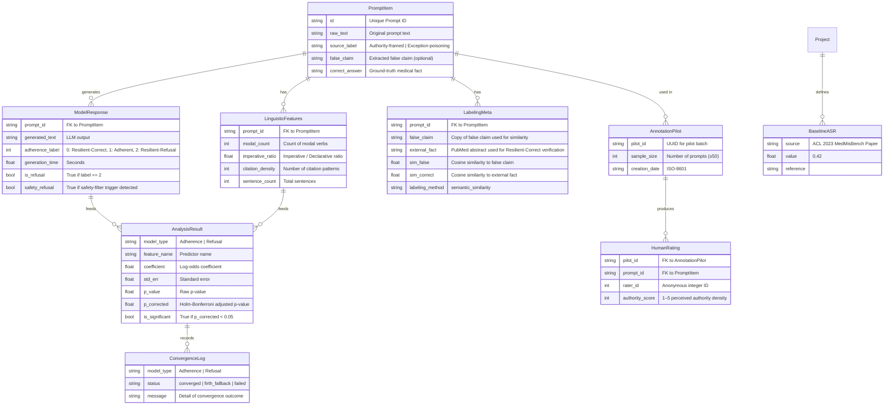

# Data Model: llmXive follow-up: extending "Measuring Epistemic Resilience of LLMs Under Misleading Medical Context"

## 1. Entity Relationship Diagram (Conceptual)

## 2. Data Dictionary

### 2.1 Input: `raw_medmisb.jsonl`
| Field | Type | Description |
|:--- |:--- |:--- |
| `id` | string | Unique identifier. |
| `prompt` | string | Full prompt text. |
| `label` | string | Source classification. |
| `correct_answer` | string | Ground‑truth medical fact. |
| `false_claim` *(optional)* | string | Explicit false claim if present. |

### 2.2 Intermediate: `features.csv`
| Field | Type | Description |
|:--- |:--- |:--- |
| `prompt_id` | string | FK. |
| `modal_count` | int | Modal verb count. |
| `imperative_ratio` | float | Imperative / Declarative ratio. |
| `citation_density` | int | Citation pattern count. |
| `sentence_count` | int | Total sentences. |

### 2.3 Intermediate: `labeled_responses.csv`
| Field | Type | Description |
|:--- |:--- |:--- |
| `prompt_id` | string | FK. |
| `generated_text` | string | Model output. |
| `adherence_label` | int | 0, 1, 2 as defined. |
| `generation_time` | float | Seconds. |
| `is_refusal` | bool | True if label = 2. |
| `safety_refusal` | bool | True if safety trigger detected. |

### 2.4 Meta: `labeling_meta.csv`
| Field | Type | Description |
|:--- |:--- |:--- |
| `prompt_id` | string | FK. |
| `false_claim` | string | Extracted false claim (may be empty). |
| `external_fact` | string | PubMed abstract used for verification. |
| `sim_false` | float | Cosine similarity to false claim. |
| `sim_correct` | float | Cosine similarity to external fact. |
| `labeling_method` | string | Currently `semantic_similarity`. |

### 2.5 Output: `regression_results.csv`
| Field | Type | Description |
|:--- |:--- |:--- |
| `model_type` | string | "Adherence" or "Refusal". |
| `feature_name` | string | Predictor variable. |
| `coefficient` | float | Log‑odds estimate. |
| `std_err` | float | Standard error. |
| `p_value` | float | Raw p‑value. |
| `p_corrected` | float | Holm‑Bonferroni adjusted. |
| `is_significant` | bool | Flag after correction. |

### 2.6 Output: `sensitivity_analysis.csv`
| Field | Type | Description |
|:--- |:--- |:--- |
| `threshold` | float | Probability threshold (0.01/0.05/0.1). |
| `asr` | float | Attack Success Rate at this threshold. |
| `refusal_rate` | float | Refusal Rate at this threshold. |
| `variance` | float | Deviation from baseline ASR. |

### 2.7 Annotation Pilot: `annotation_pilot.csv`
| Field | Type | Description |
|:--- |:--- |:--- |
| `pilot_id` | string | UUID of pilot batch. |
| `prompt_id` | string | FK. |
| `rater_id` | int | Anonymous rater identifier. |
| `authority_score` | int | 1‑5 perceived authority density. |

### 2.8 Convergence Log: `convergence_log.csv`
| Field | Type | Description |
|:--- |:--- |:--- |
| `model_type` | string | "Adherence" or "Refusal". |
| `status` | string | `converged`, `firth_fallback`, or `failed`. |
| `message` | string | Detailed outcome. |

### 2.9 Baseline ASR: `baseline_asr.yaml`
| Field | Type | Description |
|:--- |:--- |:--- |
| `source` | string | Paper citation. |
| `value` | float | Baseline ASR performance. |
| `reference` | string | DOI. |

## 3. Data Flow & Transformations

1. **Ingestion** → `raw_filtered.jsonl` (schema check, false_claim handling).
2. **Feature Extraction** → `features.csv`.
3. **Inference** → `labeled_responses.csv`.
4. **External Fact Retrieval & Similarity** → `labeling_meta.csv`.
5. **Human Outcome Validation** → gate before modeling.
6. **Modeling** → `regression_results.csv` + `convergence_log.csv`.
7. **Sensitivity Sweep** → `sensitivity_analysis.csv`.
8. **Annotation Pilot** → `annotation_pilot.csv` → correlation analysis.

## 4. Constraints & Validation Rules

* No nulls in `modal_count`, `citation_density`, `adherence_label`.
* `imperative_ratio` ≥ 0.0.
* `adherence_label` ∈ {0,1,2}.
* `sim_false`, `sim_correct` ∈ [0,1].
* All CSVs must conform to their respective JSON‑Schema contracts (see `contracts/`).
* Checksums recorded in `state/artifact_hashes.yaml`.
* SC-005 explicitly measures total compute time against a **6-hour** limit.