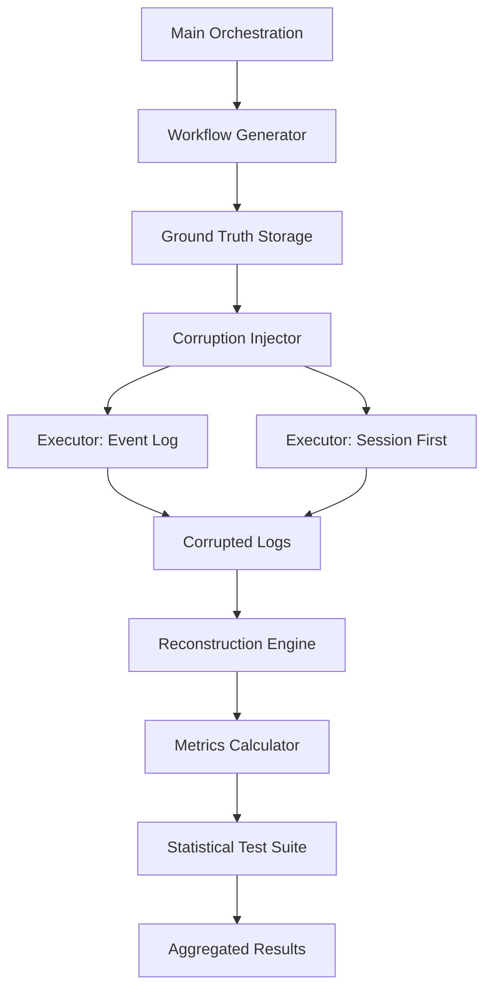

# llmXive: Extending OpenRath (Session-Centered Runtime State)

A reproducible research pipeline comparing **Event-Log** vs. **Session-First** architectures for multi-agent system resilience against data corruption and network jitter.

## 📋 Overview

This project implements a synthetic benchmark to evaluate how different state management strategies handle:
1. **Data Corruption**: Random deletion/modification of log entries.
2. **Network Jitter**: Stochastic delays in tool calls.
3. **Reconstruction**: The ability to recover ground-truth final states from corrupted traces.

**Key Metrics**: Total Resilience, Recoverable State Fidelity, Unrecoverable Rate, and Replay Latency.

## 🚀 Installation

1. **Clone the repository**:
 ```bash
 git clone <repo-url>
 cd projects/PROJ-927-llmxive-follow-up-extending-openrath-ses
 ```

2. **Create a virtual environment**:
 ```bash
 python -m venv venv
 source venv/bin/activate # On Windows: venv\Scripts\activate
 ```

3. **Install dependencies**:
 ```bash
 pip install -r requirements.txt
 ```

## 🛠 Usage

The pipeline is orchestrated via `code/main.py`. It supports three distinct execution modes controlled by specific flags.

### 1. Generate Workflows (Phase 1)
Generates deterministic synthetic workflows and their ground truth states.

```bash
python code/main.py --seed 42 --count 500
```
* `--seed`: Random seed for reproducibility (default: 42).
* `--count`: Number of workflows to generate.
* `--resume`: Resume from the last completed workflow ID if interrupted.

**Output**:
- `data/raw/workflows/{id}_ground_truth.json`
- `state/projects/PROJ-927-llmxive-follow-up-extending-openrath-ses.yaml` (updated with hashes)

### 2. Simulate & Execute (Phase 2)
Executes workflows through both architectures with corruption injection and jitter.

```bash
python code/main.py --seed 42 --count 500 --corruption-rate 0.10 --sweep
```
* `--corruption-rate`: Probability of log entry corruption (e.g., 0.10 for 10%).
* `--sweep`: Run the experiment across the configured `SWEEP_RATES` (0.05, 0.10, 0.20).

**Output**:
- `data/processed/corrupted_logs/`
- `data/processed/corruption_map.json`
- `data/processed/results/` (intermediate execution results)

### 3. Reconstruct & Analyze (Phase 3)
Reconstructs states from corrupted logs, calculates metrics, and runs statistical tests.

```bash
python code/main.py --seed 42 --count 500 --sweep
```
*Note: The main orchestration script handles the full pipeline (Generation -> Simulation -> Reconstruction) when `--sweep` is enabled, or specific phases can be targeted by adjusting the internal logic flow if custom scripts are used.*

**Output**:
- `data/processed/results/aggregated_metrics.json`
- `data/processed/results/reconstruction_results/{id}.json`

## 🏗 Architecture



**Components**:
- **Generators**: Create deterministic multi-agent workflows.
- **Executors**: Run workflows under two paradigms:
 - `EventLogExecutor`: Asynchronous, fragmented storage.
 - `SessionFirstExecutor`: Atomic, single-object state recording.
- **Simulators**: Inject corruption and network jitter.
- **Reconstructors**: Rebuild state from corrupted traces.
- **Analyzers**: Calculate fidelity scores and perform statistical tests (Cochran's Q, McNemar).

## 🧹 Data Hygiene

This project enforces **Constitution Principle III**: All artifacts are checksummed.

- **SHA256 Verification**: Every generated file is hashed immediately after creation.
- **State Tracking**: Hashes are stored in `state/projects/PROJ-927-llmxive-follow-up-extending-openrath-ses.yaml`.
- **Integrity Checks**: Run the following to verify data integrity:
 ```bash
 python code/main.py --verify-checksums
 ```
 *(Note: If `--verify-checksums` is not a top-level flag, the verification runs automatically at the end of each phase or via the `checksum_manager` utility.)*

## 📊 Statistical Analysis

The pipeline performs rigorous statistical testing:
1. **Cochran's Q Test**: Multi-factor design (Architecture x Outcome x Corruption Rate).
2. **McNemar's Test**: Pairwise comparisons with Holm-Bonferroni correction.
3. **Latency Comparison**: Paired t-test or Wilcoxon Signed-Rank.

Results are aggregated in `data/processed/results/aggregated_metrics.json`.

## 📄 License

Research code for llmXive project.
