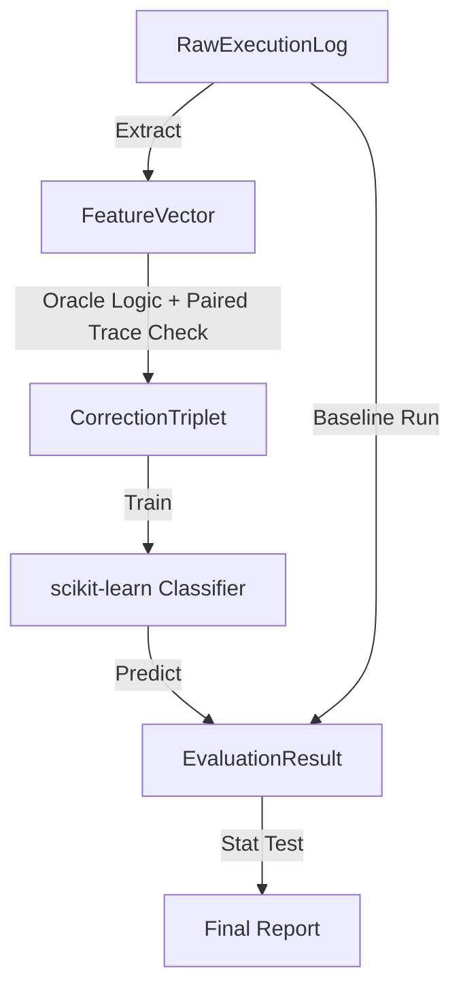

# Data Model: llmXive Follow-up: Extending EnterpriseClawBench

## 1. Entity-Relationship Overview

The data model centers on the **Execution Trace** and its derived **Feature Vector**. The model supports the flow from raw logs to training triplets and finally to evaluation metrics.

### Key Entities

1.  **RawExecutionLog**: The unprocessed input file.
2.  **FeatureVector**: The structured representation of a trace (syntax, tokens, markers).
3.  **CorrectionTriplet**: A training sample linking a failed trace, its prompt, and a successful correction.
4.  **EvaluationResult**: The outcome of the ADS calculation.

## 2. Data Schema Definitions

### 2.1 RawExecutionLog
*Source*: EnterpriseClawBench (local file or stream).
*Format*: JSON/Text log.
*Fields*:
- `trace_id`: Unique identifier.
- `task_id`: Task identifier.
- `system_prompt`: The initial prompt sent to the agent.
- `tool_sequence`: List of tool calls and responses.
- `outcome_label`: "success" or "failed".
- `status`: "success" or "failed".
- `paired_trace_id`: **REQUIRED** if `status` is "failed". Points to a successful trace for the same task.
- `timestamp`: ISO 8601.
*Constraint*: If `status` is "failed" and `paired_trace_id` is null/missing, the pipeline halts.

### 2.2 FeatureVector
*Derived from*: RawExecutionLog via `extractors`.
*Format*: JSON/Parquet.
*Fields*:
- `trace_id`: FK to RawExecutionLog.
- `syntax_tree_depth`: Integer (max depth).
- `token_frequency`: Object (key: token, value: count).
- `pragmatic_markers`: Object (key: marker_type, value: count/bool).
  - `error_recovery_attempts`: Integer.
  - `state_transition_errors`: Boolean.
- `status`: "success" | "failed".
- `ambiguity_flag`: Boolean (true if markers were ambiguous).

### 2.3 CorrectionTriplet
*Derived from*: FeatureVector + Rule-Based Oracle.
*Format*: JSON/Parquet.
*Fields*:
- `triplet_id`: Unique identifier.
- `system_prompt`: String.
- `failed_structure`: Object (reference to FeatureVector of failed trace).
- `successful_structure`: Object (reference to FeatureVector of successful trace).
- `label`: "correctable" | "unfixable".
- `oracle_logic`: String (description of the rule applied).

### 2.4 EvaluationResult
*Derived from*: Model inference + ADS calculation.
*Format*: CSV/Parquet.
*Fields*:
- `task_id`: Identifier for the task in the Lite set.
- `baseline_ads`: Float (Artifact Delivery Score).
- `adapter_ads`: Float (Artifact Delivery Score with adapter).
- `latency_ms`: Integer.
- `prediction`: "correctable" | "unfixable".
- `rewriter_applied`: Boolean (True if prediction was "correctable").

## 3. Data Flow Diagram

## 4. Constraints & Validation Rules

- **Immutability**: `RawExecutionLog` files are never modified. Derivations (`FeatureVector`, `CorrectionTriplet`) are written to new files.
- **Checksums**: All files in `data/` must have a recorded SHA-256 checksum in the project state.
- **PII**: No Personally Identifiable Information is allowed in `FeatureVector` or `CorrectionTriplet`.
- **Memory**: Streaming processing enforced for `RawExecutionLog` if size > 1GB.
- **Paired Trace**: `paired_trace_id` is required for all failed traces.

## 5. Storage Strategy

- **Raw Data**: `data/raw/` (Read-only).
- **Processed Data**: `data/processed/` (Read-Write during pipeline, immutable after run).
- **Model Artifacts**: `code/models/` (Versioned by content hash).
- **Results**: `data/results/`.
- **Lite Set**: `data/lite_set/` (Contains the 120-task subset).