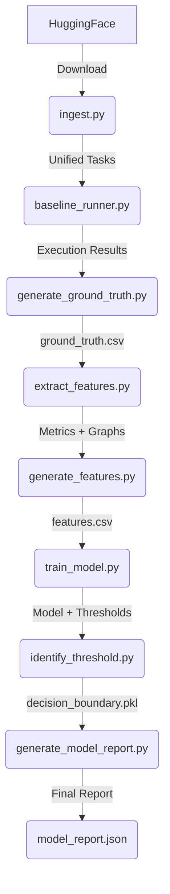

# llmXive Architecture

This document describes the high-level architecture and design decisions of the llmXive pipeline.

## Core Principles

1. **Real Data First**: All analysis is based on real SWE-bench and AgentBench data. No synthetic data generation.
2. **Safety Conservatism**: Ambiguous outcomes (timeouts, crashes) are treated as failures.
3. **Associational, Not Causal**: Model results are explicitly framed as correlations, not causal proofs (FR-006).
4. **CPU-Only**: All processing is optimized for CPU execution.

## Component Overview

### 1. Ingestion Layer (`code/scripts/ingest.py`)

- **Responsibility**: Download and normalize datasets.
- **Inputs**: HuggingFace API.
- **Outputs**: Unified JSON/CSV format.
- **Key Logic**:
 - Distinct parsers for SWE-bench and AgentBench.
 - Merging logic to create a unified task list.

### 2. Execution Layer (`code/scripts/baseline_runner.py`)

- **Responsibility**: Execute code in isolated environments to determine ground truth.
- **Mechanism**: Python `venv` + `subprocess` with timeout.
- **Outcomes**: `Pass`, `Fail`, `Timeout`, `Unparseable`.
- **Safety**: Timeouts are never "Unknown"; they are recorded as `Fail`.

### 3. Feature Extraction Layer (`code/scripts/extract_features.py`)

- **Responsibility**: Convert code into structural metrics.
- **Tools**: `tree-sitter` for AST parsing.
- **Metrics**:
 - `dependency_depth`: Max depth of the dependency graph.
 - `cyclomatic_complexity`: Number of linearly independent paths.
 - `semantic_complexity_score`: Derived from AST node types.
 - `lines_of_code`: Fallback if semantic nodes are missing.
- **Fallback Logic**: If `tree-sitter` fails to parse, use heuristic metrics (LOC, cyclomatic).

### 4. Modeling Layer (`code/scripts/train_model.py`, `sensitivity_analysis.py`)

- **Responsibility**: Train classifiers and evaluate safety thresholds.
- **Models**: Logistic Regression, Random Forest.
- **Constraints**: CPU-only, fixed random seeds.
- **Safety Check**:
 - Sweep thresholds {0.01, 0.05, 0.1}.
 - Calculate FNR for each.
 - Flag model as "unsafe" if min FNR > 0.1%.

## Data Flow

## Error Handling

- **Parsing Errors**: Flagged as "Unparseable", skipped in graph extraction but retained in CSV.
- **Execution Timeouts**: Recorded as "Fail", not "Unknown".
- **Missing Metrics**: Validation step (`validate_features.py`) ensures no nulls in `features.csv`.

## Extensibility

- **New Datasets**: Add a parser function in `ingest.py` following the SWE-bench pattern.
- **New Metrics**: Extend `extract_features.py` with new calculation functions.
- **New Models**: Add training logic in `train_model.py` while maintaining CPU-only constraint.
