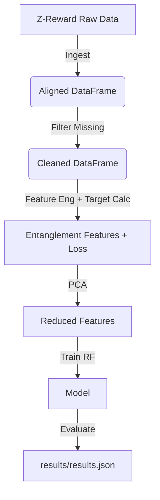

# Data Model: llmXive Follow-up: Teacher Entanglement vs. Scalar Distillation Loss

## Overview
This document defines the data structures used throughout the `llmXive-entanglement-analysis` feature. It covers the raw input schema, the engineered feature schema, and the final output schema.

## Raw Data Schema (Input)
Derived from the Z-Reward evaluation dataset.

| Field | Type | Description | Source |
| :--- | :--- | :--- | :--- |
| `sample_id` | string | Unique identifier for the prompt/image pair. | Dataset Metadata |
| `prompt` | string | The text prompt used for generation. | Dataset |
| `teacher_scores` | array[float] | 4-element array: [Alignment, Realism, Aesthetics, Plausibility]. | Pre-computed Teacher Output |
| `student_score` | float | Single scalar score from the student model. | Pre-computed Student Output |
| `human_annotations` | array[float] | 4-element array: [Alignment, Realism, Aesthetics, Plausibility]. | Human Annotators |
| `primary_dimension` | string | The dimension ID (e.g., "alignment") to use for fidelity loss calculation. Defaults to "alignment" if missing. | Metadata / Fixed Rule |

## Engineered Feature Schema (Intermediate)
Output of `features.py`.

| Field | Type | Description |
| :--- | :--- | :--- |
| `sample_id` | string | Foreign key to raw data. |
| `variance` | float | Variance of `teacher_scores`. |
| `range` | float | Max - Min of `teacher_scores` (replaces Entropy). |
| `std_dev` | float | Standard deviation of `teacher_scores`. |
| `skewness` | float | Skewness of `teacher_scores`. |
| `kurtosis` | float | Kurtosis of `teacher_scores`. |
| `global_eigenvalue` | float | Dominant eigenvalue of the *dataset-wide* covariance matrix (constant per sample). |
| `is_constant` | boolean | True if variance is 0 (all scores identical). |

## Target Variable Schema (Intermediate)
Computed in `features.py`.

| Field | Type | Description |
| :--- | :--- | :--- |
| `sample_id` | string | Foreign key. |
| `fidelity_loss` | float | MAE: $|student\_score - human\_annotations[target\_dimension]|$. |
| `excluded` | boolean | True if human annotation for target dimension was missing. |

## Final Output Schema (Results)
Output of `evaluate.py`.

| Field | Type | Description |
| :--- | :--- | :--- |
| `r2_score` | float | Coefficient of determination from 5-fold CV. |
| `mae` | float | Mean Absolute Error from 5-fold CV. |
| `p_value` | float | P-value from permutation test. |
| `feature_importance` | object | Map of feature name to importance score (after PCA). |
| `cv_std` | float | Standard deviation of R² across folds. |
| `n_samples` | integer | Number of samples used in training. |
| `timestamp` | string | ISO 8601 timestamp of execution. |
| `config` | object | Configuration used for the run (n_estimators, random_state, etc.). |

## Data Flow Diagram
