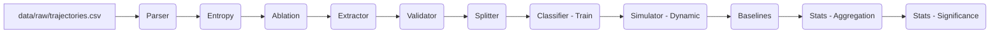

# llmXive: Extending "AgenticSTS"

**Project ID**: PROJ-990-llmxive-follow-up-extending-agenticsts-a

An automated research pipeline for evaluating bounded-memory LLM agents using a dynamic layer selection policy. This project extends the AgenticSTS testbed by implementing a token-budget-aware retrieval agent that optimizes context usage while maintaining performance.

## 📚 Overview

This project implements a **Dynamic Policy** for layer selection in long-horizon LLM agents. Unlike static "all-layers" baselines, our approach:
1. Analyzes turn-level entropy to predict utility of memory layers.
2. Enforces a hard token budget (4096 tokens).
3. Prunes least useful layers when budget constraints are tight.
4. Validates efficacy via ablation-derived ground truth and statistical significance testing.

## 🚀 Quick Start

See `quickstart.md` for detailed instructions on running the full pipeline, including data parsing, model training, simulation, and statistical analysis.

### Prerequisites
- Python 3.11+
- CPU-only runner (no GPU required)
- ~14 GB disk space for intermediate data

### Installation
```bash
pip install -r requirements.txt
```

## 🏗️ Architecture

The pipeline follows a strict data-flow dependency chain:



### Key Modules
- `code/parser.py`: Extracts per-turn metrics (health, threat, deck size).
- `code/entropy.py`: Calculates Shannon entropy of legal move distributions.
- `code/ablation.py`: Generates ground-truth utility labels via engine ablation.
- `code/classifier.py`: Trains lightweight models (Decision Tree/Logistic Regression) on ablation labels.
- `code/simulator.py`: Executes dynamic layer selection with token budget enforcement.
- `code/stats.py`: Performs statistical testing (McNemar's, Permutation, Bonferroni).

## 📊 Data Products

All processed data is stored in `data/processed/`. Key outputs:

| File | Description |
|:--- |:--- |
| `utility_labels.csv` | Ablation-derived ground truth for training. |
| `train_set.csv` / `holdout_set.csv` | Stratified data splits. |
| `baseline_comparison.csv` | Win rates and token usage by condition. |
| `statistical_results.json` | Final p-values, effect sizes, and test types. |
| `token_reduction_verification.json` | Boolean flag if token reduction ≥ 30%. |

## ✅ Validation Gates

The pipeline enforces strict validation:
1. **Proxy Validation**: Pearson correlation ≥ 0.7 between static logs and ablation utility.
2. **Token Reduction**: Must achieve ≥ 30% reduction vs. Static All-Layers.
3. **Statistical Significance**: Bonferroni-corrected p-values reported.

## 🧪 Testing

Unit tests are located in `tests/unit/`. Run with:
```bash
pytest tests/
```

## 📄 License

Research code for the llmXive project.
